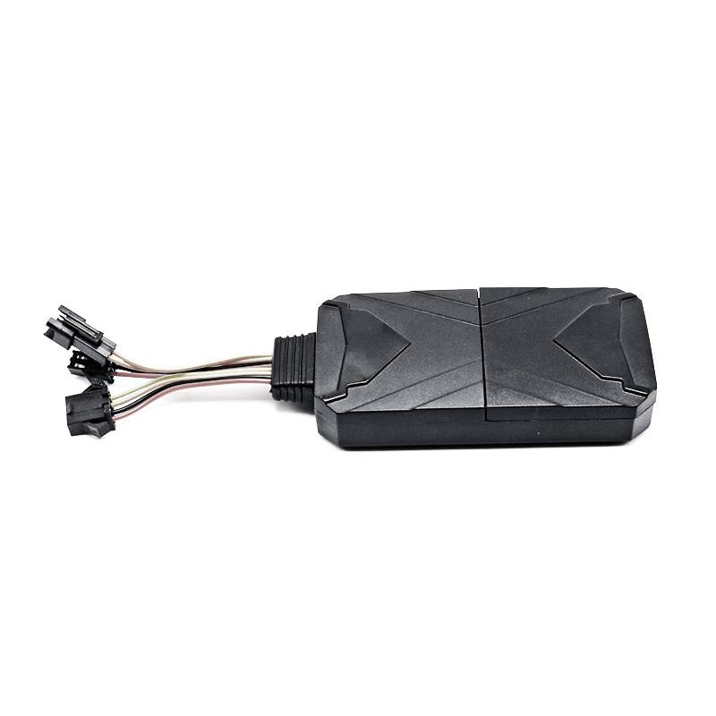

# LK-GPS - LK980-4G

El LK980-4G es un rastreador GPS cableado y compacto diseñado para ofrecer seguridad vehicular confiable y gestión de flotas. Integra antenas GPS y GSM con conectividad 4G LTE y conmutación automática a 2G para garantizar reporte continuo de ubicación y transmisión de eventos. El equipo incluye controles de seguridad y operativos prácticos como alarma SOS, escucha silenciosa, alertas por vibración y manipulación, además de corte remoto de combustible o alimentación, y opciones de administración mediante app móvil y SMS.

Como dispositivo compatible con Plaspy, el LK980-4G puede enviar posiciones, telemetría y eventos de alarma a Plaspy para monitoreo y generación de reportes centralizados. Su instalación cableada y amplio rango de voltaje operativo lo hacen adecuado para flotas mixtas donde se requiere alimentación estable y seguimiento preciso en tiempo real. Los operadores que usan Plaspy pueden aprovechar el LK980-4G para aumentar la visibilidad, reaccionar más rápido ante incidentes y reproducir trayectos históricos para análisis.

## Características principales

- Rastreador GPS 4G compatible con Plaspy con conmutación automática a 2G para conectividad resiliente en distintas zonas
- Antenas GPS y GSM integradas en un módulo compacto, ideal para instalaciones discretas en autos y motocicletas
- Funciones de seguridad como alerta SOS, escucha silenciosa, detección de vibración y manipulación, y corte remoto de combustible o alimentación
- Entradas y salidas configurables para capturar señales del vehículo y soportar alertas y telemetría basadas en eventos
- Reproducción de rutas históricas y registro de eventos para análisis de ruta y revisión operativa
- Control mediante app móvil para Android e iOS y configuración por SMS para cambios remotos de parámetros

## Cómo funciona con Plaspy

Al integrarse con Plaspy, el LK980-4G envía datos de posición y eventos a la plataforma para que los operadores puedan supervisar los activos desde una única interfaz. Plaspy agrega actualizaciones de ubicación, alarmas y telemetría para permitir rastreo en vivo, notificaciones y revisión histórica en distintas flotas y tipos de vehículo.

- Actualizaciones de ubicación y telemetría en tiempo real mostradas en los mapas en vivo de Plaspy para obtener conciencia situacional inmediata
- Reenvío de alarmas por SOS, vibración o manipulación para que los equipos reciban notificaciones oportunas y puedan actuar
- Comandos remotos de inmovilizador y corte de combustible o alimentación gestionables desde Plaspy cuando el dispositivo lo soporta
- Eventos de entradas y salidas, como ignición o apertura de puertas, registrados y visibles en los paneles y reportes de Plaspy
- Reproducción de rutas históricas y registros de eventos disponibles en Plaspy para auditorías, investigaciones y optimización operativa

## Casos de uso típicos

- Gestión de flotas que requiere seguimiento continuo de vehículos, reproducción de rutas e informes de uso
- Flujos de trabajo antirobo usando alertas SOS, detección de manipulación e inmovilización remota para proteger activos
- Operaciones de alquiler y transporte por aplicación que necesitan instalaciones cableadas discretas y monitoreo de manipulación
- Servicios de logística y entrega que rastrean movimientos de vehículos, marcas de tiempo y registros de eventos como prueba de servicio
- Flotas mixtas que incluyen motocicletas y vehículos ligeros donde se necesita amplio soporte de voltaje y alimentación estable

## Por qué elegir este rastreador con Plaspy

El LK980-4G combina un diseño compacto orientado a vehículos con funciones de seguridad y operativas que se alinean con las necesidades de supervisión de flotas. Su conectividad 4G con fallback y perfil de alimentación cableado ayudan a mantener reportes continuos, mientras que las entradas configurables y las funciones de alarma entregan eventos accionables dentro de Plaspy para un monitoreo centralizado.

Para organizaciones que buscan un rastreador práctico y compatible con Plaspy para seguridad vehicular y visibilidad de flota, el LK980-4G ofrece un conjunto equilibrado de funciones orientadas al seguimiento en tiempo real, gestión de alarmas y revisión histórica. Conozca más sobre Plaspy en el sitio principal https://www.plaspy.com. Las especificaciones del producto, disponibilidad y detalles del fabricante pueden cambiar con el tiempo, por lo que es recomendable verificar la información actual en el sitio oficial de LK GPS https://www.lk-gps.com.
