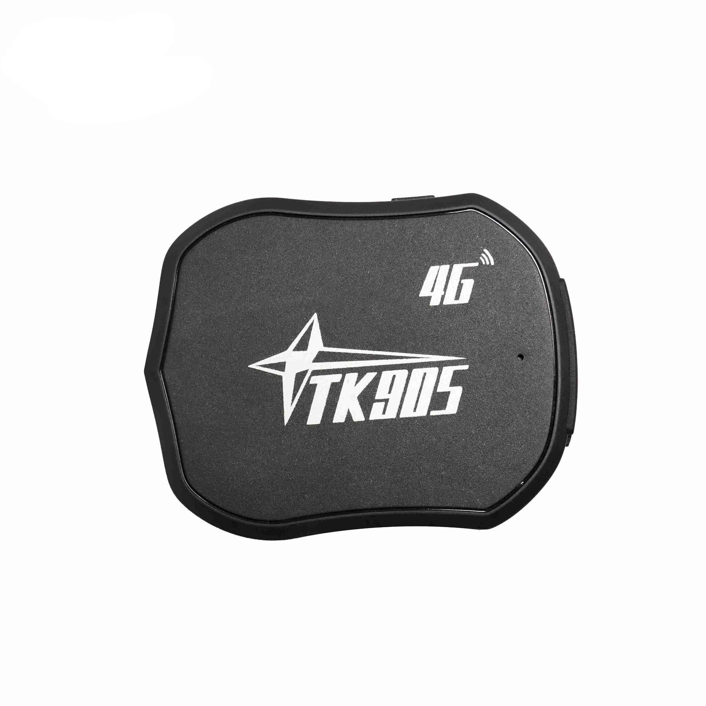

# LK-GPS - TK905

# TK905 GPS Tracker

El TK905 es un rastreador GPS compacto, compatible con Plaspy, diseñado para la seguridad discreta de vehículos y un seguimiento fiable en tiempo real. Diseñado para automóviles y motocicletas, el TK905 ofrece informes continuos de la posición GPS a plataformas en línea y a aplicaciones móviles \(Google Maps es compatible en la aplicación, PC y tableta\), lo que lo convierte en una opción práctica para protección antirrobo, visibilidad de la gestión de flotas y monitoreo de vehículos personales donde la discreción y una larga vida en reposo son importantes.

La batería recargable Li‑ion de 3.7V y 5000mAh integrada, junto con el modo de reposo de ahorro de energía, permiten desplegarse durante períodos prolongados sin necesidad de recargas frecuentes. El TK905 admite alertas configurables —incluyendo alarmas de sobrevelocidad y de choque/vibración— y puede despertarse por vibración, SMS o una llamada entrante. Cuando se combina con Plaspy, este rastreador ofrece monitorización remota sencilla, alertas y telemetría básica para las necesidades diarias de flota y seguridad.

## Aspectos clave

- Rastreador GPS compatible con Plaspy para instalación discreta en vehículos y seguimiento en tiempo real.
- Batería de larga duración en reposo: batería Li‑ion recargable de 3.7V y 5000mAh integrada, con hasta ~20 días en espera \(según el intervalo de informes\).
- Conjunto de alarmas esenciales: alarma de sobrevelocidad y alarma de choque/vibración \(impacto\) para detección de robo y manipulación.
- Modo de reposo de ahorro de energía: el GPS puede desactivarse para conservar energía, manteniendo GSM activo con bajo consumo.
- Despertar y control mediante vibración, SMS o una llamada entrante — práctico para instalaciones de vehículos de bajo consumo.
- Monitorización remota y alertas configurables a través de aplicaciones web y móviles; genera informes de posición para plataformas de rastreo estándar \(Google Maps compatible\).
- Forma compacta y de fácil ocultación, optimizada para motocicletas y montajes encubiertos en vehículos.

## Cómo funciona con Plaspy

La integración del TK905 con Plaspy ofrece un camino sencillo hacia la ubicación en tiempo real, telemetría básica y gestión de alertas. El rastreador transmite posiciones GPS y eventos de alarma a plataformas en línea; Plaspy procesa estas actualizaciones para mostrar la ubicación en mapas, generar alertas y producir informes de movimiento para la gestión de flotas o flujos de seguridad.

- Actualizaciones de ubicación y telemetría en tiempo real entregadas a Plaspy para visualización en mapas y reproducción de historial.
- Eventos de alarma de sobrevelocidad reenviados a Plaspy y a los administradores para que los responsables puedan abordar conductas de conducción de riesgo.
- Alertas de choque/vibración \(impacto\) enviadas cuando se detecta manipulación o colisiones, permitiendo una respuesta rápida.
- Despertar del dispositivo y consultas de estado vía SMS o llamada — los paneles de Plaspy reflejan el estado más reciente del dispositivo cuando se reciben comunicaciones.
- Alertas configurables e intervalos de informes: ajuste de cuán a menudo el TK905 informa a Plaspy para equilibrar la vida de la batería y la granularidad del seguimiento.

## Resumen técnico

| Conectividad | Conectividad GSM celular \(2G\) para SMS, llamadas e informes de datos a plataformas en línea |
| --- | --- |
| Bandas | No especificadas por el fabricante en la descripción proporcionada |
| Alimentación & Batería | Batería Li‑ion recargable integrada de 3.7V y 5000mAh; hasta aproximadamente 20 días en espera, según uso e intervalos de informe; modo de reposo de ahorro de energía desactiva el GPS manteniendo GSM activo |
| Interfaces | Control/despertar basado en SMS y llamadas; alarmas configurables de sobrevelocidad y de choque/vibración; monitorización remota mediante web/app. No se especifica una entrada dedicada de encendido o interfaz de inmovilizador. |
| GNSS | Informe de posición GPS \(no se especifica GLONASS ni soporte de multi‑constelación\) |
| Bluetooth | No especificado \(no se mencionan sensores BLE ni beacons en la descripción\) |
| Gestión remota | Informes a plataformas en línea y aplicaciones móviles; Google Maps compatible en la app, PC y tableta; configuración vía SMS/comandos remotos y herramientas de app/web |
| Formato | Unidad compacta y fácilmente oculta, diseñada para automóviles y motocicletas |

## Casos de uso

- Monitoreo de flotas: rastrear ubicaciones de vehículos, monitorizar la velocidad y recopilar historial de movimientos para auditoría de rutas y necesidades básicas de telemetría.
- Antirrobo y recuperación de vehículos: instalación discreta con alertas de choque/vibración para detectar manipulaciones y proporcionar datos de ubicación para su recuperación.
- Seguridad para motocicletas: formato compacto y de fácil ocultación, ideal para scooters y motocicletas que requieren largos tiempos de espera.
- Monitorización de manipulaciones en vehículos estacionados: recibir alertas de choque cuando un coche estacionado sufre impacto o vandalismo.
- Monitoreo de vehículos personales: una solución de perfil bajo para propietarios que desean seguimiento remoto simple y alertas de eventos sin recargas frecuentes.

## Por qué elegir este rastreador con Plaspy

Elegir el TK905 para su uso con Plaspy ofrece un rastreador GPS directo y rentable que enfatiza la discreción y una larga autonomía. Con alarmas integradas de sobrevelocidad y de choque, funcionalidad de activación por SMS/llamada y reporte remoto a plataformas web y aplicaciones móviles, el TK905 cubre las necesidades más comunes de protección antirrobo y gestión básica de flotas. Plaspy facilita la centralización de datos de ubicación y alertas, de modo que los equipos operativos obtienen seguimiento en tiempo real y telemetría accionable sin una integración compleja.

Si su despliegue requiere telemetría avanzada, como monitoreo de combustible, una entrada de encendido dedicada, control remoto de inmovilizador o integración de sensores Bluetooth, verifique esas capacidades específicas antes de la compra, ya que no se mencionan en la descripción del TK905. Para muchos casos de uso donde la instalación discreta, la larga vida de la batería y la confiabilidad de la ubicación/alertas son prioridades, el TK905 combinado con Plaspy ofrece una solución fiable y fácil de gestionar.

