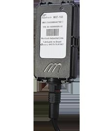

# Maxtrack - MXT-160

El Maxtrack MXT-160 es un rastreador GPS compacto y resistente, pensado para el monitoreo exigente de activos móviles. Se ofrece en dos variantes que difieren únicamente en la cantidad de entradas y salidas; su diseño prioriza la robustez frente a interferencias, variaciones de voltaje y condiciones ambientales adversas. El equipo admite el reporte remoto de posición mediante GPRS y combina posicionamiento, conectividad y lógica de aplicación embebida en un único procesador interno para simplificar su operación en despliegues de gran volumen.

Como dispositivo compatible con Plaspy, el MXT-160 puede alimentar los flujos de trabajo de gestión de flotas con datos de ubicación y eventos para ofrecer visibilidad y control operativo. Su tamaño reducido y construcción impermeable lo hacen adecuado para instalaciones en motocicletas y otros activos móviles con exposición y limitaciones de espacio. Plaspy puede ingerir los datos del MXT-160 para habilitar monitoreo centralizado, alertas e informes para organizaciones que gestionan grandes cantidades de unidades rastreadas.

## Características principales

- Diseño compacto y resistente, ideal para motocicletas y emplazamientos con espacio limitado
- Construcción mecánica impermeable para uso en entornos expuestos
- Dos variantes que difieren en entradas y salidas para cubrir necesidades básicas de I/O
- Arquitectura con un único procesador que integra posicionamiento y conectividad
- Monitoreo y control remoto por GPRS para operaciones continuas
- Certificación ANATEL y cumplimiento con la normativa informática aplicable
- Funcionalidades como detección por acelerómetro, entrada de emergencia y control de salidas para bloqueo vehicular

## Cómo funciona con Plaspy

Al conectarse a Plaspy, el MXT-160 suministra eventos de ubicación y estado que Plaspy utiliza para mostrar visibilidad en tiempo real y seguimiento histórico a lo largo de la flota. Plaspy organiza los datos entrantes para soportar la supervisión operativa sin exigir configuraciones complejas en el dispositivo.

- Visualización de ubicación en tiempo real y reproducción histórica de rutas dentro de Plaspy
- Gestión de eventos para entradas como disparadores de pánico o detección de movimiento por el acelerómetro
- Monitoreo del estado de ignición virtual y otros estados derivados de entradas para generar alertas operativas
- Control remoto de salidas a través de Plaspy para acciones como bloqueo del vehículo cuando el hardware del rastreador ofrece esa salida
- Informes y análisis a nivel de flota basados en ubicación, eventos y tiempo de actividad

## Casos de uso típicos

- Flotas de motocicletas y servicios de entrega que requieren rastreadores compactos y resistentes al clima
- Flotas de autos de alquiler y operaciones de renta que necesitan funciones de ubicación y control remoto
- Proyectos de seguros y recuperación de activos que emplean movimientos y disparadores de emergencia para la gestión de riesgos
- Instituciones financieras y programas de telemetría de alto volumen donde se prefieren dispositivos de bajo mantenimiento
- Operaciones que demandan instalaciones simplificadas y reportes de eventos directos

## Por qué elegir este rastreador con Plaspy

El MXT-160 es una opción práctica cuando las organizaciones requieren un rastreador pequeño y robusto que minimice el mantenimiento de campo mientras ofrece capacidades esenciales de seguimiento y eventos. Su enfoque en la construcción duradera, la resistencia a interferencias y la flexibilidad básica de entradas/salidas lo hace adecuado para despliegues a gran escala donde la continuidad operativa es prioritaria.

Combinado con Plaspy, el MXT-160 aporta los datos centrales necesarios para el monitoreo de flotas, alertas e informes sin añadir complejidad innecesaria. Plaspy puede consolidar las transmisiones del MXT-160 en paneles y flujos de trabajo que ayudan a los equipos a actuar sobre la información de ubicación y eventos de manera eficiente, especialmente en entornos como flotas de motocicletas, operaciones de renta y programas de recuperación para aseguradoras.

Para obtener más información sobre el uso del Maxtrack MXT-160 con Plaspy visite https://www.plaspy.com. Las especificaciones del producto, la disponibilidad y los datos del fabricante pueden cambiar con el tiempo, por lo que le recomendamos verificar las especificaciones y el cumplimiento actuales en el sitio del fabricante https://maxtrack.com.br.
