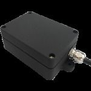

# Megastek - GMT-368

El Megastek GMT-368 es un rastreador GPS compacto diseñado específicamente para motocicletas. Ofrece un equilibrio entre tamaño reducido y funcionalidades prácticas de rastreo para proporcionar monitoreo continuo de la ubicación y notificaciones básicas del estado del vehículo. El equipo admite actualizaciones de posición en tiempo real mediante SMS o comunicación GPRS, intervalos de seguimiento configurables, geocercas, alarmas por exceso de velocidad y por pérdida de señal GPS, además de detección ACC para informar el estado de encendido.

Como dispositivo compatible con Plaspy, el GMT-368 puede enviar su ubicación y datos de alerta a Plaspy para un monitoreo y generación de reportes centralizados. Esta compatibilidad lo hace una opción adecuada tanto para motociclistas particulares como para operadores de flotas que desean consolidar el rastreo de motocicletas, las alertas de geocerca, las notificaciones de velocidad y los eventos de encendido dentro de la plataforma Plaspy para supervisión operativa y seguridad.

## Aspectos destacados

- Diseñado para motocicletas con un formato compacto adecuado para vehículos de dos ruedas  
- Seguimiento en tiempo real disponible por SMS o GPRS  
- Intervalos de seguimiento configurables para equilibrar frecuencia de actualizaciones y consumo de datos  
- Soporte de geocercas para alertas de entrada y salida en zonas predefinidas  
- Alarmas por exceso de velocidad y por ausencia de señal GPS para mayor seguridad y control  
- Detección ACC para reportar el encendido y apagado del vehículo  
- Conjunto de funciones práctico tanto para seguridad personal como para supervisión de flotas

## Cómo funciona con Plaspy

Al integrarse con Plaspy, el GMT-368 suministra actualizaciones de posición y notificaciones de estado que Plaspy puede mostrar, registrar y usar para activar alertas y reportes. Plaspy recibe los mensajes del rastreador y los presenta junto con otros activos de la flota, de modo que usted pueda monitorear las motocicletas junto con otros tipos de vehículos.

- Visualización de ubicación en tiempo real en los mapas de Plaspy para vehículos individuales o flotas agrupadas  
- Los eventos de geocerca generan alertas accionables e historial para la gestión de zonas  
- Las alarmas por velocidad y ausencia de señal se muestran en las herramientas de notificaciones y alertas de Plaspy  
- Los eventos de estado de encendido detectados por ACC aparecen en las líneas de tiempo de los activos y en los registros de actividad  
- Los intervalos de seguimiento regulares alimentan el historial de movimiento y permiten la reconstrucción de rutas para informes

## Casos de uso típicos

- Prevención y seguimiento de robos para motocicletas particulares  
- Rastreo de flotas de mensajería y reparto para supervisión de rutas  
- Operaciones de alquiler y uso compartido que requieren control de zonas y alertas de uso  
- Gerentes de flota que consolidan la actividad de motocicletas en un solo panel de Plaspy  
- Propietarios operadores que desean visibilidad continua de la ubicación y alarmas básicas

## Por qué elegir este rastreador con Plaspy

El GMT-368 es una elección práctica cuando necesita un rastreador enfocado en motocicletas que ofrezca funciones esenciales de rastreo y alerta. Su diseño compacto y su conjunto de funciones lo hacen apropiado para quienes priorizan actualizaciones sencillas de ubicación, monitoreo de geocercas y alertas básicas de estado sin requerir hardware más complejo.

Combinado con Plaspy, el GMT-368 aporta las entradas esenciales que la plataforma necesita para ofrecer monitoreo centralizado, gestión de alertas e informes históricos. Para organizaciones e individuos que rastrean motocicletas junto con otros activos, usar el GMT-368 con Plaspy puede simplificar la supervisión operativa y mejorar la respuesta ante eventos.

Para obtener más información sobre Plaspy y cómo se gestionan los dispositivos compatibles en la plataforma visite https://www.plaspy.com. Las especificaciones del producto, la disponibilidad y los datos del fabricante pueden cambiar con el tiempo, por lo que le recomendamos verificar las especificaciones técnicas actuales y la información de soporte en el sitio del fabricante https://www.megastek.com/.
