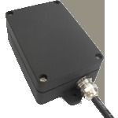

# Megastek - GMT-368SG

El Megastek GMT-368SG es un rastreador GPS para vehículos diseñado para ofrecer seguimiento preciso y fiable en distintos tipos de unidades. Cuenta con una carcasa resistente al agua con clasificación IP66 para soportar lluvia y condiciones adversas, y permite reportes por SMS y GPRS (TCP/UDP). El equipo realiza envíos periódicos de posición, seguimiento en tiempo real y ofrece un conjunto de alertas y funciones de monitoreo como geocercas, alarma por exceso de velocidad, alarma por vibración, batería baja, pérdida de señal GPS y aviso de conexión o desconexión de alimentación externa. Además incluye un registrador de datos (data logger) que almacena posiciones cuando no hay cobertura celular.

Como dispositivo compatible con Plaspy, el GMT-368SG puede integrarse en los flujos de trabajo de gestión de flotas para brindar visibilidad y control operativo. Al conectarse a Plaspy, las actualizaciones de ubicación, las alertas configuradas y los datos registrados se muestran en la plataforma para monitoreo, notificaciones e informes. Las múltiples entradas y salidas del equipo también permiten ampliar el seguimiento con señales adicionales que Plaspy puede presentar junto con la información de ubicación.

## Puntos clave

- Diseño impermeable con certificación IP66 para funcionamiento fiable al aire libre y en condiciones climáticas adversas
- Soporta reportes por SMS y GPRS para actualizaciones de posición en tiempo real y programadas
- Alarmas integradas: geocercas, exceso de velocidad, vibración, batería baja y pérdida de señal GPS
- Registrador de datos que guarda ubicaciones cuando no hay cobertura celular para sincronizarlas después
- Varias opciones de E/S: 2 salidas digitales, 3 entradas digitales y 2 entradas analógicas para integraciones adicionales
- Alarma de conexión/desconexión de alimentación externa, modo de ahorro de energía y soporte para números de teléfono autorizados

## Cómo funciona con Plaspy

Cuando se usa con Plaspy, el GMT-368SG suministra datos de ubicación y eventos que la plataforma puede mostrar y sobre los que puede actuar. Plaspy recibe los reportes del rastreador y los presenta en dashboards y mapas para que los gestores de flota monitoreen movimientos y respondan a incidentes.

- Seguimiento de ubicación en vivo y vistas de mapa para monitoreo activo de vehículos
- Reportes históricos de rutas y posiciones mediante intervalos regulares y datos registrados
- Alertas de geocerca y notificaciones por exceso de velocidad visibles en Plaspy para respuesta operativa
- Alarmas por vibración, batería baja y alimentación externa como eventos en el sistema de alertas de Plaspy
- Sincronización del registrador de datos tras periodos sin cobertura para reconstruir tramos faltantes
- Uso de entradas digitales y analógicas para reflejar estados de dispositivos externos o activar eventos en Plaspy

## Casos de uso típicos

- Seguimiento de vehículos de flotas comerciales pequeñas y medianas
- Operaciones de reparto y logística que requieren visibilidad de ubicación e historial de rutas
- Vehículos y equipos al aire libre que operan en entornos con condiciones climáticas adversas
- Monitoreo de vehículos de renta con geocercas y alertas de movimientos no autorizados
- Rastreo de activos remotos cuando se espera cobertura celular intermitente

## Por qué elegir este rastreador con Plaspy

El GMT-368SG es una opción práctica para organizaciones que necesitan un rastreador resistente al clima con un conjunto completo de alertas y registro offline. Su compatibilidad con SMS y GPRS, junto con el registrador de datos, lo hace adecuado para flotas que operan en áreas con cobertura mixta o en entornos expuestos. Las entradas y salidas disponibles ofrecen flexibilidad para monitorear señales adicionales relevantes para la operación.

Combinado con Plaspy, el dispositivo entrega la visibilidad de ubicación y las notificaciones de eventos que las flotas requieren sin complejidad innecesaria. Plaspy consolida los datos del GMT-368SG en mapas, paneles e informes para ayudar a los equipos a gestionar rutas, supervisar cumplimiento y responder a incidentes. Para la planificación de proyectos, verifique las especificaciones actuales del equipo y los detalles de integración en la documentación del fabricante y las guías de configuración de Plaspy.

Learn more about how Plaspy can work with vehicle trackers on the main website https://www.plaspy.com. Product specifications availability and manufacturer details can change over time so please verify the latest information on the Megastek website https://www.megastek.com/.
