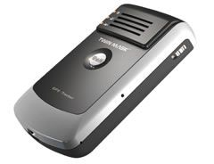

# Megastek - GT-89

El rastreador GPS Megastek GT-89 es un dispositivo de seguimiento de alta calidad que ofrece una amplia gama de características y funcionalidades. Con su tecnología SIM 900, este rastreador es compatible con las bandas de frecuencia 850/900/1800/1900 MHz, lo que le permite funcionar en la mayoría de las redes de telefonía móvil en todo el mundo.

Una de las características destacadas del GT-89 es su capacidad para realizar un seguimiento en tiempo real a través de la autorización de tres números de teléfono celular. Esto significa que puede recibir actualizaciones de ubicación en tiempo real y solicitar la ubicación del rastreador en cualquier momento.

El GT-89 también cuenta con un modo de ahorro de energía, lo que le permite prolongar la duración de la batería cuando no está en uso. Además, tiene un botón de SOS que permite una comunicación de audio bidireccional inmediata en caso de emergencia.

Otras características notables incluyen dos botones de marcación rápida para números de teléfono preestablecidos, advertencia de límite de velocidad, altavoz y micrófono incorporados, sensor de movimiento, advertencia de vigilancia de voz de fondo, advertencia de batería baja y memoria interna.

En resumen, el rastreador GPS Megastek GT-89 es una opción confiable y versátil para aquellos que buscan un dispositivo de seguimiento de alta calidad con una amplia gama de características y funcionalidades.

### Características destacadas:

- Tecnología SIM 900 compatible con bandas de frecuencia 850/900/1800/1900 MHz
- Autorización de tres números de teléfono celular para seguimiento en tiempo real
- Modo de ahorro de energía
- Botón de SOS para audio de dos vías y alarma de rescate
- Dos botones de marcación rápida para números de teléfono preestablecidos
- Advertencia de límite de velocidad
- Altavoz y micrófono incorporados
- Sensor de movimiento
- Advertencia de vigilancia de voz de fondo
- Advertencia de batería baja
- Memoria interna

