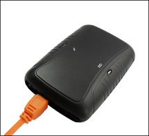

# Megastek - GT-99

El rastreador GPS Megastek GT-99 es un dispositivo confiable y versátil que utiliza el chipset GPS SiRF Star III y el chipset GSM SIM 900 para proporcionar un seguimiento preciso y en tiempo real. Con su capacidad de cuádruple banda \(850/900/1800/1900 MHz\), el GT-99 es compatible con redes de telefonía móvil en todo el mundo, lo que lo convierte en una opción ideal para su uso en diferentes países y regiones.

Una de las características destacadas del GT-99 es su capacidad para establecer hasta tres números de teléfono celular autorizados, lo que le permite recibir notificaciones y alertas importantes. Además, el rastreador ofrece varias funciones de seguridad, como el botón de SOS para el rescate y la alarma inmediata, las geo-cercas de alarma y la advertencia de límite de velocidad. Estas características garantizan la seguridad y la tranquilidad tanto para los usuarios como para sus activos.

El GT-99 también cuenta con un modo de ahorro de energía, que prolonga la duración de la batería y garantiza un uso prolongado sin necesidad de recargar. Además, el rastreador está equipado con un sensor de movimiento, que permite detectar cualquier movimiento no autorizado y enviar alertas al usuario. También cuenta con una función de advertencia "No GPS" y una advertencia de batería baja para garantizar un rendimiento óptimo en todo momento.

El GT-99 tiene un diseño compacto y ligero, con dimensiones de 80 \* 54 \* 21 mm y un peso neto de 80 g. Está disponible en dos colores: negro y gris plateado. El rastreador viene empaquetado en una caja de tamaño 18.5 \* 13 \* 9 cm, con un peso bruto de 550 g. El embalaje incluye 50 unidades por caja, y el tamaño total del cartón es de 67 \* 28 \* 47 cm.

