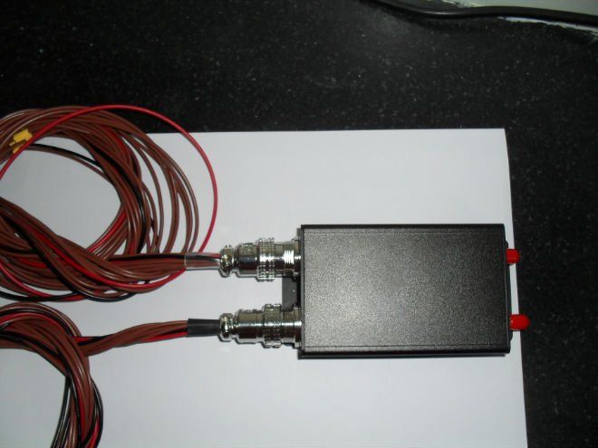

# Megastek - GVT-500

El Megastek GVT-500 es un rastreador GPS compacto y con múltiples funciones que integra chipsets Glonass y GPS para ofrecer reportes de ubicación precisos y fiables. Diseñado pensando en las necesidades prácticas de seguimiento de flotas y activos, el GVT-500 incluye en el dispositivo alertas configurables, botón SOS, corte remoto de combustible y electricidad, registro en micro SD y múltiples entradas y salidas para conectividad flexible y detección de eventos.

Como dispositivo compatible con Plaspy, el GVT-500 puede integrarse en un flujo de trabajo de gestión de flotas para mostrar ubicación, alarmas e información de eventos dentro de la plataforma Plaspy. Sus controles incorporados, soporte para varios números autorizados y alertas configurables de geocercas y exceso de velocidad lo convierten en una opción útil para organizaciones que requieren monitoreo remoto, acciones de seguridad y captura de datos históricos junto con las herramientas de visibilidad e informes de Plaspy.

## Características principales

- Posicionamiento GNSS dual mediante Glonass y GPS para mayor precisión en la localización
- Interfaz RS-232 y opciones flexibles de E/S para integrarse con sistemas y periféricos del vehículo
- Corte remoto de combustible y electricidad para mayor seguridad y control
- Botón SOS, alarma por geocercas, advertencia por exceso de velocidad y alertas de batería baja para una gestión proactiva de incidentes
- Registrador de datos en micro SD para grabación local de viajes y eventos
- Modo de ahorro de energía y hasta 5 números telefónicos autorizados para acceso controlado y operación prolongada

## Cómo funciona con Plaspy

Cuando se conecta a Plaspy, el GVT-500 entrega datos de ubicación y eventos que Plaspy puede mostrar, alertar y sumar a los informes históricos. Plaspy incorpora las posiciones y actualizaciones de estado del dispositivo para que los administradores y operadores de flota puedan monitorear activos en tiempo real y revisar actividades pasadas.

- Seguimiento de posición en tiempo real y visualización del historial de rutas dentro de los paneles de Plaspy
- Eventos de geocerca y exceso de velocidad del dispositivo mapeados a las alertas y notificaciones de Plaspy
- Eventos SOS y alarmas visibles para respuesta rápida del operador y registro de incidentes
- Registros del datalogger local que pueden utilizarse junto con los informes de Plaspy para reconstruir viajes y diagnósticos
- Eventos de corte remoto disponibles como acciones para los operadores mediante los controles y flujos de trabajo de Plaspy

## Casos de uso típicos

- Monitoreo de flotas comerciales y supervisión de rutas
- Rastreo de activos de alto valor con geocercas y disuasión del hurto
- Inmovilización remota de vehículos mediante la función de corte de combustible y electricidad
- Respuesta ante emergencias y monitoreo de seguridad personal a través de la función SOS
- Registro a largo plazo de viajes y auditorías usando el registrador en Micro SD

## Por qué elegir este rastreador con Plaspy

El GVT-500 combina funciones prácticas de rastreo con un manejo sencillo, lo que lo hace adecuado para organizaciones que requieren posicionamiento confiable y controles de seguridad. Su combinación de posicionamiento GNSS dual, capacidad de corte remoto y reporte de eventos se alinea bien con las fortalezas de Plaspy en visibilidad de flotas, generación de alertas e informes históricos.

Si bien los requisitos de despliegue pueden variar, el GVT-500 es una buena opción cuando la precisión del rastreo, las alarmas configurables y el registro local de datos son prioridades. Al integrarse con Plaspy, el rastreador soporta flujos de trabajo comunes de flotas como monitoreo en tiempo real, alertas de incidentes y análisis de viajes sin añadir complejidad innecesaria.

Para obtener más información sobre cómo el GVT-500 puede trabajar con Plaspy y si satisface sus necesidades operativas, visite https://www.plaspy.com. Las especificaciones y la disponibilidad del producto pueden cambiar con el tiempo, por lo que le recomendamos verificar los detalles actuales con el fabricante en https://www.megastek.com/ antes de tomar decisiones de compra o despliegue.
