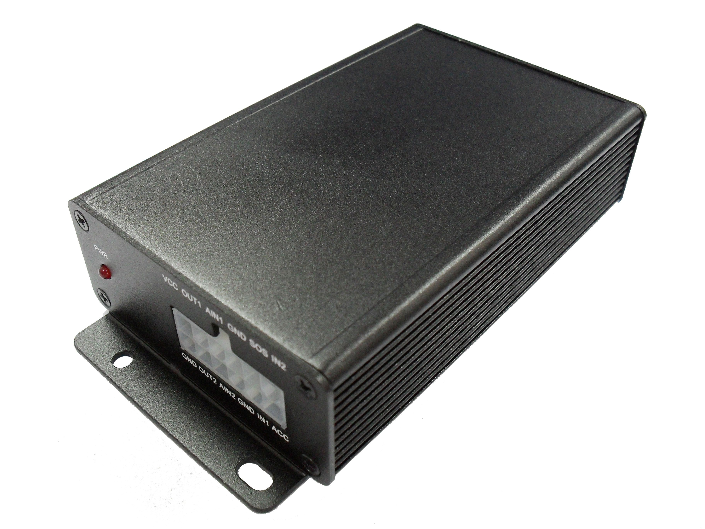

# Megastek - GVT-510

El Megastek GVT-510 es un rastreador GPS compacto y resistente diseñado para ofrecer monitoreo de ubicación preciso y confiable en aplicaciones personales y comerciales. Emplea el chipset SiRF Star III para posicionamiento exacto y un módulo GSM SIM900 para cobertura cuatribanda. El dispositivo admite varios modos de rastreo, funciones básicas de alarma como SOS y geo-cercas, detección de movimiento y registro de datos, por lo que es apropiado tanto para seguimiento continuo como para reportes intermitentes.

Como dispositivo compatible con Plaspy, el GVT-510 puede reportar posiciones y eventos a la plataforma Plaspy para la gestión unificada de flotas y activos. Sus funciones principales —ubicación en tiempo real, alertas configurables, registro en el dispositivo y múltiples entradas para señalización de eventos— se integran con las capacidades habituales de Plaspy para visibilidad, monitoreo e informes. Esta compatibilidad facilita que las organizaciones utilicen Plaspy para administrar activos rastreados con el GVT-510 sin alterar sus flujos operativos existentes.

## Características principales

- Posicionamiento GPS preciso con chipset SiRF Star III para informes de ubicación confiables
- Módulo GSM cuatribanda SIM900 para cobertura celular amplia en distintas regiones
- Varios modos de rastreo, incluyendo rastreo bajo demanda y activación desde teléfono móvil
- Botón SOS integrado, detección de movimiento, alarma de geocerca y alerta de exceso de velocidad para seguridad y supervisión
- Registro de datos en el dispositivo para conservar el historial de ubicaciones cuando no hay conectividad
- Tres entradas digitales y dos analógicas que permiten detección de eventos e integraciones con señales del vehículo
- Factor de forma compacto y resistente, apto para instalación oculta y diversos casos de uso

## Cómo funciona con Plaspy

Al conectarse a Plaspy, el GVT-510 envía actualizaciones de ubicación y eventos que la plataforma normaliza para visualización, alertas e informes. Plaspy puede aprovechar el flujo de posiciones y eventos del dispositivo para mostrar mapas en vivo, generar notificaciones y mantener registros históricos para análisis y cumplimiento.

- Visualización en mapas de las ubicaciones en tiempo real del GVT-510 en los paneles de Plaspy
- Alertas configurables en Plaspy para SOS, entrada o salida de geocercas y condiciones de exceso de velocidad
- Reproducción histórica y generación de informes usando datos registrados en el GVT-510 y recibidos por Plaspy
- Monitoreo a nivel de flota y vistas de estado para seguir la utilización y el movimiento de activos
- Gestión de eventos y notificaciones enviadas vía Plaspy a equipos operativos o supervisores
- Uso de eventos de entradas digitales y analógicas para activar flujos de trabajo o cambios de estado dentro de Plaspy

## Casos de uso típicos

- Rastreo de vehículos para flotas comerciales pequeñas y medianas
- Protección y recuperación de activos portátiles o de alto valor
- Monitoreo de vehículos de alquiler y supervisión de estado
- Seguridad de conductores y protección de trabajadores en solitario usando SOS y detección de movimiento
- Visibilidad logística y de entregas para monitoreo de rutas y gestión de excepciones

## Por qué elegir este rastreador con Plaspy

El GVT-510 combina funciones prácticas de rastreo con un formato compacto, lo que lo convierte en una opción sensata para organizaciones que requieren informes de ubicación confiables y alertas configurables. La combinación de posicionamiento satelital preciso, amplia cobertura celular y registro en el dispositivo favorece el monitoreo continuo y la resiliencia cuando la conectividad es intermitente.

Usado junto con Plaspy, el GVT-510 puede integrarse en una solución de monitoreo unificada que combina visibilidad en vivo, alertas y reportes históricos. Esta sinergia ayuda a los equipos operativos a reducir revisiones manuales y a responder más rápido ante incidentes, manteniendo un rastro de auditoría claro de movimientos y eventos.

Para obtener más información sobre Plaspy y cómo el GVT-510 puede integrarse en su solución de rastreo visite https://www.plaspy.com. Las especificaciones y la disponibilidad del producto pueden cambiar con el tiempo, por lo que le recomendamos verificar los detalles técnicos y las opciones actuales con la documentación del fabricante en https://www.megastek.com/ antes de tomar decisiones de compra o despliegue.
