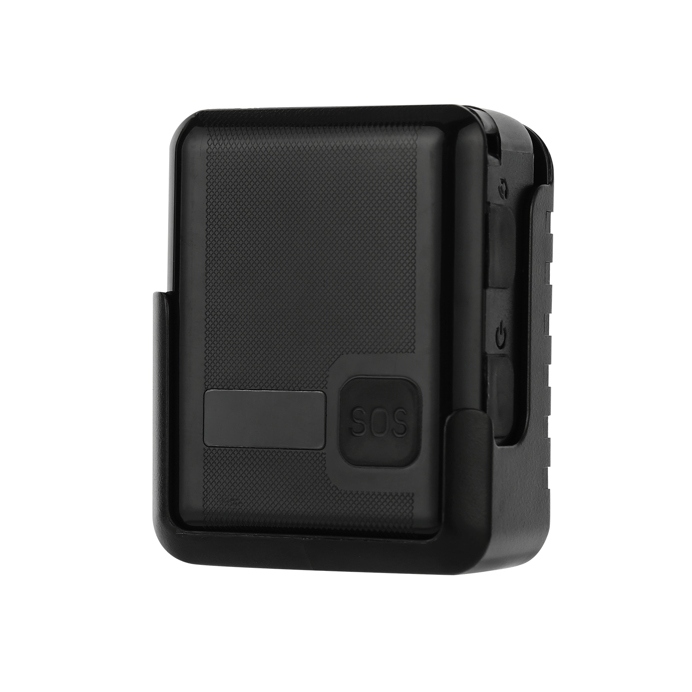

# Megastek - MT100

El MT100 es un rastreador GPS personal 4G compacto de Megastek, pensado para protección personal, personal de seguridad y aplicaciones de seguridad pública. Integra posicionamiento multimodal, una carcasa resistente con certificación IP67, comunicación de voz bidireccional y alertas SOS, proporcionando localización en tiempo real y señalización de incidentes fiable tanto en exteriores como en entornos interiores mixtos.

Como dispositivo compatible con Plaspy, el MT100 puede enviar posiciones, alarmas de eventos y estado del equipo a Plaspy para un monitoreo centralizado y supervisión operativa. Su protocolo abierto y el soporte para actualizaciones de firmware remotas facilitan la integración con los paneles, las reglas de alerta y los flujos de informe de Plaspy, ideal para equipos que requieren funciones de rastreo y seguridad confiables.

## Aspectos destacados

- Compatible con Plaspy y con documentación de protocolo abierto que simplifica la integración para seguimiento y alertas en tiempo real.
- Posicionamiento multimodal que aprovecha GNSS y métodos asistidos para mejorar las fijaciones de ubicación en entornos difíciles.
- Voz bidireccional y alarma de emergencia SOS para comunicación directa y notificación rápida de incidentes.
- Carcasa resistente IP67 con carga inalámbrica y larga autonomía en espera para uso continuo en campo.
- Detección de movimiento integrada y alarma por vibración para apoyar flujos de trabajo contra robo y manipulación.
- Alertas configurables, incluyendo coordenadas SOS y notificaciones de geocerca, para destacar eventos críticos en Plaspy.
- Funciones de gestión remota para actualizaciones de firmware y configuración que reducen la carga de mantenimiento.

## Cómo funciona con Plaspy

Integrado con Plaspy, el MT100 entrega un flujo continuo de ubicaciones y eventos que Plaspy muestra en mapas, líneas de tiempo e informes. Plaspy puede usar esa información para activar reglas de geocercas, notificaciones a respondedores y reproducciones históricas, de modo que los equipos mantengan conciencia situacional y control operativo.

- Ubicación y telemetría en tiempo real mostradas en los mapas de Plaspy para monitoreo en vivo y revisión de rutas.
- Alertas SOS enviadas a Plaspy para notificar a los respondedores designados y registrar coordenadas del incidente.
- Eventos de geocerca, movimiento o vibración reportados a Plaspy para soportar detección de robo y manipulación.
- Registros y correlación de llamadas de voz y eventos de monitoreo cuando se capturan metadatos de voz.
- Actualizaciones de firmware remotas y cambios de configuración simplificados para mantener los dispositivos alineados con los requisitos de reporte de Plaspy.

## Casos de uso típicos

- Seguridad personal y protección de trabajadores solitarios mediante alertas SOS y seguimiento en vivo para una respuesta rápida.
- Seguimiento de equipos de seguridad y personal de seguridad pública para gestionar patrullas y coordinar recursos.
- Protección de activos y monitoreo anti robo para equipos portátiles y objetos de valor.
- Operaciones y seguridad en eventos donde se requieren rastreadores compactos e impermeables para el personal en entornos mixtos.
- Implementaciones gestionadas y mantenimiento remoto de dispositivos usando actualizaciones por aire y control centralizado.

## Por qué elegir este rastreador con Plaspy

El MT100 combina características de hardware prácticas con soporte de protocolo amigable para la integración, lo que lo convierte en una opción adecuada para organizaciones que necesitan rastreo personal confiable y señalización de incidentes. Su combinación de posicionamiento multimodal, SOS y voz bidireccional ayuda a mantener la visibilidad del personal y los activos, mientras que las opciones de gestión remota reducen el trabajo de mantenimiento para los administradores.

Para obtener más información sobre cómo se puede usar este rastreador con Plaspy visite https://www.plaspy.com. Las especificaciones y la disponibilidad del producto pueden cambiar con el tiempo, por lo que por favor verifique los detalles actuales en el sitio del fabricante https://www.megastek.com/ antes de la compra o el despliegue.
