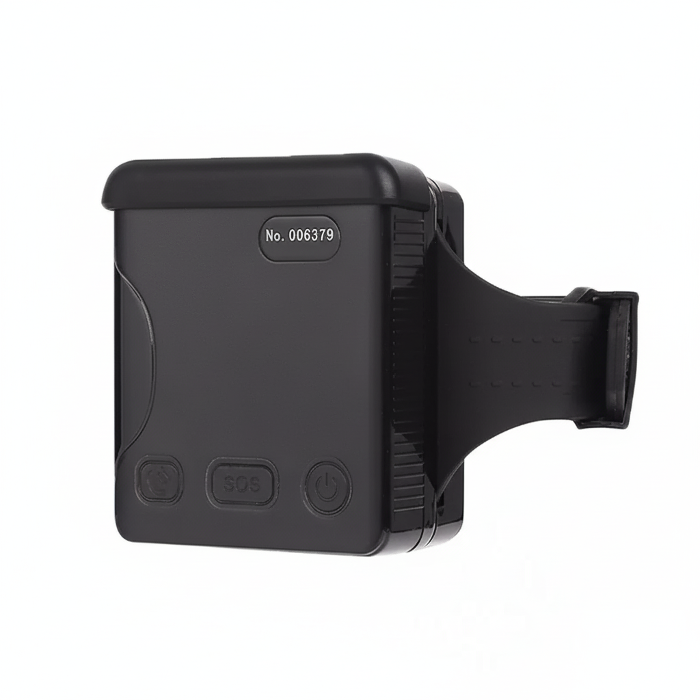

# Megastek - MT200X

El MT200X Prisoner Tracking Ankle es un rastreador GPS de muñeca robusto, diseñado para supervisión y monitoreo electrónico continuo. Construido específicamente para el monitoreo de liberados condicionales y de prisioneros, el MT200X combina posicionamiento GNSS de alta sensibilidad Ublox y un módulo celular SIMCOM7600 con hardware endurecido, proporcionando seguimiento en tiempo real fiable y telemetría compatible con Plaspy en entornos exigentes.

El dispositivo admite posicionamiento multímodo \(GPS + LBS + A‑GPS + Wi‑Fi\), amplias bandas celulares 2G/3G/4G LTE‑FDD y una batería de larga duración de 1900 mAh que mantiene más de 35 horas de funcionamiento con un intervalo de informe de 1 minuto. Con voz bidireccional, detección de manipulación, geocercas y alertas configurables, el MT200X se integra sin problemas con Plaspy y otras plataformas de rastreo para proporcionar inteligencia de ubicación segura y accionable para programas de corrección y escenarios de transporte seguro.

## Principales características

- Rastreador GPS compatible con Plaspy diseñado específicamente para monitoreo electrónico y supervisión de libertad condicional.
- Posicionamiento multímodo \(GPS + LBS + A‑GPS + Wi‑Fi\) para una localización fiable en exteriores y mejorada en interiores.
- Amplia cobertura celular vía SIMCOM7600: 2G, 3G y extensas bandas 4G LTE‑FDD para conectividad global y rastreo en tiempo real.
- Diseño duradero y compacto \(70 × 64 × 20 mm, 242 g\) con correa de acero inoxidable y informes de pruebas con grado IP68.
- Batería de polímero de 1900 mAh \(3.8 V\) con tiempo de funcionamiento típico >35 horas a intervalos de reporte de 1 minuto.
- Funciones de seguridad que incluyen botón SOS, alarmas de manipulación y de corte de correa, sirena ruidosa y voz bidireccional y monitorización de voz.
- Modos de seguimiento flexibles \(ahorro de energía, vehículo, inteligente\), geocercas, alertas de batería baja y registro de datos GPRS para trazabilidad de auditoría.
- Cargador inalámbrico opcional y estación base Wi‑Fi para mejorar la localización en interiores y en casa, y una carga sencilla en campo.

## Cómo funciona con Plaspy

Cuando se integra con Plaspy, el MT200X se convierte en un nodo totalmente gestionado dentro de un ecosistema de monitoreo seguro. El rastreador transmite correcciones GNSS y telemetría a través de datos celulares a la plataforma de Plaspy, donde los administradores pueden ver la ubicación en tiempo real, recibir alertas de estado y generar informes históricos de movimientos. El mapeo de protocolos compatible con Plaspy y la integración de protocolos OEM facilitan la configuración, de modo que las agencias pueden aplicar reglas, geocercas y flujos de notificación de forma rápida.

- Actualizaciones de ubicación y telemetría en tiempo real enviadas sobre 2G/3G/4G a Plaspy para monitoreo continuo.
- La voz bidireccional y la monitorización de voz permiten comunicaciones supervisadas y captura de pruebas cuando se requiera.
- Geocercas, alarmas de golpe/impacto y alarmas de manipulación o corte de la correa envían alertas inmediatas a Plaspy para la respuesta a incidentes.
- Notificaciones de batería y de carga baja, y telemetría de estado del dispositivo permiten la escalada automatizada y los flujos de mantenimiento.
- El soporte de estación base Wi‑Fi mejora la localización en interiores y en casa, y se integra con la fusión de ubicaciones de Plaspy para una mayor precisión.

## Resumen técnico

| Conectividad | Módulo SIMCOM7600; posicionamiento multímodo \(GPS + LBS + A‑GPS + Wi‑Fi\) |
| --- | --- |
| Bandas | 2G GSM 900/1800; 3G WCDMA B1/B2/B5/B8; 4G LTE‑FDD B1/B2/B3/B4/B5/B7/B8/B12/B13/B18/B19/B20/B26/B28 |
| Potencia y Batería | Batería de polímero de 1900 mAh \(3.8 V\); tiempo de funcionamiento típico >35 horas a intervalo de informe de 1 minuto |
| Interfaces y Controles | Botón SOS, botón de encendido, LEDs de estado \(power/GPS/GSM\), voz bidireccional, sirena alta, alarmas de manipulación / corte de correa |
| GNSS | Chipset GPS Ublox; alta sensibilidad –160 dB para una recepción satelital fiable |
| Wi‑Fi | 2.4–2.4835 GHz para posicionamiento asistido por Wi‑Fi y localización opcional por estación base |
| Datos e Integración | Registrador de datos GPRS; personalización OEM e integración de protocolos; compatible con múltiples plataformas de rastreo de terceros |
| Forma y Medio Ambiente | Dimensiones 70 × 64 × 20 mm; peso 242 g; rango de temperatura de operación −20 °C a +55 °C; correa de acero inoxidable |

## Casos de uso

- Monitoreo electrónico para liberados condicionales y detenidos, con rastreo en tiempo real continuo, geocercas y alertas.
- Supervisión de transporte seguro para traslados de reclusos o escoltas de custodia donde se requiera voz bidireccional y telemetría.
- Confinamiento en el hogar y refuerzo del cumplimiento de horarios con soporte de estación base Wi‑Fi para mayor precisión en interiores.
- Respuesta a incidentes y detección de manipulación: alertas instantáneas por corte de correa, impactos y activaciones de SOS dirigidas a Plaspy.
- Informes de auditoría y cumplimiento mediante registro de datos GPRS y consultas históricas de seguimiento para la gestión de casos.

## Por qué elegir este rastreador con Plaspy

El MT200X combina hardware de rastreo endurecido y una pila GNSS celular madura con la flexibilidad de integración que esperan los usuarios de Plaspy. Su batería de larga duración, la alta sensibilidad GNSS y el posicionamiento multímodo proporcionan un seguimiento en tiempo real y telemetría confiables, mientras que las características de seguridad como alarmas de manipulación, voz bidireccional y una sirena ruidosa respaldan las necesidades operativas en entornos correccionales. El registro GPRS integrado, la personalización de protocolos y la compatibilidad con plataformas de la industria agilizan el despliegue y permiten escalar a través de programas de monitoreo.

Para agencias y proveedores de servicios que buscan un rastreador GPS compatible con Plaspy que combine durabilidad, características de seguridad y reportes de ubicación precisos, el MT200X está optimizado para un funcionamiento continuo en condiciones desafiantes y para los flujos de trabajo de cumplimiento de los modernos programas de monitoreo electrónico.

