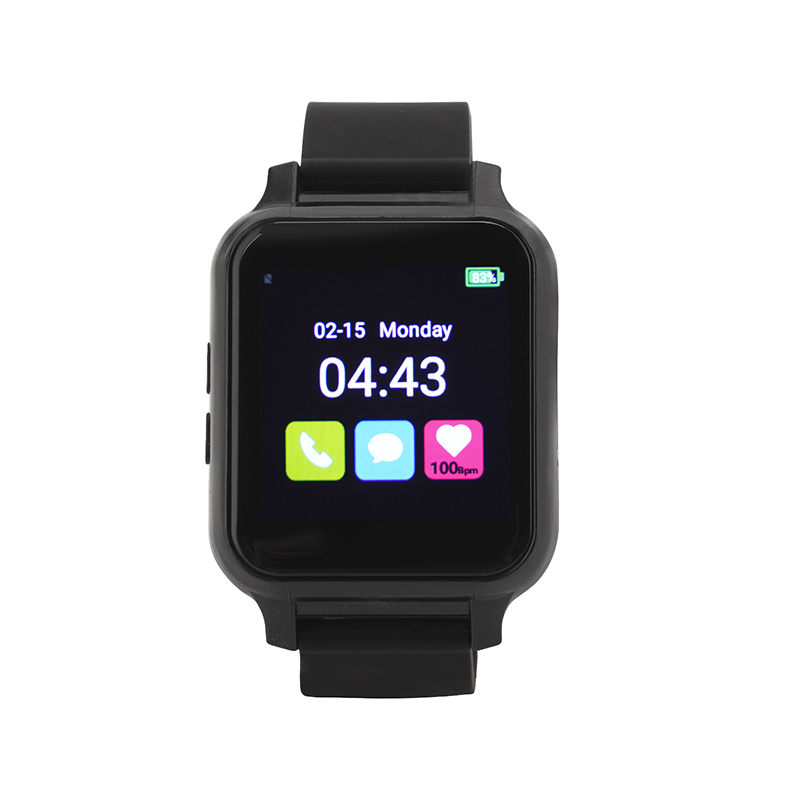

# Megastek - MT400

El Megastek MT400 ECG Medical Watch es un rastreador GPS wearable diseñado para combinar monitorización continua de la salud con servicios de localización confiables. Pensado para pacientes, adultos mayores y flujos de trabajo de atención remota, el MT400 captura la forma de onda del ECG y el ritmo cardiaco continuo, además de ofrecer reporte de posición y comunicación de voz bidireccional en un dispositivo de muñeca compacto. Su diseño prioriza la visibilidad simultánea de señales de salud personal y de movimiento para cuidadores y equipos operativos.

Como dispositivo compatible con Plaspy, el MT400 puede transmitir ubicación y telemetría médica a Plaspy para un monitoreo y respuesta unificados. Su compatibilidad con plataformas y la posibilidad de personalizar protocolos lo hacen adecuado para integrarse con Plaspy, permitiendo a cuidadores y equipos de despacho ver la ubicación en tiempo real, recibir alertas médicas y mantener registros históricos dentro de un único entorno de supervisión.

## Características principales

- Telemetría de grado médico en movimiento con captura de la forma de onda del ECG y monitorización continua del ritmo cardiaco.
- Compatible con Plaspy mediante personalización de protocolos e interfaces estándar de rastreo para una integración sencilla.
- Posicionamiento híbrido para mejorar la cobertura en interiores y exteriores y asegurar un seguimiento de ubicación fiable.
- Funciones de emergencia como SOS, detección de caídas y voz bidireccional para contacto rápido con el cuidador.
- Soporte múltiple de conectividad, incluyendo celular, Wi Fi y Bluetooth 4.0 para mantener la entrega de datos en condiciones variadas.
- Factor de forma wearable pensado para uso de pacientes y adultos mayores, con pantalla táctil a color y controles accesibles.

## Cómo funciona con Plaspy

Cuando se conecta a Plaspy, el MT400 ofrece una vista combinada de ubicación y telemetría de salud para que los equipos de monitoreo puedan actuar tanto sobre eventos médicos como de movimiento. Plaspy ingiere los mensajes de reporte del reloj y los presenta junto con otros activos para apoyar la supervisión operativa y los flujos de trabajo de los cuidadores.

- Actualizaciones de ubicación en tiempo real e historial de posiciones para rastrear movimiento y revisar rutas.
- Transmisión continua de ritmo cardiaco y forma de onda del ECG para activar alertas médicas y registrar eventos.
- SOS y detección de caídas canalizados a Plaspy para notificaciones inmediatas y procesos de escalamiento.
- Voz bidireccional y monitoreo de audio disponibles mediante la integración con la plataforma para facilitar la comunicación directa.
- Alertas de geocerca y notificaciones configurables por incumplimiento de perímetros y reglas basadas en ubicación.

## Casos de uso típicos

- Monitorización remota de pacientes con datos continuos de ECG y ritmo cardiaco accesibles para los equipos de cuidado.
- Seguridad de adultos mayores y entornos de vida asistida que emplean detección de caídas y alertas SOS para una respuesta rápida.
- Atención domiciliaria móvil y enfermería comunitaria donde se requiere visitas con conciencia de ubicación y monitoreo de condición.
- Estudios clínicos que requieren captura de ECG con marca de tiempo combinada con contexto de ubicación para análisis de eventos.
- Seguridad personal para usuarios vulnerables y trabajadores solitarios con compartición de posición en tiempo real y alertas.

## Por qué elegir este rastreador con Plaspy

El MT400 es una opción práctica para organizaciones que necesitan converger telemetría de salud y seguimiento de ubicación en una sola plataforma. Su formato wearable y sus capacidades de telemetría médica permiten a los usuarios de Plaspy monitorear eventos fisiológicos junto con el movimiento, ayudando a cuidadores y equipos operativos a priorizar respuestas y conservar historiales del paciente sin manejar sistemas separados.

Al estar diseñado para interoperar con plataformas y ofrecer opciones de personalización, la integración del MT400 en despliegues Plaspy suele soportar flujos de trabajo comunes de rastreo, como mapas en vivo, enrutamiento de alarmas e informes históricos. Para equipos que requieren tanto monitoreo de seguridad personal como visibilidad operativa más amplia, el MT400 puede complementar otros rastreadores de activos dentro de Plaspy para crear una solución de monitoreo unificada.

Learn more about how Plaspy can work with compatible devices like the MT400 at https://www.plaspy.com. Product specifications, availability, and manufacturer details can change over time; please verify current information on the manufacturer site https://www.megastek.com/ before making deployment decisions.
