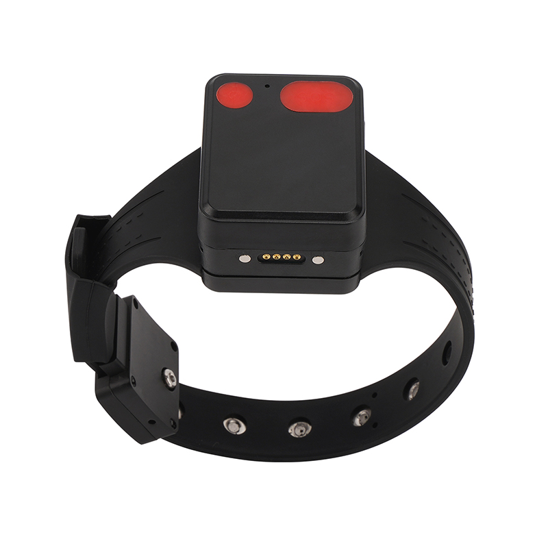

# Megastek - MT60PRO

El Megastek MT60PRO 4G Parolee Tracking Ankle es un rastreador GPS para tobillo, resistente, diseñado para correcciones y supervisión comunitaria. Diseñado para un monitoreo seguro de liberados condicionales y presos, el MT60PRO es compatible con Plaspy e integra posicionamiento en múltiples modos, detección de manipulación, voz bidireccional y controles remotos de bloqueo/desbloqueo para ofrecer rastreo en tiempo real y supervisión a través de los programas correccionales.

Con IP68 protección de entrada y una pulsera reforzada con ajuste patentado, el MT60PRO se centra en la seguridad del usuario y en la resiliencia ante manipulación, al tiempo que proporciona telemetría e informes de eventos que se integran directamente con Plaspy para la gestión de casos, alertas e informes. Las agencias pueden usar el MT60PRO con Plaspy para centralizar datos de ubicación, alarmas y estado de la persona supervisada en una única interfaz.

## Aspectos Clave

- Compatibilidad con Plaspy — integra ubicación, alarmas y telemetría de voz en los paneles y flujos de trabajo de Plaspy para una supervisión más eficiente.
- Diseño robusto y resistente a manipulaciones — clasificación IP68 a prueba de agua y pulsera reforzada que resiste cortes y exposición ambiental.
- Posicionamiento en múltiples modos — GPS \(U‑blox\), AGPS, Wi‑Fi y posicionamiento híbrido LBS para un rastreo en tiempo real robusto incluso en entornos con señales mixtas.
- Cierre físico y electrónico seguro — llave mecánica dedicada y comandos electrónicos de bloqueo/desbloqueo remotos para una gestión controlada del dispositivo.
- Voz bidireccional y monitoreo remoto — monitoreo de voz a distancia y comunicación bidireccional para verificaciones de bienestar y verificación de cumplimiento.
- Conjunto completo de alarmas — geovalla, SOS, batería baja, manipulación por corte de correa/encendido-apagado y alarma de sirena, con registro GPRS en Plaspy.
- Opciones de alimentación prácticas — batería integrada de 1500 mAh, soporte de carga inalámbrica y una base de batería móvil opcional que extiende la operación en 3–4 días.

## Cómo funciona con Plaspy

Cuando se empareja con Plaspy, el MT60PRO transmite datos de posicionamiento y estado a la plataforma para seguimiento en tiempo real, alertas automáticas y telemetría histórica. Plaspy ingiere la posición GPS+LBS+AGPS+Wi‑Fi del dispositivo y los registros de datos GPRS para mostrar trazas de ubicación, activar reglas de cumplimiento y notificar a los supervisores de los eventos. Los comandos desde Plaspy \(como bloqueo/desbloqueo electrónico o actualizaciones de configuración\) pueden ser enviados al MT60PRO para gestión remota.

- Actualizaciones de ubicación y telemetría en tiempo real \(GPS U‑blox + AGPS + LBS + posicionamiento híbrido Wi‑Fi\).
- Las alertas de manipulación y de corte de correa se reportan de inmediato a Plaspy para respuestas anti‑robo y de cumplimiento.
- Los eventos de geovalla y las alarmas SOS de emergencia generan notificaciones instantáneas a Plaspy y capturas de ubicación.
- Comandos de bloqueo/desbloqueo remotos y monitoreo de voz remoto permiten el control de la persona supervisada y verificaciones de bienestar.
- El registro de datos GPRS y las cargas periódicas permiten a Plaspy generar informes históricos de movimientos y trazas de auditoría.

## Resumen Técnico

| Conectividad | Celular 2G/3G/4G \(GPRS para registro de datos\); Wi‑Fi 802.11 b/g/n |
| --- | --- |
| Bandas | 2G: 900/1800 MHz; 3G WCDMA: B1/B2/B5/B8; 4G LTE‑FDD: B1/B2/B3/B4/B5/B7/B8/B12/B13/B18/B19/B20/B26/B28 |
| Posicionamiento \(GNSS\) | GPS \(chip U‑blox\) con AGPS; posicionamiento híbrido que incluye LBS y Wi‑Fi |
| Alimentación y batería | 1500 mAh 3.8V de batería de polímero de litio; base de batería móvil opcional extiende la operación en ~3–4 días; admite carga inalámbrica |
| Durabilidad | Clasificación IP68 a prueba de agua; pulsera reforzada y carcasa resistente a manipulaciones |
| Interfaces y alarmas | Cierre mecánico seguro + comandos de bloqueo/desbloqueo electrónicos; SOS, manipulación por corte de correa/encendido-apagado, batería baja, geovalla, alarma de sirena, voz bidireccional, monitoreo de voz remoto; registro de datos GPRS |
| Bluetooth | No especificado en la descripción del fabricante \(no se mencionan sensores Bluetooth\) |
| Gestión remota y compatibilidad | Compatible con múltiples plataformas de seguimiento de terceros \(ejemplos: TeraTrack, Navixy, iTrack.live, Gurtam, Traccar, Geotrucks\); se integra con Plaspy para telemetría, alertas e informes |
| Factor de forma | Unidad de monitorización electrónica para tobillo; pulsera reforzada con ajuste patentado; aproximadamente 55 × 43 × 28 mm; peso neto ≈ 175 g |

## Casos de uso

- Supervisión de liberados condicionales y libertad condicional — seguimiento continuo en tiempo real, aplicación de geovalla y comprobaciones de estado gestionadas a través de Plaspy.
- Corrections y programas de detención electrónica — detección de manipulación, bloqueo seguro y monitoreo de voz para una supervisión comunitaria segura.
- Detención en el hogar y monitoreo electrónico del hogar — usar con una base Wi‑Fi doméstica y reglas de Plaspy para hacer cumplir el toque de queda y las restricciones de ubicación.
- Aplicación de cumplimiento y respuesta a incidentes — alertas SOS, sirena y notificaciones inmediatas de manipulación dirigidas a Plaspy para intervenciones rápidas.
- Gestión de programas basada en datos — telemetría GPRS y historiales registrados respaldan auditorías, informes y revisiones de casos dentro de Plaspy.

## Por qué elegir este rastreador con Plaspy

El MT60PRO está diseñado específicamente para una supervisión electrónica segura y escalable. Su hardware resistente a manipulaciones, su carcasa impermeable y su posicionamiento híbrido ofrecen un rastreo en tiempo real confiable y un historial de ubicación forense esencial para los programas de corrección. Emparejado con Plaspy, las agencias obtienen telemetría centralizada, alertas automatizadas y capacidad de comandos, reduciendo las comprobaciones manuales y mejorando los tiempos de respuesta. Las opciones de bloqueo/desbloqueo remoto, voz bidireccional y accesorios \(cargador inalámbrico, base de batería móvil, cerradura inteligente y base para uso en casa\) hacen de este dispositivo una opción flexible para programas que requieren alta confiabilidad y trazas de auditoría claras.

Nota sobre características orientadas a vehículos: el MT60PRO es un rastreador GPS personal para tobillo y no enumera interfaces de encendido de vehículo, inmovilizador o monitoreo de combustible en la descripción del fabricante. Las agencias que necesiten telemetría para vehículos y gestión de flotas pueden dirigir los datos de ubicación del MT60PRO a Plaspy junto con rastreadores de vehículos para crear vistas unificadas de gestión y supervisión de la flota.

