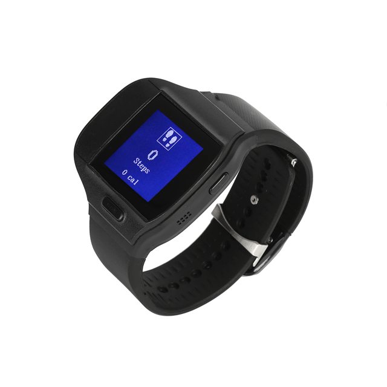

# Megastek - MT80T

El MT80T es un rastreador GPS de grado médico compacto presentado en formato de pulsera inteligente, diseñado para monitorización continua de la salud y seguimiento fiable de la ubicación personal. Según la descripción del fabricante, incorpora un receptor GNSS Ublox de alta sensibilidad y conectividad celular multimodal para ofrecer posicionamiento en tiempo real junto con telemetría fisiológica continua. Su diseño wearable, construcción impermeable y funciones SOS lo hacen adecuado para el uso diario cuando se requiere visibilidad constante y respuesta rápida ante incidentes.

Como dispositivo compatible con Plaspy, el MT80T se integra en flujos de trabajo de monitoreo centralizados para consolidar datos de ubicación, eventos y telemetría de salud en una sola plataforma. Esta compatibilidad lo hace útil para organizaciones y cuidadores que usan Plaspy para tableros consolidados, alertas automáticas e informes históricos, proporcionando tanto conciencia situacional como registros para supervisión operativa.

## Aspectos destacados

- Monitorización fisiológica de grado médico con telemetría continua de frecuencia cardíaca, SpO2 y temperatura corporal para atención proactiva.
- Compatible con Plaspy para tableros centralizados, alertas basadas en reglas e informes históricos consolidados.
- Receptor GNSS Ublox de alta sensibilidad para fijaciones de posición fiables y registro de rutas.
- Conectividad celular multimodal que permite despliegues en diversos entornos de red.
- Funciones orientadas a la seguridad como botón SOS, detección de caídas y alarma por desconexión de la pulsera.
- Diseño wearable durable con resistencia al agua y carga inalámbrica para uso diario.

## Cómo funciona con Plaspy

Al conectarse a Plaspy, el MT80T transmite actualizaciones de posición, notificaciones de eventos y lecturas de sensores de salud a la plataforma Plaspy para que administradores y equipos de respuesta puedan supervisar la actividad desde una única interfaz. Plaspy puede aplicar reglas y flujos de trabajo a esas entradas para generar alertas, almacenar historial y ofrecer vistas operativas para los equipos.

- Actualizaciones de ubicación en tiempo real y registro histórico de rutas visibles en los mapas y líneas de tiempo de Plaspy.
- Alertas automáticas por pulsaciones del botón SOS, detección de caídas y retiro de la pulsera, dirigidas a operadores y cuidadores.
- Visibilidad de la telemetría para apoyar la conciencia situacional y los informes de tendencias de los usuarios monitorizados.
- Disparadores por geocerca y notificaciones basadas en ubicación para monitoreo de perímetros o rutas.
- Voz bidireccional y eventos de alarma mostrados en Plaspy para permitir una respuesta rápida y contacto directo.

## Casos de uso típicos

- Monitoreo de adultos mayores que combina signos vitales continuos y seguimiento de ubicación para cuidadores remotos.
- Seguridad laboral para trabajadores aislados que necesitan visibilidad de ubicación y alertas de emergencia.
- Seguridad personal y vigilancia de liberados condicionales donde se requiere detección de manipulación y alertas por geocercas.
- Programas de salud y coordinación clínica en los que importa la ubicación etiquetada y la telemetría con sello de tiempo.
- Actividades al aire libre y viajes que requieren un rastreador wearable, impermeable y con registro persistente.

## Por qué elegir este rastreador con Plaspy

El MT80T combina sensores médicos wearables con un diseño compacto y resistente, lo que lo convierte en una opción práctica para programas que necesitan tanto telemetría de salud como visibilidad de ubicación en tiempo real. Usado con Plaspy, los eventos del dispositivo y los datos de sensores se consolidan en una sola vista operativa, lo que permite a los equipos configurar alertas, revisar historiales de incidentes y gestionar flujos de respuesta sin depender de sistemas separados.

Si desea conocer más sobre cómo Plaspy soporta dispositivos como el MT80T, visite el sitio principal de Plaspy en https://www.plaspy.com. Las especificaciones del producto, la disponibilidad y los detalles del fabricante pueden cambiar con el tiempo, por lo que le recomendamos verificar la información técnica actual en el sitio del fabricante https://www.megastek.com/ antes de tomar decisiones de compra o despliegue.
