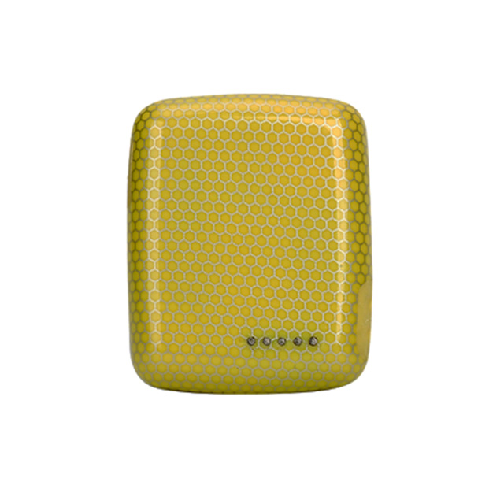

# Megastek - MT90N

El MT90N es un rastreador GPS personal NB IoT compacto diseñado para la seguridad personal y el monitoreo de activos ligeros. Combina posicionamiento GNSS con asistencia por Wi‑Fi y LBS para mejorar el rendimiento de ubicación en entornos difíciles. El equipo incluye un botón SOS dedicado, protección robusta contra el agua y comportamiento de reporte configurable, ideal para niños, personas mayores, mascotas y trabajadores que laboran solos.

Como dispositivo compatible con Plaspy, el MT90N puede enviar datos de ubicación y eventos a Plaspy para ofrecer visibilidad en tiempo real, generar alertas y reproducir históricos. Su conectividad NB IoT de bajo consumo y su posicionamiento multimodal lo convierten en una opción práctica cuando necesita actualizaciones persistentes de ubicación, notificaciones de emergencia e integración sencilla en flujos de trabajo de monitoreo o gestión basados en Plaspy.

## Aspectos clave

- Compatible con Plaspy para monitoreo unificado de ubicaciones y eventos en toda su implementación.
- Posicionamiento multimodal que combina GNSS con asistencia por Wi‑Fi y LBS para mejorar la precisión en interiores y zonas urbanas.
- Conectividad NB IoT diseñada para reportes de área amplia y bajo consumo con mayor standby.
- Diseño resistente con protección contra agua y polvo, adecuado para uso personal y de activos en exteriores.
- Botón SOS dedicado e indicadores de estado para alertas inmediatas y diagnóstico simple.
- Intervalos de reporte configurables además de soporte para geocercas y alertas por batería baja para control operativo.

## Cómo funciona con Plaspy

Cuando el MT90N envía posiciones y mensajes de eventos, Plaspy procesa esos flujos y los presenta en tiempo real para los operadores. Plaspy puede entonces generar alertas, registrar el historial de movimientos e integrar los datos del MT90N junto con la telemetría de otros activos para apoyar las tareas de monitoreo e informes.

- Seguimiento en tiempo real e intervalos de reporte configurables para visibilidad continua en Plaspy.
- Notificaciones SOS y de emergencia dirigidas a Plaspy para que los equipos puedan responder con rapidez.
- Eventos de geocerca y alertas de batería baja entregados en Plaspy para notificaciones automatizadas.
- Reproducción de rutas históricas y registros disponibles en Plaspy para revisión y análisis.
- Combine las transmisiones de ubicación del MT90N con otros activos en los tableros de Plaspy para una supervisión consolidada.

## Casos de uso típicos

- Seguridad infantil y supervisión por parte de tutores con alertas SOS e historial de ubicaciones.
- Cuidado de personas mayores y protección de trabajadores solitarios donde se requiere señalización de emergencia simple y reportes periódicos.
- Monitoreo de mascotas para recuperación de ubicación y alertas por límites virtuales mediante geocercas.
- Seguimiento temporal de vehículos o unidades de alquiler cuando se necesita rastreo por tiempo limitado.
- Rastreo de activos ligeros para equipos portátiles que se benefician de protección impermeable y diseño compacto.

## Por qué elegir este rastreador con Plaspy

El MT90N es una opción práctica para organizaciones que usan Plaspy y requieren un rastreador compacto de bajo consumo con posicionamiento fiable y señalización de emergencia. Su combinación de GNSS, asistencia por Wi‑Fi y LBS reduce el tiempo hasta la primera fijación en entornos complejos, mientras que la conectividad NB IoT permite un mayor tiempo de standby entre reportes. Las alertas integradas de SOS, geocerca y batería hacen que el dispositivo sea adecuado para escenarios de seguridad personal y monitoreo de activos ligeros.

Si desea evaluar el MT90N para su implementación con Plaspy, este rastreador ofrece un conjunto equilibrado de funciones para ubicación en tiempo real, alertas y reproducción histórica sin necesidad de hardware específico para vehículos. Obtenga más información sobre Plaspy en el sitio web principal https://www.plaspy.com. Las especificaciones y la disponibilidad del producto pueden cambiar con el tiempo, así que verifique los detalles técnicos actuales e información del fabricante en https://www.megastek.com/ antes de la compra.
