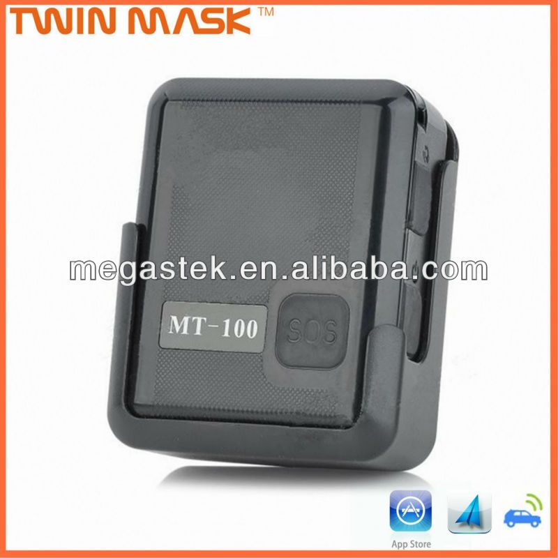

# Megastek - MT-100

El rastreador GPS Megastek MT-100 ha sido especialmente desarrollado para funcionar en entornos hostiles. Cuenta con un módulo de GPS de alta sensibilidad U-blox y un módulo de comunicación GSM de banda cuádruple que funciona en todo el mundo. Además, es compatible con el posicionamiento AGPS y el posicionamiento basado en estaciones base LBS asistido.

Este rastreador se puede fijar fácilmente a un cinturón o una pulsera con tornillos para evitar que se suelte accidentalmente. Además, cuenta con una función de alarma que puede enviar notificaciones a los teléfonos autorizados y al software de seguimiento en caso de intentos de desprender el rastreador o cortar la pulsera \(la pulsera especial debe ser adquirida por separado\). También puede ser utilizado en modo de vigilancia para prolongar la duración de la batería.

Características destacadas:

- Modo de ahorro de energía para una larga duración de la batería.
- Posibilidad de configurar hasta 5 números de teléfono celular autorizados.
- Seguimiento en tiempo real a través de teléfono móvil y sistema de seguimiento en línea.
- Alarma SOS para situaciones de emergencia.
- Alarma de Geo-cerca para recibir notificaciones cuando el rastreador sale de una zona predefinida.
- Alarma de límite de velocidad para recibir alertas cuando el rastreador excede una velocidad establecida.
- Alarma de baja energía para saber cuándo es necesario recargar la batería.
- Alarma de vibración con sensor 3G para detectar movimientos no autorizados.

