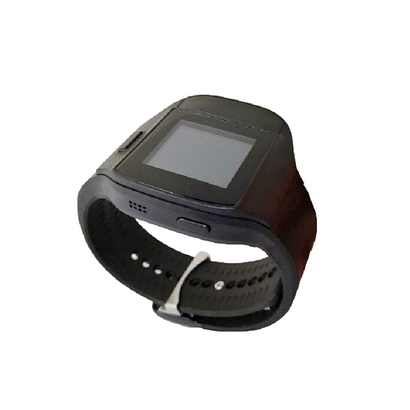

# Megastek - MT-350

El MT-350 es una pulsera de posicionamiento interior de alta precisión diseñada para uso continuo y para el rastreo de personal y activos con gran exactitud. Con un tamaño compacto similar al de un reloj de pulsera, utiliza posicionamiento Ultra Wideband (UWB) para ofrecer ubicación en tiempo real con precisión típica de 10 a 30 centímetros. Su formato ergonómico, soporte para carga inalámbrica y funciones de seguridad orientadas a la misión lo hacen idóneo para usos prolongados en entornos donde la localización interior precisa es crítica.

Al integrarse con plataformas de ubicación compatibles con Plaspy, el MT-350 extiende la cobertura de despliegue a espacios interiores donde el GPS no llega. La pulsera transmite actualizaciones de ubicación y estado a través de la infraestructura UWB, y sus funciones SOS, detección de manipulación, detección de movimiento e informes de estado del dispositivo permiten que Plaspy presente datos unificados de ubicación, alarmas y mantenimiento para el personal y activos de alto valor.

## Puntos clave

- Posicionamiento interior de alta precisión con ubicación basada en UWB y exactitud de 10–30 cm para seguimiento a corta distancia.
- Formato de pulsera para uso continuo y comodidad del usuario en escenarios de rastreo de personal.
- Soporte de carga inalámbrica y larga vida de batería para minimizar interrupciones y mantener los dispositivos operativos.
- Funciones de seguridad integradas, como botón SOS, detección de manipulación, vibración y alertas audibles para apoyar una respuesta rápida.
- Informes de estado y salud del dispositivo para simplificar el mantenimiento centralizado y el monitoreo de disponibilidad.
- Intervalos de reporte y sensibilidad de movimiento configurables para equilibrar la frecuencia de ubicación con el consumo de batería.
- Diseñado para integrarse con estaciones base UWB montadas en el techo y conformar un RTLS completo compatible con Plaspy.

## Cómo funciona con Plaspy

Cuando se despliega con estaciones base UWB, el MT-350 forma parte de un RTLS interior que reenvía mensajes de ubicación y estado a la plataforma Plaspy. Plaspy puede ingerir esos datos para mostrar posiciones en mapas, correlacionar alarmas y ofrecer reportes operativos junto con otras telemetrías en una vista centralizada.

- Ubicación en tiempo real y actualizaciones de telemetría enviadas desde la infraestructura UWB a Plaspy para mapeo y monitoreo.
- Eventos del botón SOS y alertas de manipulación enviados a Plaspy para notificación inmediata al operador y flujos de trabajo de incidentes.
- Telemetría de batería y salud del dispositivo incluida en los paneles de Plaspy para apoyar mantenimiento predictivo y disponibilidad de activos.
- Datos de movimiento y actividad utilizados para inferir estados de desplazamiento y activar alertas configurables dentro de Plaspy.
- Intervalos de reporte ajustables que permiten a los usuarios de Plaspy afinar la frecuencia según necesiten más precisión o mayor autonomía de batería.

## Casos de uso típicos

- Centros penitenciarios que requieren rastreo interior preciso con funciones SOS y protección contra desmontaje para seguridad y vigilancia.
- Hospitales y centros de atención para ubicación de pacientes y personal, detección de caídas e integración con respuestas rápidas.
- Sitios industriales y plantas de manufactura donde la localización interior del personal y las alertas de áreas restringidas mejoran la seguridad.
- Programas de libertad condicional o supervisión que necesitan reportes interiores continuos con alertas de manipulación y batería baja.
- Almacenes y centros logísticos que requieren localización de corto alcance para complementar el rastreo exterior de vehículos.

## Por qué elegir este rastreador con Plaspy

El MT-350 ofrece un rendimiento focalizado en posicionamiento interior que complementa las capacidades de rastreo más amplias de Plaspy. Su ubicación precisa por UWB, diseño ponible y funciones orientadas a la seguridad lo convierten en una opción práctica cuando se necesita conciencia situacional interior y flujos de trabajo basados en alarmas junto con el rastreo exterior de flotas o activos.

Para conocer más sobre cómo el MT-350 puede ampliar el rastreo interior en una implementación compatible con Plaspy, visite https://www.plaspy.com. Las especificaciones del producto, disponibilidad y detalles del fabricante pueden cambiar con el tiempo, por lo que le recomendamos verificar la información técnica actual en el sitio del fabricante https://www.megastek.com/ antes de finalizar la compra o los planes de integración.
