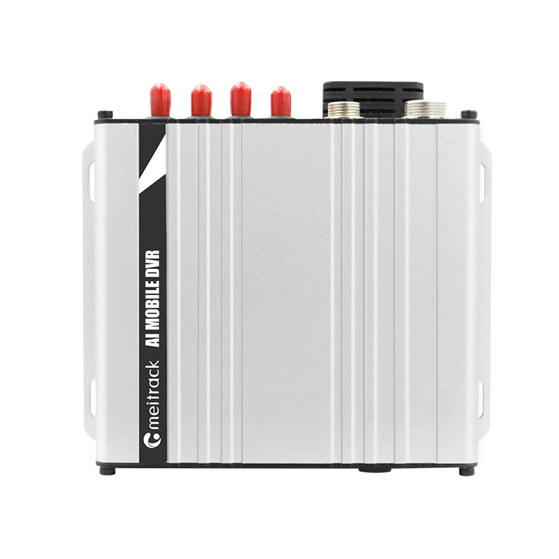

# Meitrack - MD600

El Meitrack MD600 es un DVR móvil para vehículos diseñado para ofrecer telemática de video en alta resolución en entornos de flotas y vehículos comerciales. Integra captura de video AHD multicanal, compresión de video configurable, audio multicanal y una amplia gama de interfaces de E/S y sensores para recopilar video sincronizado y telemetría del vehículo, útil como evidencia, para monitoreo de seguridad y supervisión operativa.

Como dispositivo compatible con Plaspy, el MD600 puede transmitir video y reportar telemetría a Plaspy para unificar la evidencia visual con datos de ubicación y eventos. Esa compatibilidad convierte al MD600 en una opción práctica para flotas que necesitan revisiones de incidentes respaldadas por video, seguimiento en tiempo real y alertas basadas en telemetría dentro del entorno de gestión de flotas de Plaspy.

## Aspectos principales

- Captura de video AHD multicanal para evidencia sincronizada desde varios puntos de vista
- Opciones de compresión de video configurables para equilibrar almacenamiento y calidad de imagen
- Múltiples opciones de conectividad incluyendo celular, Wi Fi, Bluetooth y Ethernet para subida fiable de datos
- Amplio soporte de E/S y periféricos para registrar encendido, eventos de puertas y datos de sensores externos
- Almacenamiento local escalable para conservar registros extendidos de video y telemetría en el vehículo
- Diseño robusto apto para despliegues en flotas comerciales y transporte público

## Cómo funciona con Plaspy

Cuando se conecta a Plaspy, el MD600 entrega video sincronizado, posición GNSS y datos de eventos a un único entorno de monitoreo y reportes. Plaspy utiliza ese flujo combinado para mostrar ubicación en vivo, evidencia grabada y líneas de tiempo de eventos de forma integrada, facilitando el análisis de incidentes y la supervisión continua de la flota.

- Ubicación y telemetría en tiempo real visibles en los mapas y paneles de seguimiento en vivo de Plaspy
- Registro de eventos e ignición para alertas inmediatas y líneas de tiempo históricas de incidentes
- Datos de combustible y sensores enviados a los módulos de Plaspy para monitoreo y detección de anomalías
- Control remoto y estado de relés disponibles en flujos de trabajo de Plaspy para inmovilización o control operativo cuando el operador lo configure
- Periféricos BLE y sensores externos integrados para enriquecer la telemetría y vincular datos ambientales con la evidencia en video

## Casos de uso típicos

- Captura de evidencia con múltiples cámaras para reconstrucción de incidentes y cumplimiento normativo
- Programas de monitoreo de conductores y seguridad que combinan video con telemetría para capacitación y revisión
- Flujos de trabajo anti robo e inmovilizadores ligados a control de ignición y relés para seguridad de la flota
- Monitoreo de combustible y reporte de telemetría para gestión de combustible y detección de pérdidas
- Vigilancia en transporte público y vehículos comerciales con video sincronizado y georreferenciado

## Por qué elegir este rastreador con Plaspy

El MD600 combina captura de video multicanal de alta calidad con un amplio soporte de telemetría y periféricos, lo que lo convierte en un nodo telemático adecuado para flotas que requieren evidencia en video junto con seguimiento en tiempo real. Su conectividad flexible y capacidad de almacenamiento ayudan a reducir la dependencia de ancho de banda constante, garantizando que los eventos y las grabaciones estén disponibles para revisión posterior en Plaspy.

Para organizaciones que buscan combinar video, ubicación y datos de eventos en una sola plataforma, el MD600 ofrece una opción práctica y resistente que se integra con Plaspy para monitoreo, alertas y reportes unificados. Para más información sobre cómo Plaspy soporta telemática de video en vehículos visite https://www.plaspy.com. Las especificaciones y la disponibilidad del producto pueden cambiar con el tiempo, por lo que le recomendamos verificar los detalles actuales en el sitio del fabricante https://www.meitrack.com/ antes de comprar o desplegar.
