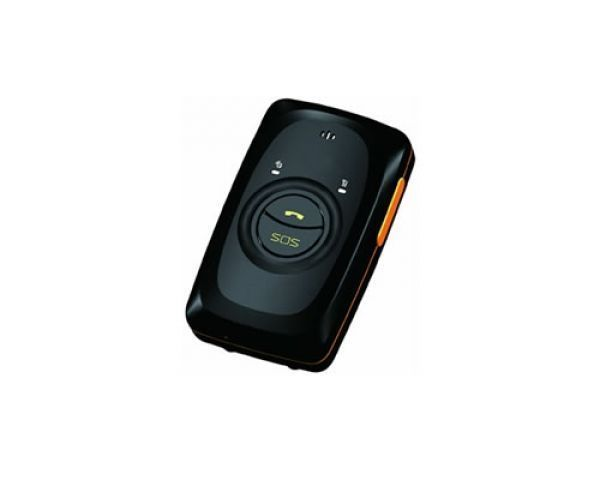

# Meitrack - MT-90

El Meitrack MT-90 V4 es un rastreador GPS personal compacto pensado para un uso cotidiano y ligero. Combina un tamaño reducido con funcionalidades orientadas a la seguridad y monitoreo personal, incluyendo hasta 10 días de autonomía en espera, una alarma integrada de persona caída para situaciones de emergencia, audio bidireccional con capacidad de escucha remota y protección con clasificación IP65 contra el agua. Su operación se mantiene sencilla gracias a una interfaz de solo dos botones, ideal para usuarios no técnicos.

Como dispositivo compatible con Plaspy, el MT-90 puede integrarse en flujos de trabajo de vigilancia de flotas y activos para mejorar la visibilidad y la supervisión de seguridad. La larga autonomía y las funciones de alerta de emergencia lo hacen adecuado para escenarios donde se requieren actualizaciones de ubicación fiables y notificación rápida de incidentes. Usted puede agregar dispositivos MT-90 a su cuenta en Plaspy para monitorear ubicación, recibir alertas, ver el historial e incluir la unidad en informes operativos más amplios.

## Características principales

- Rastreador GPS personal pequeño y liviano, apto para llevar diariamente
- Larga autonomía en espera, hasta 10 días entre cargas
- Alarma integrada de persona caída para notificaciones en emergencias
- Audio bidireccional y función de escucha para comprobaciones de voz directas
- Resistencia al agua IP65 para uso en exteriores y entornos expuestos
- Interfaz simple con solo dos botones para facilitar su uso

## Cómo funciona con Plaspy

Al conectarse con Plaspy, el MT-90 aporta información de ubicación y eventos que ayuda a equipos y cuidadores a mantener el control sobre personas y activos. Plaspy ingiere las actualizaciones del dispositivo y las muestra en mapas, líneas de tiempo y flujos de alertas para apoyar el monitoreo y la respuesta.

- Visibilidad de la ubicación en tiempo real e historial de posiciones para supervisión operativa
- Reenvío de eventos de emergencia para alarmas de persona caída y otras alertas activadas
- Eventos de audio bidireccional y estado de escucha disponibles para comprobaciones situacionales
- Monitoreo de batería y estado del dispositivo para gestionar la disponibilidad
- Alertas por corte de antena GPS o pérdida de alimentación externa como eventos de estado
- Informes de historial y exportes para revisión de incidentes y registros de cumplimiento

## Casos de uso típicos

- Monitoreo de seguridad personal para niños, personas mayores o adultos vulnerables
- Trabajadores que operan solos o en ubicaciones remotas donde se necesitan alertas de emergencia
- Seguimiento de pacientes o personas con necesidades especiales para asistencia oportuna
- Actividades al aire libre donde la resistencia al agua y la larga autonomía son valiosas
- Seguimiento de mascotas grandes o animales de compañía durante salidas o en zonas rurales
- Despliegues temporales donde la simplicidad y el factor de forma compacto son prioritarios

## Por qué elegir este rastreador con Plaspy

El MT-90 es una opción práctica para organizaciones y particulares que requieren un rastreador personal discreto y fácil de usar que se integre en una plataforma de monitoreo más amplia. Su combinación de larga autonomía, alertas de incidentes y capacidad de audio puede reducir la carga operacional de los registros de estado y mejorar los tiempos de respuesta ante un evento. Plaspy aporta valor al agregar los datos del MT-90 en una única interfaz para visualización, notificaciones e informes.

Si desea evaluar el MT-90 para su implementación con Plaspy, considere cómo la autonomía, las alertas de emergencia y la robustez del dispositivo se ajustan a sus necesidades de monitoreo. Conozca más sobre Plaspy en el sitio principal https://www.plaspy.com. Las especificaciones y la disponibilidad de producto pueden cambiar con el tiempo, por lo que conviene verificar los detalles actuales y la documentación técnica completa con el fabricante en https://www.meitrack.com/
