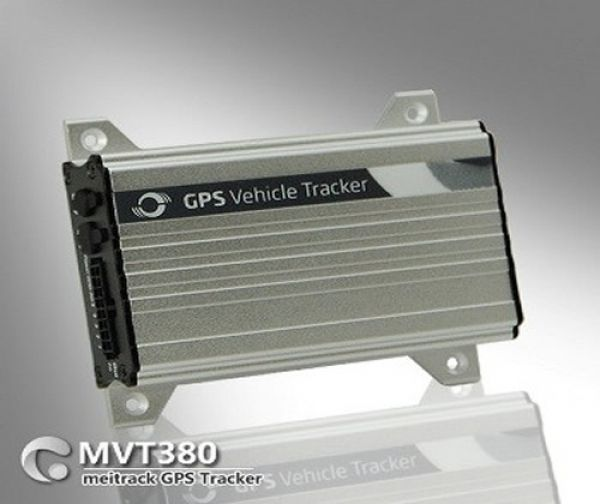

# Meitrack - MVT-380

El Meitrack MVT-380 es un rastreador GPS versátil diseñado para el seguimiento de vehículos y activos con un conjunto práctico de funciones. Ofrece seguimiento en tiempo real, alertas por geocercas, registro GPS para historiales de viaje y audio bidireccional, lo que lo hace adecuado tanto para flotas comerciales como para monitoreo de vehículos personales. La unidad es configurable para accesorios como un relé de corte de motor y dispone de modos de ahorro de energía para prolongar su tiempo de operación.

Como dispositivo compatible con Plaspy, el MVT-380 puede integrarse en flujos de trabajo de gestión de flotas y activos para ofrecer visibilidad y registros históricos dentro de la plataforma Plaspy. Plaspy aprovecha las funciones básicas del rastreador —informes de ubicación, eventos de geocerca, registros y alertas— para presentar información útil para operaciones, reportes y supervisión sin requerir cambios profundos en la forma en que usted administra los dispositivos.

## Principales características

- Seguimiento de ubicación en tiempo real para visibilidad inmediata de vehículos y activos
- Creación de geocercas y alertas para monitorear entradas y salidas de áreas
- Registro GPS que almacena la distancia recorrida y ubicaciones para reportes posteriores
- Soporte de audio bidireccional para comunicación remota por voz cuando sea necesario
- Opciones configurables y soporte de accesorios como relé para corte de motor
- Modo de reposo para conservar energía y extender los periodos de operación del dispositivo
- Alertas integradas de SOS y exceso de velocidad para notificaciones básicas de seguridad y cumplimiento

## Cómo funciona con Plaspy

Al integrarse con Plaspy, el MVT-380 envía información de ubicación y eventos a un tablero unificado para monitoreo y generación de reportes. Plaspy agrega estos datos para ofrecer visibilidad en tiempo real y revisiones históricas, además de permitir que los administradores configuren alertas y consulten los viajes registrados.

- Mostrar la ubicación en vivo y los movimientos recientes de los dispositivos MVT-380 en los mapas de Plaspy
- Recibir notificaciones de geocerca y SOS en Plaspy para una detección inmediata
- Acceder a registros GPS históricos y reportes de viaje recopilados por el MVT-380 mediante las herramientas de reporte de Plaspy
- Usar las alertas de Plaspy para monitorear notificaciones de exceso de velocidad y otros eventos configurables
- Agrupar dispositivos para supervisión a nivel de flota y monitoreo operativo simplificado
- Exportar o programar reportes basados en los datos registrados por el MVT-380 para auditorías y análisis

## Casos de uso típicos

- Seguimiento de vehículos de empresa para supervisar rutas, paradas y asignación de activos
- Flotas de alquiler o uso compartido donde se requiere registro de viajes y ubicaciones
- Monitoreo de vehículos personales para historial de ubicaciones y comunicación remota ocasional
- Flotas pequeñas y medianas que necesitan alertas por geocerca y visibilidad centralizada
- Situaciones que requieren alertas SOS o audio bidireccional remoto para respuesta de seguridad

## Por qué elegir este rastreador con Plaspy

El Meitrack MVT-380 combina un conjunto de funciones conciso con las capacidades de gestión de Plaspy para ofrecer seguimiento y reportes prácticos sin complejidad innecesaria. Su registro GPS y funciones de geocerca lo hacen útil para organizaciones que necesitan datos históricos de viajes además de la ubicación en vivo, mientras que el audio bidireccional y las funciones SOS añaden capas de utilidad operativa y seguridad.

Debido a que el dispositivo es configurable y admite opciones de accesorios, puede adaptarse a diversas necesidades operativas y gestionarse de forma centralizada a través de Plaspy. Para equipos que buscan visibilidad sencilla de ubicación, alertas oportunas y detalles de viajes archivados en una sola plataforma, el MVT-380 representa una opción sólida a considerar.

Para obtener más información sobre cómo Plaspy puede trabajar con dispositivos Meitrack como el MVT-380 visite https://www.plaspy.com. Las especificaciones y la disponibilidad de productos pueden cambiar con el tiempo, por favor verifique los detalles técnicos y la compatibilidad de accesorios con el fabricante en https://www.meitrack.com/.
