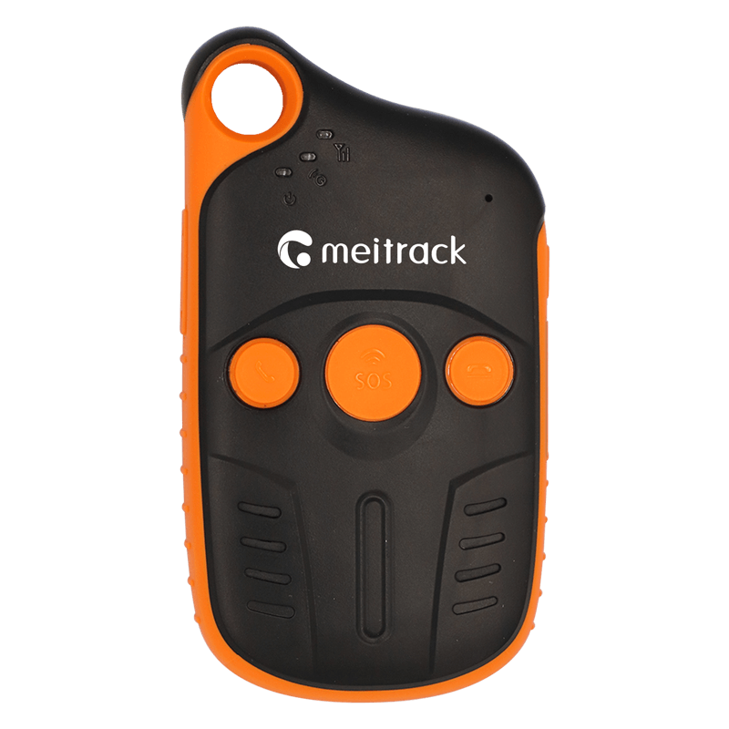

# Meitrack - P99L

El P99L es un rastreador GPS portátil compacto y resistente, diseñado para atletas al aire libre y trabajadores de campo que requieren posicionamiento fiable y de larga duración en entornos exigentes. Diseñado para despliegues compatibles con Plaspy, el P99L combina protección IP67 y resistencia a golpes con posicionamiento híbrido \(GNSS, Wi‑Fi y LBS\) y conectividad 4G LTE Cat 1 para ofrecer un seguimiento en tiempo real fiable donde los dispositivos convencionales tienen dificultades.

La batería interna de 2000 mAh, la gestión inteligente de sueño y hasta 400 horas en espera \(aprox. 50 horas en modo de trabajo normal\) hacen del P99L un compañero ideal para salidas prolongadas, seguridad de trabajadores solitarios y monitorización de equipos remotos. Con opciones de carga magnética e inalámbrica, actualizaciones de firmware OTA y variantes regionales de radio, el P99L está preparado para una integración sencilla con Plaspy para telemetría, historial de ubicación y flujos de alerta.

## Puntos clave

- Compatible con Plaspy: se integra con Plaspy para seguimiento en tiempo real seguro y telemetría.
- Diseño robusto para exteriores: resistencia al agua IP67 y carcasa a prueba de golpes para senderismo, escalada y trabajo de campo.
- Posicionamiento híbrido: modos GNSS, Wi‑Fi y LBS proporcionan fijaciones de ubicación fiables incluso en entornos con señal difícil.
- Larga duración de la batería: batería de 2000 mAh con modo de sueño inteligente; hasta ~400 horas en espera y ~50 horas en operación normal.
- Conectividad 4G LTE Cat 1 más Wi‑Fi integrado de 2.4 GHz \(802.11 b/g/n\) para subida de datos oportuna y posicionamiento asistido.
- Carga conveniente: opciones de carga magnética e inalámbrica para uso rápido en campo sin puertos expuestos.
- Actualizaciones OTA y variantes regionales: admite gestión remota de firmware y versiones de radio específicas de cada mercado \(P99G, P99L‑E, P99L‑A, P99L‑SA\).

## Cómo funciona con Plaspy

Cuando se despliega en la plataforma Plaspy, el P99L proporciona datos continuos de ubicación y estado del dispositivo que Plaspy ingiere, visualiza y utiliza para activar alertas, informes y acciones de geocerca. Plaspy recibe las correcciones de posicionamiento híbrido y telemetría del P99L a través de 4G LTE o Wi‑Fi y normaliza esos datos para paneles de seguimiento en tiempo real, reproducción histórica y notificaciones automáticas.

- Actualizaciones de ubicación y telemetría en tiempo real \(GNSS/Wi‑Fi/LBS\).
- Estado de la batería e informe de salud del dispositivo para monitorización remota y alertas.
- Historial de ubicación y rastro de ruta para análisis post-evento y revisión de rutas.
- Actualizaciones de firmware Over-the-air \(OTA\) compatibles entregadas vía Plaspy para mantenimiento de la flota.
- Detección de variantes regionales para que Plaspy gestione dispositivos en distintos mercados \(P99G, P99L‑E, P99L‑A, P99L‑SA\).

## Resumen técnico

| Conectividad | 4G LTE Cat 1 \(soporte UMTS/GSM dependiente de la variante\); Wi‑Fi integrado de 2.4 GHz \(802.11 b/g/n\) |
| --- | --- |
| Bandas | Variantes regionales de frecuencia múltiples: P99G \(global\), P99L‑E \(África/Europa/Oriente Medio\), P99L‑A \(Américas\), P99L‑SA \(Australia\). Cubre las bandas LTE‑FDD, UMTS y GSM relevantes por mercado. |
| Alimentación y batería | Batería interna de 2000 mAh; gestión inteligente de sueño; hasta ~400 horas en espera; aproximadamente 50 horas de funcionamiento normal; carga magnética e inalámbrica compatibles. |
| Interfaces | Carga mediante conectores magnéticos/inalámbricos; otras entradas/salidas físicas no especificadas en la descripción. |
| GNSS | Posicionamiento multiformato \(GNSS, LBS, Wi‑Fi\). Precisión de posicionamiento de aproximadamente 2,5 metros \(condiciones variables\). |
| Bluetooth | No especificado |
| Memoria | 8 MB de memoria interna |
| Gestión remota | Actualizaciones de firmware OTA compatibles |
| Forma/Factor | Diseño compacto y portátil: 108 x 52 x 18 mm; peso 106 g; carcasa resistente al agua IP67 y resistente a golpes |
| Certificaciones | CE, FCC |

## Casos de uso

- Seguridad personal para trabajadores solitarios y técnicos de campo: seguimiento en tiempo real y monitorización de situaciones de emergencia durante tareas remotas.
- Seguimiento deportivo y de aventura: senderismo, camping, snowboard y escalada con protección duradera y resistencia al agua, y larga vida de batería.
- Monitoreo remoto de activos y equipos: seguimiento de herramientas portátiles y equipamiento de campo cuando no hay suministro eléctrico.
- Gestión de la fuerza laboral al aire libre: historial de ubicación y telemetría para programación, cumplimiento y coordinación de respuesta ante emergencias.

## Por qué elegir este rastreador con Plaspy

El P99L está diseñado para un rastreo GPS confiable en exteriores y se integra de forma clara con Plaspy para ofrecer telemetría práctica y orientada a la misión. Su posicionamiento híbrido GNSS/Wi‑Fi/LBS y la subida 4G LTE Cat 1 permiten que Plaspy aporte seguimiento en tiempo real preciso y rutas históricas incluso en condiciones de señal parcial, mientras que la larga autonomía de la batería y la carga inalámbrica reducen el tiempo fuera de servicio en campo. El soporte para actualizaciones OTA y las múltiples variantes regionales de radio facilitan la implementación en flotas y el mantenimiento a largo plazo.

Para las organizaciones que usan Plaspy para la gestión de flotas, flujos de trabajo anti-robos o un uso más amplio de telemetría, el P99L proporciona los datos de ubicación y salud del dispositivo necesarios para alimentar paneles y alertas. Cuando se requieren entradas adicionales como control de ignición, inmovilizador, monitoreo de combustible o sensores Bluetooth, Plaspy puede combinar datos del P99L con otros dispositivos o periféricos compatibles para construir una solución completa sin exagerar las capacidades del dispositivo.

