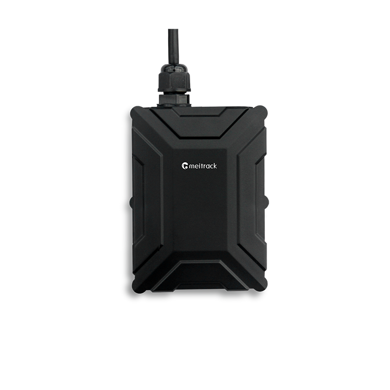

# Meitrack - T399L/T399E

El Meitrack T399L/T399E es un rastreador vehicular robusto con clasificación IP67, diseñado para la monitorización de flotas, logística y vehículos comerciales. Pensado para entornos exigentes y despliegues globales, la serie T399 ofrece posicionamiento GNSS de alta precisión, conectividad celular de varias generaciones y compatibilidad con periféricos que permiten a los operadores de flota recopilar datos de posición y telemetría en tiempo real.

Este modelo es totalmente compatible con Plaspy, lo que permite a los administradores de flota enviar ubicaciones, telemetría de sensores y datos de eventos a la plataforma. La compatibilidad convierte al T399L/T399E en una opción práctica cuando necesita seguimiento integrado, análisis del comportamiento del conductor y monitoreo de combustible o condiciones ambientales dentro de un mismo sistema de gestión de flotas.

## Aspectos destacados

- Compatibilidad total con Plaspy para seguimiento en tiempo real y telemetría de flota.
- Carcasa robusta con clasificación IP67, adecuada para despliegues exigentes en vehículos y equipos.
- Posicionamiento GNSS de alta precisión con una exactitud típica de 2.5 metros.
- Opciones celulares multi generación y variantes regionales para amplia cobertura.
- Análisis de comportamiento del conductor y detección de eventos para seguridad y capacitación.
- Soporte para sensores Bluetooth y múltiples entradas periféricas para monitoreo de combustible y condiciones ambientales.
- Actualizaciones OTA de firmware disponibles en el T399L para mantenimiento remoto.

## Cómo funciona con Plaspy

Al integrarse con Plaspy, el T399L/T399E transmite posiciones GNSS, informes de eventos y telemetría periférica a la plataforma, otorgando visibilidad en vivo e información histórica a los operadores. Plaspy procesa las actualizaciones de posición y las entradas de sensor para alimentar paneles, alertas e informes que respaldan la toma de decisiones operativas y la supervisión de la flota.

- Seguimiento de ubicación en tiempo real y visualización en mapas de vehículos y activos.
- Informes de eventos e incidentes por conducción brusca, alertas de fatiga y colisiones visibles en Plaspy.
- Tendencias de nivel y consumo de combustible a partir de sensores ultrasónicos o cableados, reflejadas en informes.
- Telemetría ambiental desde sensores Bluetooth de temperatura y humedad para carga sensible.
- Entradas periféricas y cambios de estado de relés capturados para soportar control de accesos, inmovilizadores y reglas de automatización.

## Casos de uso típicos

- Transporte de larga distancia y operaciones logísticas que requieren seguimiento global confiable y telemetría.
- Flotas de reparto y mensajería que necesitan visibilidad de rutas, puntuación de conductores y alertas de incidentes.
- Servicios de alquiler y carsharing que usan identificación de conductor y registro de accesos para facturación segura.
- Maquinaria pesada y activos off road que demandan hardware resistente y monitorización remota.
- Operaciones sensibles al combustible que se benefician del monitoreo continuo de niveles de tanque y análisis.

## Por qué elegir este rastreador con Plaspy

El T399L/T399E combina hardware resistente y E/S flexibles para satisfacer las necesidades operativas de flotas comerciales e integrarse sin contratiempos con Plaspy. Sus opciones celulares multigeneración y variantes de bandas regionales lo hacen apto para despliegues variados, mientras que el soporte incorporado para sensores ambientales y de combustible amplía las capacidades de Plaspy más allá del simple seguimiento de ubicación.

Seleccionar la serie T399 junto con Plaspy brinda a los equipos de flota una vista consolidada de posición, comportamiento del conductor y telemetría periférica, además de opciones para mantenimiento remoto mediante OTA en el T399L. Esta combinación ayuda a reducir el mantenimiento in situ y centraliza la telemetría para que los gestores de flota tomen decisiones con mayor rapidez y escala.

Learn more about Plaspy on the main website https://www.plaspy.com. Product specifications, availability and manufacturer details can change over time, so verify current technical information and regional variants on the Meitrack website https://www.meitrack.com/ before purchase.
