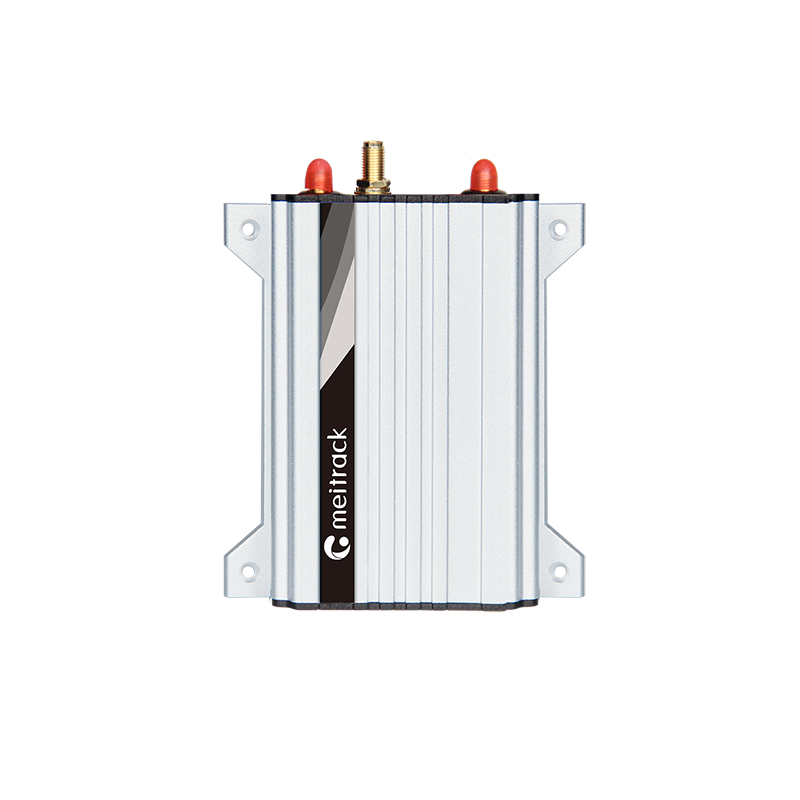

# Meitrack - T622E-F9/T622G-F9

# Meitrack T622E‑F9 / T622G‑F9 — Rastreador GPS para vehículos compatible con Plaspy

El Meitrack T622E‑F9 / T622G‑F9 es un rastreador GPS profesional diseñado para la gestión de flotas, logística y activos de vehículos de alto valor que requieren conectividad confiable a nivel mundial. Construido alrededor de posicionamiento GNSS integrado y telemetría celular multibanda con respaldo satelital Iridium SBD, la serie T622 ofrece informes continuos de ubicación y telemetría donde las redes terrestres por sí solas no pueden garantizar cobertura. Como rastreador compatible con Plaspy, proporciona los tipos de datos y las interfaces que los operadores de flotas esperan para seguimiento en tiempo real, flujos de anti‑robo y telemetría avanzada de vehículos.

Diseñada para una integración robusta en vehículos, la familia T622 admite CAN bus, puertos serie \(RS232/RS485\), relés y una gama de periféricos como lectores RFID, sensores ultrasónicos de nivel de combustible y cámaras RS232. Esa flexibilidad de hardware, combinada con la gestión OTA/FOTA y la configuración vía Wi‑Fi, convierte a la serie T622 en una opción práctica para implementaciones que requieren entrega garantizada de mensajes, control remoto del inmovilizador y telemetría detallada en territorios con cobertura mixta.

## Características principales

- Con cobertura global con respaldo Iridium SBD — mantiene la conectividad donde GSM no está disponible para un seguimiento y alertas compatibles con Plaspy de forma continua.
- Soporte celular multibanda \(4G LTE Cat M1/NB1/2G/3G según modelo\) para una amplia compatibilidad regional y de redes IoT.
- Receptor GNSS de alta sensibilidad \(–161 dB\) con precisión de posicionamiento de aproximadamente 2,5 m.
- Telemática de vehículos a través de CAN bus, RS232 y RS485 — lectura de datos del motor, estado del vehículo y telemetría personalizada para paneles de gestión de flotas.
- Periféricos compatibles: RFID de identificación del conductor, relés \(12 V / 24 V\) para inmovilizador/ control del motor a distancia, monitoreo ultrasónico de combustible y captura de cámaras RS232 disparada por eventos.
- Diseño de energía robusto para vehículos pesados: entrada DC 11,4–36 V, batería interna de respaldo de 400 mAh y bajo consumo en modo de suspensión para operación fiable.
- Actualizaciones OTA/FOTA y configuración Wi‑Fi para simplificar la gestión de firmware y el aprovisionamiento remoto a escala.

## Cómo funciona con Plaspy

Cuando se integra con Plaspy, el T622E‑F9 / T622G‑F9 transmite ubicación, telemetría CAN bus y datos de eventos de periféricos a su instancia de Plaspy para seguimiento en tiempo real, alertas e informes históricos. El dispositivo utiliza automáticamente la ruta Iridium SBD cuando no hay cobertura GSM, de modo que Plaspy mantiene la visibilidad de activos a lo largo de rutas marítimas, remotas o de baja cobertura. Los datos se entregan como actualizaciones de posición, paquetes de telemetría y notificaciones de eventos que Plaspy puede usar para tableros, geocercas y flujos de trabajo automatizados.

- Actualizaciones de ubicación y telemetría en tiempo real entregadas a Plaspy vía celular y respaldo por Iridium SBD.
- Datos del CAN bus mapeados en Plaspy para diagnósticos del motor y del vehículo, tendencias de consumo de combustible y campos de telemetría personalizados.
- Monitoreo de combustible vía sensores ultrasónicos reportados a Plaspy para análisis de consumo y detección de fraude.
- Control remoto del inmovilizador y gestión de relés compatibles para respuestas anti‑robo disparadas por alertas de Plaspy.
- Identificación del conductor vía RFID y captura de cámaras RS232 disparada por eventos — todo registrado en Plaspy para auditorías y revisión de incidentes.
- Actualizaciones OTA/FOTA permiten implementaciones sincronizadas de firmware y configuración desde herramientas del fabricante o flujos de trabajo integrados con Plaspy.

## Resumen técnico

| Conectividad | Conectividad celular multibanda \(4G LTE Cat M1 / Cat NB1 / NB2 / 2G / 3G según modelo\) además de mensajería satelital Iridium SBD como respaldo global |
| --- | --- |
| Bandas | T622G‑F9: certificado para bandas GSM/UMTS/HSDPA globales; T622E‑F9: cubre bandas LTE‑FDD de África/Europa/Medio Oriente y variantes Cat M1/Cat NB2 \(tabla de frecuencias según modelo proporcionada por el fabricante\) |
| Alimentación y batería | Entrada DC 11,4–36 V \(1,5 A\); batería de respaldo interna de 400 mAh; corriente típica en modo de suspensión ≈11 mA |
| Interfaces | CAN bus, RS232, RS485, I/O digital y soporte para relés \(12 V / 24 V\), RFID, sensores ultrasónicos de combustible y cámaras RS232 |
| GNSS | Receptor GNSS de alta sensibilidad \(–161 dB\) con precisión de posicionamiento de aproximadamente 2,5 m |
| Iridium | La mensajería satelital Iridium SBD proporciona respaldo automático cuando GSM no está disponible; T622G‑F9 está certificado por Iridium |
| Memoria y registro | 8 MB de memoria interna para registro; admite almacenamiento en búfer y carga diferida vía satélite o celular |
| Gestión remota | Configuración por Wi‑Fi y actualizaciones de firmware OTA/FOTA para aprovisionamiento y mantenimiento remoto |
| Físico y ambiental | Dimensiones 105 × 65 × 26 mm; peso ≈190 g; rango de operación –10 °C a 55 °C; humedad relativa 5%–95% |
| Tiempo de funcionamiento | Horas de funcionamiento típicas de hasta ~45 horas en modo de ahorro de energía y ~4 horas en modo normal, dependiendo del uso de periféricos y de las tasas de reporte |
| Certificaciones | CE y TELEC cuando aplique; la documentación del fabricante y los detalles de certificación regional están disponibles de Meitrack |

## Casos de uso

- Operaciones de flota que abarcan zonas urbanas y remotas — seguimiento en tiempo real y telemetría constantes vía celular con respaldo Iridium para visibilidad ininterrumpida.
- Logística de largo alcance y rutas próximas a zonas marítimas que requieren garantía de entrega de mensajes en áreas con poca cobertura.
- Vehículos blindados o de alto valor que requieren flujos de anti‑robo, control remoto del inmovilizador y identificación del conductor.
- Vehículos especializados donde la telemetría CAN bus, el monitoreo de combustible y la captura de video disparada por eventos ofrecen información accionable para mantenimiento y cumplimiento.
- Despliegues de activos mixtos que se benefician de la gestión OTA, dashboards centrales de Plaspy y soluciones impulsadas por accesorios \(RFID, relés, cámaras\).

## Por qué elegir este rastreador con Plaspy

El T622E‑F9 / T622G‑F9 combina hardware de telemática de vehículos probado con mensajería global garantizada vía Iridium SBD, lo que lo convierte en una opción sólida para implementaciones de Plaspy que exigen resiliencia y amplia cobertura de telemetría. Su soporte CAN bus y sus múltiples interfaces serie permiten que Plaspy ingiera datos completos del vehículo para una gestión avanzada de flotas y flujos de trabajo predictivos. Con compatibilidad integrada para periféricos comúnmente usados — identificación de conductor por RFID, sensores ultrasónicos de combustible y relés para control del inmovilizador —, los integradores pueden implementar escenarios de anti‑robo, monitoreo de combustible y control de ignición sin cambios extensos de hardware.

Para organizaciones que requieren un rastreador GPS compatible con Plaspy que combine posicionamiento GNSS preciso, integración robusta de vehículos y conectividad mundial, la serie Meitrack T622 ofrece un perfil de configurabilidad y fiabilidad diseñado para flotas, proveedores logísticos y operadores de vehículos especializados. La documentación del fabricante, las opciones de accesorios y las herramientas de configuración están disponibles por parte de Meitrack para simplificar la implementación y la gestión a largo plazo.

Para obtener detalles completos de integración, listas de frecuencias compatibles y compatibilidad de accesorios, consulte la hoja de datos del producto de Meitrack y la guía de integración de dispositivos de Plaspy antes de la implementación.

