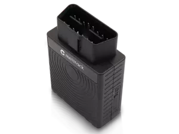

# Meitrack - TC68L

El Meitrack TC68L es un rastreador GPS compacto tipo plug and play diseñado para vehículos con conector OBD II estándar. Combina conectividad 4G y una interfaz OBD II para ofrecer reportes continuos de ubicación, información básica del vehículo y alertas antirrobo. El equipo incluye una batería interna de respaldo que permite mantener el rastreo por un periodo limitado si se retira del vehículo, y dispone de un botón SOS para señalizar emergencias de forma inmediata.

Como modelo compatible con Plaspy, el TC68L puede enviar actualizaciones de ubicación, alertas de desconexión y datos del vehículo a Plaspy para su monitoreo centralizado de flotas y supervisión operativa. Plaspy puede usar la alimentación del TC68L para mostrar posiciones en tiempo real, manejar notificaciones de emergencia e incorporar métricas derivadas de OBD en informes y paneles, ayudando a empresas y usuarios privados a tener mayor visibilidad sobre el estado y la seguridad de sus vehículos.

## Características principales

- Factor de forma OBD II plug and play para conexión rápida en la mayoría de vehículos con puerto OBD II
- Conectividad 4G para transmisión de datos más rápida y actualizaciones oportunas
- Batería interna para rastreo temporal cuando la alimentación externa se interrumpe o el dispositivo es removido
- Alerta de desconexión que avisa cuando el dispositivo se desconecta del vehículo
- Capacidad opcional de hotspot WiFi 4G para ofrecer acceso a internet a pasajeros y dispositivos a bordo
- Botón SOS integrado para enviar notificaciones de emergencia de inmediato

## Cómo funciona con Plaspy

Cuando un TC68L se configura para operar con Plaspy, el dispositivo entrega información de ubicación y estado del vehículo que Plaspy procesa y presenta mediante su tablero y herramientas de reporte. Plaspy agrega esas entradas para proporcionar conciencia situacional, alertas y registros históricos útiles para las operaciones diarias y la respuesta ante incidentes.

- Rastreo de ubicación en tiempo real visualizado en los mapas de Plaspy para monitoreo activo
- Telemetría del vehículo y datos OBD incluidos en los informes de Plaspy para supervisión de combustible y estado
- Alertas automáticas en Plaspy por eventos de desconexión del dispositivo y activaciones de SOS
- Reproducción histórica y reportes de viajes para revisar rutas y patrones operativos
- Gestión centralizada de dispositivos en Plaspy para flotas que utilicen múltiples unidades TC68L

## Casos de uso típicos

- Automóviles particulares que requieren supervisión antirrobo sencilla y alertas de emergencia
- Vehículos de flota que se benefician de una instalación plug and play y del seguimiento centralizado
- Vehículos de renta y uso compartido donde la instalación rápida y la notificación de desconexión son importantes
- Vehículos de pasajeros que pueden aprovechar la función de hotspot para acceso a internet a bordo
- Operadores que necesitan datos básicos derivados de OBD en los informes de flota sin instalaciones complejas

## Por qué elegir este rastreador con Plaspy

El TC68L es una opción práctica para organizaciones y usuarios que buscan un rastreador compacto y vehicular de fácil implementación que proporcione visibilidad continua. Su conector OBD II reduce la complejidad de la instalación, mientras que la batería interna y las alertas de desconexión añaden una capa de protección antirrobo. El botón SOS y la capacidad de hotspot son complementos útiles que aumentan la seguridad y la comodidad para los pasajeros.

En combinación con Plaspy, el TC68L forma parte de un flujo de trabajo centralizado de rastreo e informes. Plaspy recopila la alimentación del dispositivo para presentar ubicación, alertas e información del vehículo en paneles e informes que apoyan la toma de decisiones operativas, la respuesta a incidentes y la supervisión rutinaria de flotas. Para quienes buscan un equilibrio entre facilidad de implementación y funciones prácticas de rastreo, el TC68L con Plaspy es una alternativa sólida.

Para obtener más información sobre Plaspy y cómo puede funcionar con dispositivos compatibles visite https://www.plaspy.com. Las especificaciones del producto y su disponibilidad pueden cambiar con el tiempo, por lo que le recomendamos verificar los detalles técnicos más recientes y la documentación del fabricante en https://www.meitrack.com/.
