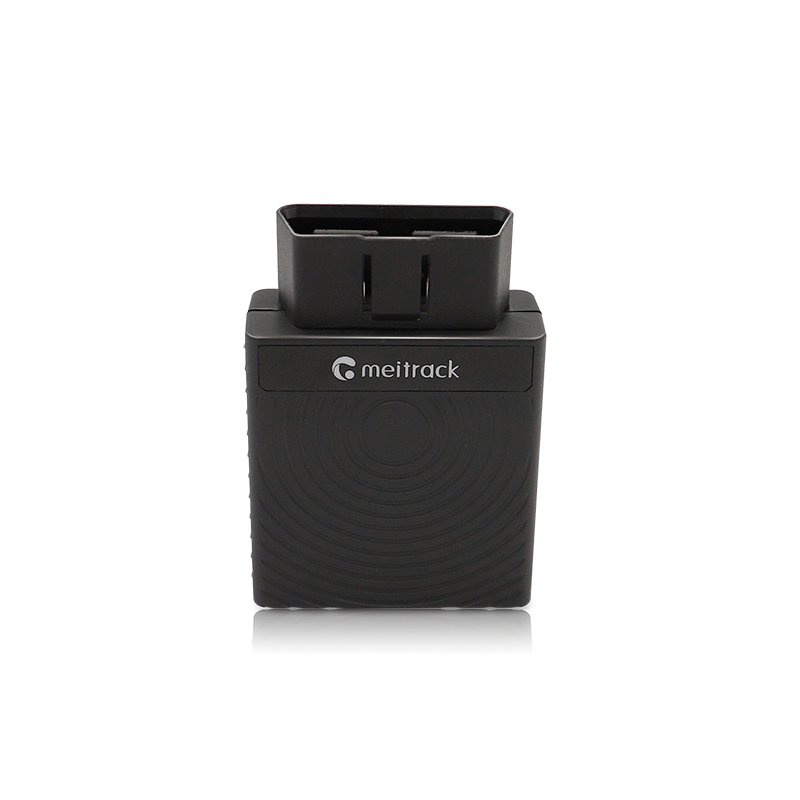

# Meitrack - TC68L/E

# TC68L/E OBD II GPS Tracker

El TC68L/E es un rastreador GPS plug-and-play diseñado para una instalación rápida en cualquier puerto OBD II de vehículos. Compatible con Plaspy listo para usar, este rastreador aporta rastreo en tiempo real y telemetría de vehículo rica para la gestión de flotas, operaciones de alquiler y car‑sharing, y programas anti‑robo de vehículos sin cableado complejo ni tiempo de inactividad de instalación.

Compacto y repleto de funciones, el TC68L/E combina posicionamiento GNSS \(~2.5 m de precisión\), conectividad celular multimodo \(4G/3G/2G\), lectura de datos OBD para monitoreo de combustible y diagnósticos, Bluetooth 4.2/5.0 para sensores periféricos y un hotspot Wi‑Fi de 2.4 GHz a bordo que admite hasta ocho dispositivos para pasajeros. Con actualizaciones FOTA y gestión remota, está diseñado para escalar con flujos de trabajo de rastreo y telemetría impulsados por Plaspy.

## Aspectos clave

- Instalación OBD II plug-and-play para un despliegue rápido y rastreo compatible con Plaspy al instante.
- Rastreo en tiempo real y posicionamiento GNSS con una precisión de aproximadamente 2.5 m para datos de ubicación precisos.
- Telemetría integral desde OBD: consumo de combustible, kilometraje, velocidad, temperatura del motor y comportamiento de conducción para apoyar el mantenimiento preventivo y el análisis.
- Punto de acceso Wi‑Fi de 2.4 GHz para conectividad de pasajeros—admite hasta 8 dispositivos en movimiento.
- Soporte de Bluetooth 4.2 y 5.0 para sensores y periféricos Bluetooth que enriquecen la telemetría de sensores.
- Opciones de cobertura celular global \(4G LTE Cat 1/4/M1/NB2, 3G, 2G\) disponibles en SKUs regionales para despliegues mundiales.
- Actualizaciones de firmware remotas \(FOTA/OTA\) y un formato compacto orientado al vehículo para una integración de flota de perfil bajo.

## Cómo funciona con Plaspy

Cuando se empareja con Plaspy, el TC68L/E transmite la ubicación GNSS y la telemetría procedente de OBD hacia la plataforma de Plaspy para monitoreo en tiempo real, alertas e informes históricos. Al conectarse al puerto OBD del vehículo, puede reportar de forma continua métricas de diagnóstico y rendimiento junto con los datos de posición, proporcionando una visión unificada de la salud y el movimiento del vehículo dentro de los paneles y APIs de Plaspy.

- Actualizaciones de ubicación y telemetría en tiempo real entregadas a Plaspy para rastreo en vivo y reproducción de rutas.
- Informes de parámetros OBD para monitoreo de combustible, kilometraje, velocidad y temperatura del motor—datos que Plaspy utiliza para diagnósticos y alertas de mantenimiento preventivo.
- Alertas de extracción/desconexión instantáneas para notificar a los administradores sobre posibles manipulaciones o hurtos.
- Sensores Bluetooth: integre datos de sensores suplementarios \(BLE\) para temperatura, condiciones de carga u otros periféricos BLE compatibles con Plaspy.
- Estado del hotspot Wi‑Fi y metadatos de uso disponibles para informes de conectividad de pasajeros en Plaspy.
- El soporte FOTA garantiza que el firmware del TC68L/E pueda actualizarse de forma remota para mantener la compatibilidad con las características de Plaspy y las actualizaciones de seguridad.

## Resumen técnico

| Conectividad | 4G \(LTE Cat 1 / Cat 4 / M1 / NB2\), 3G y 2G \(variantes regionales\) |
| --- | --- |
| Bandas / SKUs regionales | El soporte de bandas varía según el modelo; TC68E \(global\) y variantes regionales TC68L/E para África/Europa/Oriente Medio, Américas, Australia, Japón. Verifique el SKU para el mercado objetivo. |
| Potencia y Batería | DC 11.5–36 V / operación de 1 A; batería de respaldo opcional de 200 mAh / 3.7 V. Standby típico ~100 mA; modo de ahorro de energía hasta ~20 horas; operación de respaldo normal ~2 horas. |
| Interfaces | Interfaz de plug‑in OBD II, hotspot Wi‑Fi de 2.4 GHz \(hasta 8 dispositivos\), Bluetooth 4.2 y 5.0, opciones de carga magnética e inalámbrica. |
| GNSS | Posicionamiento GNSS con approximately 2.5 m de precisión |
| Bluetooth | Soporte BLE \(Bluetooth 4.2 y 5.0\) para sensores y accesorios periféricos |
| Almacenamiento y búfer | 8 MB de búfer a bordo para telemetría y posiciones en caché |
| Gestión remota | Actualizaciones de firmware FOTA / OTA soportadas |
| Certificaciones | Conformidad CE y CITC \(la certificación de modelo y regional puede variar\) |
| Formato y entorno | Compacto: 67 × 51 × 23.5 mm; peso ~60 g; rango de temperatura de operación −20 °C a 55 °C |

## Casos de uso

- Gestión de flotas: paneles centrales de Plaspy con flujos de rastreo GPS en tiempo real, análisis de comportamiento del conductor y monitoreo de combustible para la eficiencia operativa.
- Alquiler de coches y car‑sharing: diagnósticos OBD instantáneos, seguimiento del kilometraje y alertas de desconexión para despliegues seguros y listos para usar.
- Monitoreo del comportamiento del conductor: combinar velocidad, kilometraje y patrones de conducción para capacitar a los conductores y reducir el riesgo en una flota.
- Programas de mantenimiento preventivo: usar la temperatura del motor, el kilometraje y la telemetría OBD para programar el servicio antes de que surjan fallos.
- Conectividad para pasajeros y servicios de valor añadido: ofrecer acceso a Wi‑Fi a bordo manteniendo la telemática y las funciones de seguridad de Plaspy.

## Por qué elegir este rastreador con Plaspy

El TC68L/E combina rastreo en tiempo real compatible con Plaspy con diagnósticos OBD listos para usar para ofrecer una solución equilibrada para flotas y servicios de vehículos compartidos. Su formato OBD plug-and-play reduce costos y tiempo de instalación, mientras que el soporte de conectividad celular multimodo y los SKUs regionales permiten despliegues globales donde la cobertura varía. Telemetría rica —incluyendo monitoreo de combustible y datos de comportamiento de conducción— combinada con sensores Bluetooth y un hotspot Wi‑Fi a bordo ofrece a los operadores más opciones de telemetría sin sacrificar la simplicidad.

Para organizaciones que requieren una integración fiable de rastreadores GPS en Plaspy para rastreo en tiempo real, gestión de flotas, alertas anti‑robo y mantenimiento impulsado por telemetría, el TC68L/E ofrece una plataforma accesible y gestionable de forma remota. Use Plaspy para correlacionar ubicación, telemetría OBD y datos de uso en informes y alertas accionables; y aproveche las actualizaciones FOTA para mantener los dispositivos seguros y alineados con las características y actualizaciones de seguridad a lo largo del tiempo.

