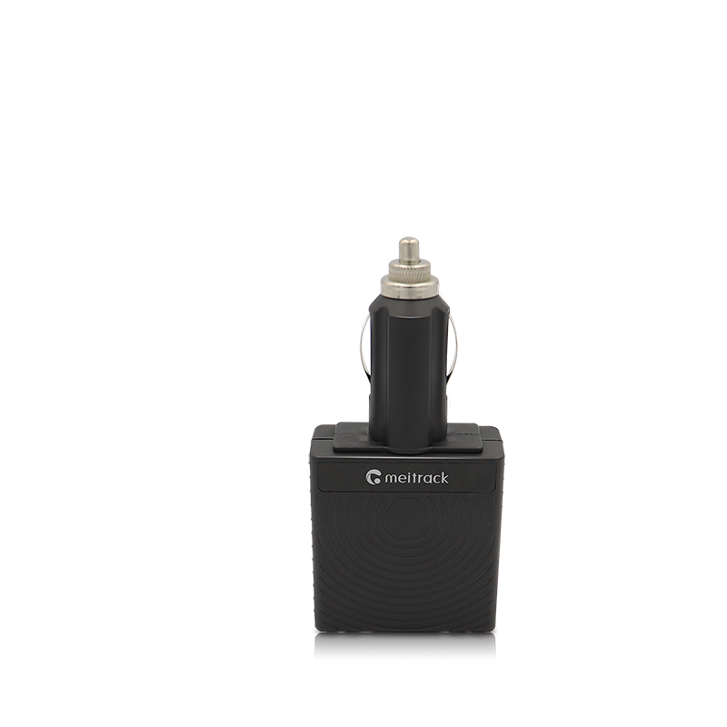

# Meitrack - TS299L

El TS299L es un rastreador GPS enchufable al encendedor de Meitrack diseñado para autos particulares, servicios de transporte por app, car sharing y flotas livianas. Pensado para una instalación rápida sin cableado, ofrece posicionamiento GNSS fiable y seguimiento continuo mientras está conectado a la toma de corriente del vehículo. Opciones adicionales, como un punto de acceso Wi‑Fi a bordo y conectividad con sensores Bluetooth, amplían su utilidad cuando se requiere conectividad para pasajeros o monitoreo ambiental.

Como dispositivo compatible con Plaspy, el TS299L transmite ubicación, alertas de desconexión y lecturas de sensores Bluetooth a la plataforma Plaspy para un monitoreo y reportes consolidados de la flota. Su combinación de despliegue sencillo, variantes celulares regionales y soporte de firmware remoto lo convierten en una opción práctica para operadores que buscan instalación rápida junto con visibilidad centralizada y alertas de eventos en Plaspy.

## Características principales

- Factor de forma enchufable al encendedor para una instalación rápida y sin herramientas en la mayoría de los vehículos
- Posicionamiento GNSS robusto con precisión reportada de aproximadamente 2.5 metros para informes de ubicación más precisos
- Conectividad celular de varias generaciones con variantes de bandas regionales para soportar despliegues internacionales
- Punto de acceso Wi‑Fi opcional en 2.4 GHz para acceso a internet de pasajeros y enlace de telemetría adicional
- Soporte Bluetooth para conectar sensores y balizas externas que permitan monitorear temperatura, humedad o movimiento
- Alerta instantánea de desconexión que notifica la extracción del encendedor, útil para monitoreo antirrobo
- Soporte FOTA para actualizaciones de firmware remotas y gestión a largo plazo del dispositivo

## Cómo funciona con Plaspy

Al integrarse con Plaspy, el TS299L envía ubicación y telemetría a una plataforma en la nube única para que usted pueda supervisar el movimiento de los vehículos, recibir alertas de eventos y revisar la actividad histórica. Plaspy procesa el estado del dispositivo y las lecturas de sensores para ofrecer vistas operativas en tiempo real y retrospectivas en flotas mixtas.

- Actualizaciones de ubicación en tiempo real y telemetría GNSS disponibles para seguimiento en mapa en vivo y reproducción en Plaspy
- Alertas de extracción y desconexión reenviadas a Plaspy para apoyar flujos de trabajo antirrobo y respuesta rápida
- Datos de sensores Bluetooth, como temperatura, humedad o movimiento, entregados a Plaspy para monitoreo ambiental
- Presencia del hotspot Wi‑Fi y estado básico visibles en Plaspy para correlacionar la conectividad de pasajeros con eventos del vehículo
- Actualizaciones remotas de firmware vía FOTA gestionadas junto con otros dispositivos Plaspy para mantener compatibilidad

## Casos de uso típicos

- Despliegue rápido de seguimiento de flotas para vehículos comerciales livianos y automóviles de pasajeros
- Servicios de transporte por app y car sharing que requieren Wi‑Fi para pasajeros y monitoreo consolidado de vehículos
- Monitoreo antirrobo donde las alertas de desconexión informan a los operadores sobre extracciones no autorizadas
- Transporte de mercancías sensibles a la temperatura con sensores Bluetooth que transmiten datos ambientales
- Operaciones de flotas en múltiples regiones que se benefician de variantes de bandas celulares regionales

## ¿Por qué elegir este rastreador con Plaspy?

El TS299L combina una instalación sencilla y no invasiva con la gestión de flotas basada en la nube de Plaspy. Si usted necesita un despliegue rápido en muchos vehículos, el factor de forma enchufable reduce el tiempo de instalación, mientras que Plaspy proporciona visibilidad centralizada, alertas e informes. Las funciones de conectividad opcionales, como el hotspot Wi‑Fi a bordo y el soporte para sensores Bluetooth, son útiles para servicios orientados a pasajeros y monitoreo con sensores sin requerir modificaciones importantes en el vehículo.

La compatibilidad con Plaspy añade valor operativo al consolidar ubicación, alertas de eventos y flujos de sensores en una sola interfaz para despachadores y gestores de flota. La gestión remota de firmware y las variantes regionales ayudan a mantener la consistencia de los dispositivos en flotas mixtas y geografías diversas, simplificando la administración continua y reduciendo la carga de mantenimiento.

Para más información sobre Plaspy y cómo se integran los rastreadores compatibles con la plataforma visite https://www.plaspy.com. Las especificaciones del producto y su disponibilidad pueden cambiar con el tiempo, por lo que le recomendamos verificar los detalles técnicos actuales y las variantes regionales en el sitio del fabricante https://www.meitrack.com/ antes de la compra o el despliegue.
