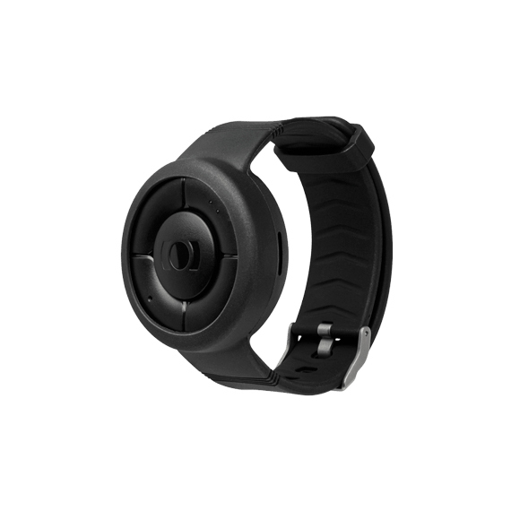

# MiniFinder - Nano

# MiniFinder Nano

El MiniFinder Nano es un rastreador GPS vestible y una alarma personal de tamaño compacto, destinado a la atención sanitaria, al cuidado de personas mayores y a la seguridad de trabajadores que trabajan solos. Diseñado para usarse como un reloj de pulsera o como un accesorio que se lleva en una correa, Nano fusiona una localización GPS fiable en exteriores con Wi‑Fi, BLE y una eSIM integrada para ofrecer seguimiento en tiempo real y gestión de alarmas. Como dispositivo compatible con Plaspy, Nano aporta telemetría de seguridad personal, SOS y alertas de caídas a Plaspy para monitorización centralizada, notificaciones rápidas y un historial de eventos apto para auditoría.

La compatibilidad con Plaspy permite a las organizaciones combinar la rica información de ubicación y estado de MiniFinder Nano con los paneles, reglas de alerta y herramientas de generación de informes de Plaspy. El resultado es un rastreador GPS compacto que se integra en flujos de telemática, seguridad personal y atención, proporcionando a cuidadores y equipos operativos una visibilidad situacional inmediata, telemetría histórica y gestión integrada de alarmas.

## Aspectos destacados

- Rastreador GPS vestible en un formato de reloj compacto: ligero \(60 g\) y fácil de llevar como pulsera o colgado en una correa para cuello.
- Compatible con Plaspy para seguimiento en tiempo real, enrutamiento de alarmas y gestión centralizada de telemetría entre usuarios y equipos de atención.
- Posicionamiento híbrido fiable: GNSS \(AG3352QN\) para una precisión de 0–5 m en exteriores, además de Wi‑Fi y BLE 5.0 para una mejora de la localización en interiores.
- Botón de pánico SOS dedicado y llamadas de voz bidireccionales para una respuesta rápida y centrada en las personas ante las alarmas.
- Sensores de seguridad avanzados, incluyendo acelerómetro de 3 ejes, detección de caídas y un sensor de proximidad para detectar si se lleva en la muñeca y activar alertas automáticas.
- Alcance celular global mediante eSIM integrada y bandas LTE/GSM para operar en más de 190 países.
- Diseño de bajo consumo con el algoritmo MLPC™ y duraciones de batería flexibles para adaptarse a escenarios de uso activo y en espera.

## Cómo funciona con Plaspy

Cuando se configura como un rastreador GPS compatible con Plaspy, MiniFinder Nano transmite fijaciones de posición, eventos de sensores y señales de alarma a Plaspy en tiempo casi real. Plaspy recibe telemetría y utiliza su motor de reglas para activar notificaciones, enrutar alarmas a cuidadores responsables y registrar eventos para la generación de informes. La integración se centra en la entrega clara de metadatos de ubicación, estado y alarma para que los equipos puedan responder con rapidez y revisar incidentes posteriormente.

- Actualizaciones de ubicación y telemetría en tiempo real: posiciones GNSS, fijaciones interiores asistidas por Wi‑Fi/BLE y sellos temporales de estado alimentan a Plaspy para el seguimiento en vivo.
- Alarmas SOS y de caídas: pulsaciones de botón y detección automática de caídas generan alertas inmediatas que se envían a través de Plaspy a contactos preconfigurados o centros de alarma.
- Contexto de voz bidireccional: los eventos de alarma pueden acompañarse de metadatos de llamadas para que los equipos de respuesta sepan cuándo se realizó una sesión de voz.
- Sensores Bluetooth y balizas: soporte BLE 5.0 y compatibilidad con iBeacon permiten mejorar la localización en interiores y la conexión de sensores para monitorización de temperatura o proximidad.
- Telemetría e historial de eventos: MiniFinder Nano almacena un historial de eventos \(hasta un año mediante MiniFinder Live\) y Plaspy puede agregarlo para informes y registros de cumplimiento.
- Nota sobre telemática de vehículos: Nano está optimizado para seguridad personal y monitoreo wearable. Para telemetría específica de vehículos, como control de encendido, comandos de inmovilizador o monitoreo de combustible, se recomienda utilizar rastreadores de vehículos; no obstante, la telemetría de Nano puede complementar las estrategias más amplias de gestión de flotas o anti‑robo cuando se use para personal o activos portátiles.

## Resumen técnico

| Fabricante y modelo | MiniFinder Nano |
| --- | --- |
| Conectividad | eSIM integrada con LTE y GSM; Wi‑Fi \(ESP8266EX\); Bluetooth Low Energy \(BLE 5.0\) |
| Bandas | Bandas LTE B1, B3, B7, B8; GSM 900/1800 MHz |
| Alimentación y batería | Rendimientos típicos: ~24 horas \(informes cada 5 minutos\), ~32 horas de uso activo, hasta ~120 horas en espera \(según configuración\); conector de carga magnético |
| Interfaces y entradas | Botón de pánico SOS, llamadas de voz bidireccionales, sensor de proximidad, acelerómetro \(3 ejes\) para movimiento y detección de caídas, indicadores LED para GPS/LTE/energía |
| GNSS | Chip GPS AG3352QN \(Airoha\); precisión reportada de 0–5 m en cielo despejado |
| Bluetooth | BLE 5.0 para sensores y compatibilidad con iBeacon para mejorar la localización en interiores |
| Gestión remota | Se integra con MiniFinder Live web y apps móviles \(iOS y Android\) para configuración, seguimiento en vivo y gestión de alarmas; un año de datos históricos de posición disponibles vía MiniFinder Live |
| Formato y durabilidad | Formato reloj vestible, 47 × 41 × 16 mm, 60 g, carcasa de silicona suave y duradera apta para pulsera o correa |

## Casos de uso

- Monitorización de cuidado de personas mayores: localización continua, detección de caídas y llamadas SOS para adultos mayores que viven de forma independiente o en hogares asistidos.
- Protección de pacientes y personas vulnerables: alertas rápidas y enlaces de voz bidireccionales para pacientes, visitantes o personal que requiera asistencia inmediata.
- Seguridad de trabajadores que trabajan solos: alarma personal compacta para personal de campo, trabajadores sociales o proveedores de atención a domicilio donde la monitorización en tiempo real y las capacidades de pánico son esenciales.
- Seguridad de niños y familias: rastreador GPS fácil de llevar con SOS y voz para aumentar la seguridad personal durante viajes o actividades diarias.
- Protección de activos portátiles: se puede acoplar a equipos portátiles valiosos, donde su formato compacto, sensores BLE y ubicación GPS respaldan flujos anti‑robo cuando se combina con la monitorización de Plaspy.

## Por qué elegir este rastreador con Plaspy

Emparejar el MiniFinder Nano con Plaspy ofrece a las organizaciones un rastreador GPS compacto diseñado específicamente para la seguridad personal, pero lo suficientemente versátil como para alimentar flujos de telemática y telemetría. El posicionamiento híbrido de Nano \(GNSS más Wi‑Fi y BLE\), el SOS y la detección automática de caídas proporcionan alertas inmediatas y accionables; Plaspy añade reglas centralizadas, rutas de escalamiento e informes para hacer que esas alertas sean operativas. La eSIM integrada y las múltiples bandas celulares proporcionan una amplia cobertura geográfica, mientras que un diseño de bajo consumo y indicadores de estado claros simplifican el uso diario.

Para equipos que buscan ampliar las capacidades de Plaspy hacia la seguridad personal y el seguimiento de activos pequeños, el MiniFinder Nano ofrece un seguimiento en tiempo real fiable, historial de eventos y soporte de sensores Bluetooth sin sacrificar la portabilidad. Si tu despliegue requiere telemetría específica de vehículos, como control de ignición, control de inmovilizador o monitoreo de combustible, combina Nano con rastreadores de vehículos en Plaspy para una estrategia integral de flota y protección personal.

