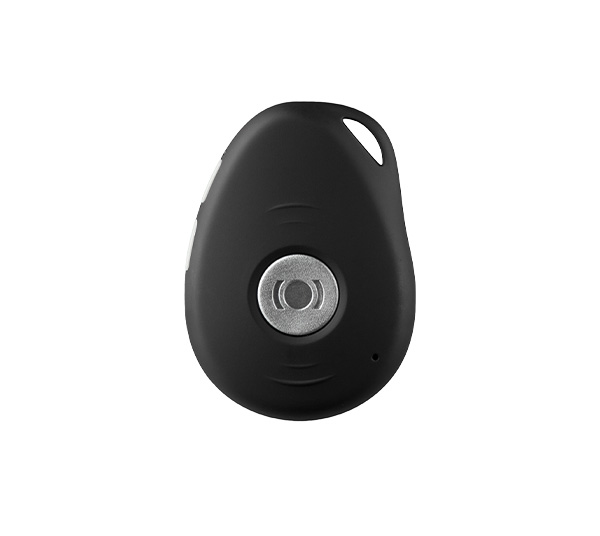

# MiniFinder - Pico

# MiniFinder Pico — Plaspy Compatible GPS Tracker for Personal Safety & Assets

El MiniFinder Pico es un rastreador GPS compacto y discreto con alarma de llavero de MiniFinder, diseñado para la seguridad personal, personas vulnerables y la protección de activos pequeños. Lo suficientemente pequeño para ir en un cordón o en un bolsillo, Pico ofrece seguimiento en tiempo real fiable, alerta SOS y alarmas inteligentes. Es totalmente compatible con Plaspy, lo que facilita añadir telemetría de ubicación de alta precisión y notificaciones de incidentes a flujos de trabajo habilitados para Plaspy.

Diseñado para uso diario y despliegues simples de flotas o activos, Pico combina un posicionamiento GNSS preciso con detección de movimiento basada en acelerómetro y una conectividad de roaming robusta en múltiples regiones. Cuando se integra con Plaspy, el dispositivo refuerza las medidas anti‐robo, la monitorización de trabajadores aislados y la telemática centralizada sin sacrificar la comodidad de uso o la duración de la batería.

## Aspectos clave

- Compatible con Plaspy para seguimiento en tiempo real sin interrupciones y monitoreo centralizado en plataformas iOS, Android y web.
- Factor de forma compacto para llavero \(60 × 41 × 16 mm, ~40 g\) — ideal para llaves, cordones o colocación discreta junto a objetos de valor.
- GNSS de alta precisión con u‑Blox MAX M8 + A‑GPS que ofrece posicionamiento de 0–5 m en exteriores para telemetría fiable.
- Roaming multired \(bandas LTE y GSM 900/1800\) para una cobertura regional amplia en más de 190 países.
- Botón SOS integrado y llamadas bidireccionales a contactos predefinidos para respuesta rápida ante incidentes y seguridad personal.
- Alarmas inteligentes: geocercas, detección de caídas, alertas de movimiento y velocidad, batería baja y avisos de pérdida de GPS.
- Clasificación IPX7 a prueba de agua y rendimiento sólido de la batería — típico entre 36‑40 horas con intervalos de reporte de 5 minutos.

## Cómo funciona con Plaspy

Al registrar MiniFinder Pico en Plaspy, los datos de ubicación y eventos se alimentan directamente al panel de control y al motor de alertas de Plaspy, de modo que los equipos pueden supervisar los dispositivos en tiempo real, recibir alarmas y reproducir historiales. Los informes basados en eventos de Pico \(SOS, caídas, entradas/salidas de geocerca, movimiento y velocidad, y alertas de batería\) se convierten en telemetría accionable dentro de Plaspy para un manejo centralizado de incidentes y generación de informes.

- Actualizaciones de ubicación y telemetría en tiempo real entregadas a Plaspy para seguimiento en vivo y visualización en el mapa.
- Las alertas SOS y los eventos de llamadas bidireccionales pueden reenviarse a operadores de Plaspy o a centros de monitoreo para una respuesta inmediata.
- Los eventos de geocerca y detección de movimiento/caída generan notificaciones automáticas de Plaspy para una intervención rápida.
- Historial de posición almacenado \(hasta un año en el ecosistema del dispositivo\) que admite reproducción y análisis de rutas dentro de Plaspy.
- Las alertas de batería baja y pérdida de señal GPS aparecen en Plaspy para que el mantenimiento y la conectividad se gestionen con rapidez.

## Resumen técnico

| Conectividad | LTE B1, B3, B7, B8, B20; GSM 900/1800 MHz \(roaming entre múltiples redes\) |
| --- | --- |
| Bandas | LTE B1/B3/B7/B8/B20 y GSM 900/1800 MHz |
| Alimentación y batería | Batería recargable de 800 mAh de polímero de litio; duración típica de 36–40 horas con intervalos de reporte de 5 minutos; referencias de modo de espera de marketing de hasta ~72 horas dependiendo de la configuración |
| Interfaces | Botones físicos para SOS y encendido; tres indicadores LED para GPS, LTE y estado de energía |
| GNSS | u‑Blox MAX M8 con A‑GPS; precisión de posicionamiento 0–5 m en exteriores; tiempos de fijación GPS: Activo 1 s, Templado 35 s, Frío 45 s |
| Sensores | Acelerómetro de 3 ejes \(detección de movimiento y caídas\) |
| Memoria | Memoria flash de 16 MB; historial de posiciones almacenado en el sistema de MiniFinder \(hasta un año\) |
| Ambiental y factor de forma | Dimensiones 60 × 41 × 16 mm; peso ~40 g; rango de temperatura de funcionamiento -10°C a +60°C; clasificación IPX7 a prueba de agua |
| Gestión remota | Se integra con MiniFinder Live para gestión de dispositivos y requiere suscripción para plena funcionalidad; compatible con Plaspy para monitoreo centralizado y reenvío de alarmas |

## Casos de uso

- Seguridad personal para personas mayores o vulnerables: SOS, detección de caídas y seguimiento en tiempo real para cuidadores y personal de atención.
- Seguimiento de niños y protección familiar: formato compacto apto para mochilas, llaveros o bolsillos con alertas de geocerca para zonas escolares o domésticas.
- Protección de trabajadores aislados: reporte de alarmas instantáneo y llamadas bidireccionales combinados con monitorización en Plaspy para una intervención rápida.
- Antirrobo y protección de activos pequeños: colocación discreta con historial de posición y seguimiento en vivo para apoyar los esfuerzos de recuperación.
- Logística y alquileres de corta duración: rastrear activos portátiles de alto valor y proporcionar telemetría de ubicación a Plaspy para flujos de gestión de flotas.

## Por qué elegir este rastreador con Plaspy

MiniFinder Pico es un rastreador GPS fiable y de despliegue sencillo que aporta GNSS de precisión, funciones de seguridad esenciales y un amplio roaming celular a soluciones habilitadas para Plaspy. Su combinación de formato compacto, posicionamiento probado con u‑Blox y alarmas impulsadas por acelerómetro lo convierten en una opción práctica para organizaciones y usuarios particulares que requieren seguimiento en tiempo real discreto y telemetría fiable. Al integrar Pico en Plaspy, los equipos obtienen una fuente constante de datos de ubicación y eventos que complementa la gestión de flotas, los procedimientos anti‑robo y los flujos de trabajo de los centros de monitoreo.

Para implementaciones que también requieren monitoreo de combustible, control de ignición o inmovilizador, o sensores Bluetooth, Pico puede funcionar como el núcleo posicional y de alarmas, mientras Plaspy gestiona datos telemáticos más completos — consulte las opciones de integración para adaptadores telemáticos externos o sensores adicionales. Accesorios como estaciones de carga, collares portátiles y convertidores de alimentación para vehículos simplifican la instalación y mantienen los dispositivos operativos para un seguimiento en tiempo real continuo.

