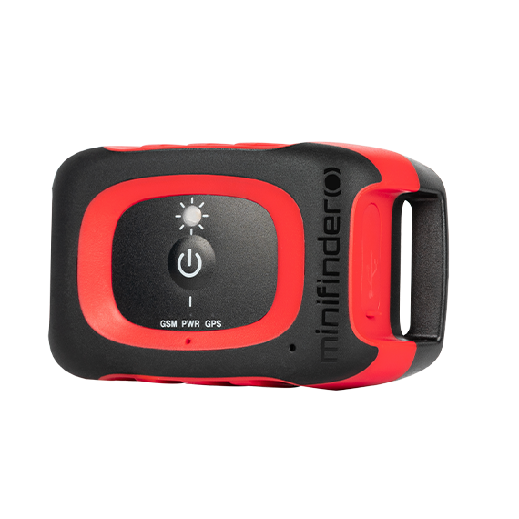

# MiniFinder - Rex: Rastreador para perros de caza

El MiniFinder Rex es un rastreador GPS diseñado específicamente para perros de caza y animales de trabajo. Robusto e impermeable, con un formato compacto, Rex ofrece posicionamiento GNSS de alta sensibilidad, larga autonomía y conectividad inalámbrica local para proporcionar datos fiables de ubicación y comportamiento en tiempo real en el campo. Sus funciones orientadas al uso exterior incluyen un LED guía, detección de ladridos, modos de vibración y voz, además de comunicación de audio para ayudar a los manejadores a localizar e interactuar con los animales durante las operaciones.

Rex está disponible como dispositivo compatible con Plaspy, lo que facilita incorporar sus datos de seguimiento y las métricas específicas de caza a un flujo de trabajo más amplio de telemetría y gestión de flotas. Al integrarlo con Plaspy, la información de posición y estado de Rex aparece en mapas en vivo, se puede incluir en reglas de alerta y alimenta reportes históricos, de modo que los manejadores y equipos puedan coordinarse de forma más eficiente sin perder las funciones nativas del dispositivo diseñadas para el trabajo en campo.

## Características principales

- Diseñado para perros de caza y animales de trabajo al aire libre, con diseño compacto, resistente y clasificación de impermeabilidad.
- LED guía incorporado y opciones audibles para ayudar a localizar animales en condiciones de poca luz o terreno denso.
- Monitoreo de comportamiento, como la detección de ladridos, y modos configurables de vibración y comando de voz.
- Larga autonomía y diseño recargable pensado para soportar operaciones prolongadas en campo.
- Conectividad inalámbrica local para interacciones a corta distancia y cobertura celular para actualizaciones en vivo cuando haya señal.
- Compatible con Plaspy para integrar ubicación en tiempo real, alertas y datos históricos en sus flujos de monitoreo y coordinación existentes.

## Cómo funciona con Plaspy

Cuando Rex se utiliza con Plaspy, la posición y el estado del dispositivo se transmiten a la plataforma para que los equipos puedan ver ubicaciones en vivo, recibir alertas y analizar la actividad tras una operación. Plaspy procesa los datos del dispositivo para ofrecer mapeo, notificaciones e informes, a la vez que preserva las funciones específicas de Rex pensadas para el trabajo de campo.

- Actualizaciones de posición en tiempo real y estado del dispositivo visibles en los mapas de Plaspy para mantener la conciencia situacional.
- Alertas de geocercas e historial de ubicaciones sincronizados con Plaspy para revisión y análisis posteriores al evento.
- Notificaciones de actividad y seguridad, como eventos de detención y alertas de ladridos, integradas en las reglas de alerta de Plaspy.
- Comandos remotos y señales iniciadas desde la plataforma o la app emparejada permiten a los manejadores activar luces guía o señales audibles cuando el dispositivo lo soporta.
- Interacciones inalámbricas locales para emparejamiento rápido y sincronización de configuración que complementan los flujos de trabajo de Plaspy con dispositivos cercanos.

## Casos de uso típicos

- Caza y trabajo de campo donde es crítico localizar y comunicarse con los perros con rapidez.
- Gestión y entrenamiento de perros de trabajo que se benefician de capacidades remotas de vibración o comando de voz.
- Apoyo en búsqueda y rescate, donde los rastreadores compactos y resistentes permiten la coordinación de equipos en mapas en vivo de Plaspy.
- Equipos de manejadores colaborando y compartiendo posiciones en tiempo real y alertas de eventos durante las operaciones.
- Análisis post operación de rutas, periodos de descanso y líneas de tiempo de eventos utilizando los reportes de Plaspy.

## Por qué elegir este rastreador con Plaspy

El MiniFinder Rex está diseñado para satisfacer las necesidades prácticas de manejadores y equipos que operan en entornos exteriores, y su conjunto de funciones encaja bien con los casos de uso de Plaspy para monitoreo en vivo y respuesta coordinada. La combinación de sensores orientados al campo, construcción duradera y largas autonomías hace de Rex una opción relevante para organizaciones que desean incorporar el seguimiento animal dentro de una configuración más amplia de telemetría o visibilidad de flotas.

Si desea saber más sobre cómo Plaspy puede integrar el seguimiento de Rex en sus flujos de trabajo de monitoreo y coordinación visite https://www.plaspy.com. Product specifications, availability, and manufacturer details can change over time, so verify current specifications and subscription requirements on the manufacturer website https://minifinder.se/.
