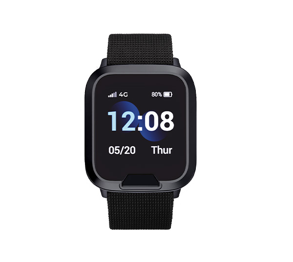

# MiniFinder - Watch

El MiniFinder Watch es un rastreador GPS portátil y reloj inteligente de seguridad pensado para personas mayores y usuarios vulnerables. Ofrece seguimiento de ubicación en tiempo real junto con telemetría de salud, detección automática de caídas y una alarma SOS de un solo toque para que cuidadores y equipos de monitoreo reciban alertas y datos de ubicación oportunos. El dispositivo está pensado tanto para uso doméstico como institucional e incluye funciones para supervisión continua y uso diario.

Este modelo es compatible con Plaspy desde el primer momento, lo que facilita incorporar seguridad personal y monitorización de salud en un entorno Plaspy ya existente. El Watch transmite posición, eventos SOS, alertas por caída y telemetrías seleccionadas a Plaspy para visibilidad centralizada, permitiendo a cuidadores y administradores supervisar ubicaciones e incidentes desde la misma plataforma que usan para rastreo de flotas y activos.

## Aspectos destacados

- Reloj inteligente de seguridad diseñado para protección personal y supervisión continua.
- Compatible con Plaspy para integrar directamente ubicación, alertas y telemetría en una plataforma central de monitoreo.
- Telemetría de salud que incluye frecuencia cardíaca y SpO2, junto con detección automática de caídas y un botón SOS sencillo de usar.
- Posicionamiento multiconstelación y soporte de balizas para mejorar la precisión a nivel de habitación dentro de instalaciones de cuidado.
- Conectividad celular y capacidad de llamadas de voz para reportes en tiempo real y comunicación bidireccional.
- Diseño robusto para uso diario con resistencia al agua y autonomía de batería optimizada para vigilancia continua.

## Cómo funciona con Plaspy

Una vez que el MiniFinder Watch se registra en Plaspy, entrega en tiempo real datos de posición, eventos y telemetría. Plaspy procesa estas transmisiones y pone a disposición en paneles y flujos de alertas los puntos de ubicación, disparadores SOS y lecturas de salud para que cuidadores, centros de monitoreo y administradores puedan responder y revisar el historial.

- Las actualizaciones de ubicación en tiempo real y el historial de movimiento aparecen en los paneles de Plaspy para ofrecer conciencia situacional.
- Las alarmas SOS y las alertas automáticas por caída se enrutan hacia contactos predefinidos o colas de monitoreo dentro de Plaspy.
- La telemetría de frecuencia cardíaca y SpO2 está disponible junto con los datos de ubicación para una supervisión combinada y revisión de tendencias.
- El posicionamiento en interiores mediante balizas y Wi-Fi mejora la precisión a nivel de habitación en instalaciones de cuidado y reduce el uso innecesario del GPS.
- Las actualizaciones remotas y la gestión de dispositivos se pueden coordinar mediante las herramientas de administración compatibles con Plaspy para mantener los equipos al día.

## Casos de uso típicos

- Respuesta personal a emergencias para usuarios mayores, usando SOS y alertas por caída para notificar a cuidadores.
- Monitorización remota de salud y bienestar donde los signos vitales complementan el historial de ubicación para una supervisión más completa.
- Despliegues en centros de cuidado que requieren seguimiento a nivel de habitación y manejo centralizado de incidentes.
- Apoyo para vida independiente con recordatorios y geocercas que ayudan a mantener rutinas y proporcionan notificaciones rápidas ante excepciones.
- Extensión de una implementación de Plaspy para incluir seguridad personal portátil para el personal o personas vulnerables junto al rastreo de vehículos y activos.

## Por qué elegir este rastreador con Plaspy

El MiniFinder Watch incorpora funciones específicas de seguridad personal y telemetría de salud en Plaspy sin añadir complejidad operativa. Para organizaciones que ya confían en Plaspy para visibilidad operacional, el Watch extiende el mismo modelo de monitoreo y alertas centralizado a las personas, permitiendo flujos de trabajo consistentes para la respuesta a incidentes y la generación de informes históricos.

Si desea obtener más información sobre cómo Plaspy puede integrar dispositivos de seguridad portátiles como el MiniFinder Watch en sus procesos de monitoreo y respuesta, visite https://www.plaspy.com. Las especificaciones del producto y su disponibilidad pueden cambiar con el tiempo, por lo que le recomendamos verificar los detalles y la compatibilidad actuales en el sitio del fabricante https://minifinder.se/.
