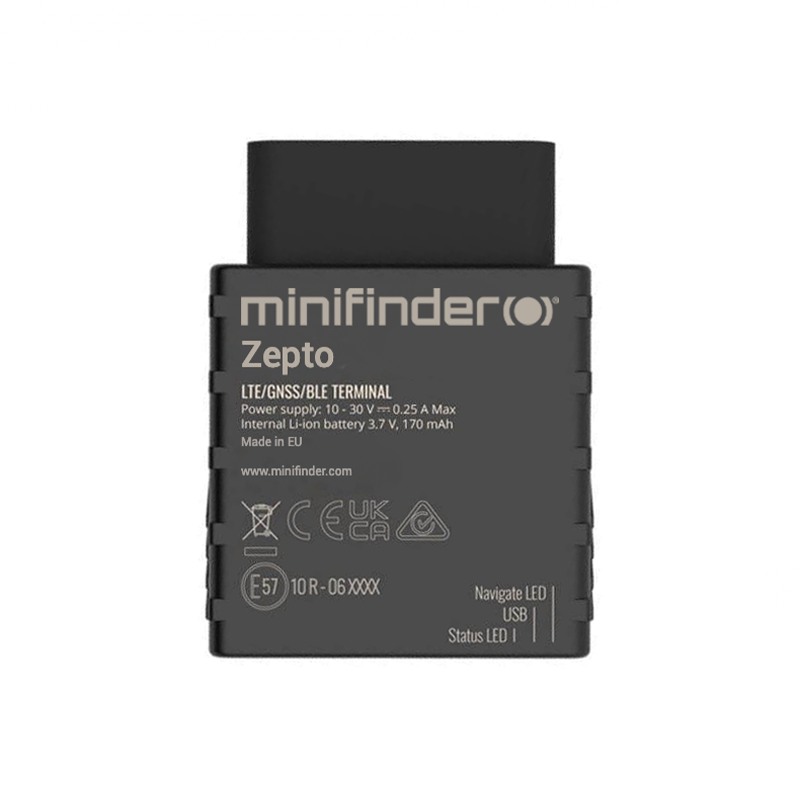

# MiniFinder - Zepto

El MiniFinder Zepto es un rastreador GPS compacto tipo OBD2, plug and play, diseñado para el seguimiento vehicular discreto y la monitorización continua en tiempo real. Pensado para montaje interno y uso normal del vehículo, Zepto ofrece ubicación en vivo y telemetría adecuada tanto para autos particulares como para vehículos de flota. Su tamaño reducido y la alimentación constante desde el vehículo lo hacen práctico para despliegues a largo plazo donde la discreción y la conectividad permanente son prioridades.

Zepto es compatible con Plaspy desde el primer momento, lo que permite enviar ubicación y telemetría proveniente del OBD directamente a la plataforma Plaspy para visibilidad en tiempo real, alertas e informes históricos. Esa compatibilidad convierte a Zepto en una opción eficiente para organizaciones que desean un rastreador de bajo mantenimiento que alimente datos a Plaspy para la gestión de flotas, procesos antirobo y registro de viajes.

## Aspectos clave

- Conexión OBD2 plug and play para seguimiento con alimentación continua del vehículo sin necesidad de recarga por parte del usuario.
- GNSS multi-constelación para posicionamiento preciso en exteriores y actualizaciones de ubicación fiables.
- Factor de forma pequeño para montaje interno discreto y menor riesgo de descubrimiento.
- Batería interna de respaldo para reportes de emergencia cortos en caso de interrupción de la alimentación del vehículo.
- Registro histórico de recorridos y geocercas configurables para reproducción y reportes de cumplimiento.
- Alarmas por eventos como exceso de velocidad, movimiento y manipulación para soportar flujos de trabajo de flota y antirobo.

## Cómo funciona con Plaspy

Al integrarlo con Plaspy, el MiniFinder Zepto transmite la posición en tiempo real y los eventos derivados del OBD a su cuenta de Plaspy, de modo que los equipos pueden monitorear vehículos en vivo, recibir alertas y generar informes. Plaspy presenta estos datos entrantes en paneles y vistas de reproducción para apoyar la toma de decisiones operativas y la revisión de incidentes.

- Entregar actualizaciones de ubicación en tiempo real a Plaspy para paneles de seguimiento y vistas de mapa.
- Activar alertas configurables por geocerca y por eventos dentro de Plaspy para notificar de inmediato incidentes relevantes.
- Reproducir recorridos históricos y acceder a registros de trayectos almacenados para análisis posterior a incidentes y reportes de cumplimiento.
- Mostrar eventos provenientes del OBD, como encendido o señales de alarma, en Plaspy cuando esas señales estén disponibles en la alimentación del vehículo.
- Incluir datos de viaje y horas de motor en los informes de Plaspy para apoyar diarios de kilometraje y auditorías operativas.
- Soportar flujos de trabajo y acceso para múltiples usuarios para que gerentes y responsables trabajen con los mismos datos rastreados.

## Casos de uso típicos

- Gestión de flotas para seguimiento continuo, optimización de rutas y revisión del desempeño del conductor.
- Protección antirobo mediante instalación discreta, alarmas de movimiento y manipulación, y alertas rápidas.
- Diarios de viaje para conductores y registro de kilometraje conforme a requisitos fiscales usando registros de trayectos y reproducción.
- Supervisión de flotas mixtas que incluyen autos, camiones y autobuses, centralizando la telemetría en Plaspy.
- Informes operativos para planificación de mantenimiento a partir del historial de viajes y resúmenes de horas de motor.

## Por qué elegir este rastreador con Plaspy

El MiniFinder Zepto es una opción práctica para empresas y usuarios particulares que buscan un rastreador discreto alimentado por el vehículo que se conecte directamente a Plaspy para monitorización en vivo e informes históricos. Su diseño OBD2 plug and play reduce la necesidad de mantenimiento, mientras que el posicionamiento multiconstelación y el amplio soporte celular ayudan a mantener una cobertura consistente en muchas regiones. Alimentar los datos de Zepto en Plaspy permite paneles unificados, alertas configurables y herramientas de reproducción que simplifican la supervisión de flotas y el análisis de incidentes.

Si su implementación requiere integraciones más avanzadas, como sensores externos o control de inmovilizador, verifique esas capacidades específicas para su vehículo y las opciones de accesorios. Zepto se enfoca en el seguimiento y la notificación de eventos provenientes del OBD e integra esos flujos de datos en los procesos de Plaspy que dependen de dichas señales.

Para obtener más información sobre Plaspy y cómo puede gestionar dispositivos MiniFinder Zepto visite https://www.plaspy.com. Las especificaciones del producto y la disponibilidad pueden cambiar con el tiempo, así que confirme los detalles y la compatibilidad actuales en el sitio del fabricante https://minifinder.se/.
