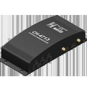

# Navis - Señal CH - 4713

El rastreador GPS Navis Señal CH-4713 es un equipo de comunicación diseñado para ser instalado en vehículos y permitir la navegación y transmisión de telemetría. Este dispositivo es ideal para monitorear el funcionamiento del vehículo y el equipo a bordo, así como para establecer comunicación de voz con el centro de monitoreo.

Con el rastreador GPS Navis Señal CH-4713, podrás tener un control total sobre tu flota de vehículos. Podrás rastrear la ubicación en tiempo real, recibir alertas de movimiento no autorizado, y obtener informes detallados sobre el rendimiento y el uso de los vehículos. Además, este rastreador GPS cuenta con una función de mensajería de voz, lo que te permite comunicarte directamente con el conductor en caso de emergencia o para dar instrucciones.

Características destacadas:

- Función de navegación y transmisión de telemetría
- Comunicación de voz con el centro de monitoreo
- Rastreo de ubicación en tiempo real
- Alertas de movimiento no autorizado
- Informes detallados sobre el rendimiento y uso de los vehículos

