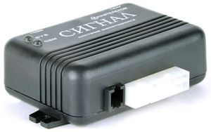

# Navtelekom - СИГНАЛ S-2114

El СИГНАЛ S-2114 es un rastreador GPS automotriz con conectividad GSM diseñado para el monitoreo vehicular, la seguridad y una telemetría sencilla. Pensado para instalaciones existentes y entornos heredados, el S-2114 ofrece posicionamiento GPS confiable, notificaciones de alarma mediante llamadas de voz y SMS, e integración con sensores digitales de combustible. Su conjunto de funciones está orientado a equipos que requieren seguimiento y telemetría esenciales sin depender de un ecosistema de sensores moderno.

Como dispositivo compatible con Plaspy, el S-2114 puede enviar posiciones, alarmas y datos de combustible a Plaspy para el seguimiento centralizado en tiempo real y la gestión de flotas. Al ser un modelo archivado y destinado a soporte y reemplazo, resulta especialmente relevante para organizaciones que operan flotas heredadas y desean mantener unidades existentes integradas en Plaspy aprovechando la documentación y los archivos de firmware del fabricante.

## Características principales

- Integración compatible con Plaspy para seguimiento y reportes centralizados en tiempo real.
- Conectividad GSM GPRS para actualizaciones de ubicación en vivo y transporte remoto de datos.
- Interfaz RS-232 para integrar sensores digitales de combustible y recibir telemetría de nivel de tanque.
- Notificación de alarmas mediante llamadas de voz y SMS para avisos rápidos de eventos.
- Configuración y actualizaciones de firmware locales por USB, además de actualización remota vía GPRS.
- Diseñado para uso automotriz y óptimo para mantener continuidad en flotas heredadas.

## Cómo funciona con Plaspy

El S-2114 transmite datos posicionales y de telemetría a través de la red celular para que Plaspy pueda mostrar la ubicación de los vehículos, registrar eventos de alarma e incluir lecturas de combustible en los paneles operativos. La integración con Plaspy permite a las flotas combinar las señales del dispositivo con otros activos y flujos de trabajo para supervisión e informes.

- Ubicación en tiempo real y telemetría básica entregadas por GSM GPRS a Plaspy.
- Los eventos de alarma reportados por llamada de voz o SMS se registran y pueden activar notificaciones o acciones en los flujos de trabajo de Plaspy.
- Los datos de nivel de combustible procedentes de sensores conectados por RS-232 se reciben como telemetría y pueden visualizarse y analizarse en los informes y tendencias de Plaspy.
- Actualizaciones de firmware y configuración, tanto remotas como locales, facilitan la gestión de unidades integradas en Plaspy.
- Plaspy puede correlacionar la posición del rastreador y la telemetría reportada con señales de estado del vehículo cuando esas señales estén disponibles en la configuración de integración.

## Casos de uso típicos

- Gestión de flotas para monitoreo de rutas, visibilidad de activos e informes operativos.
- Monitoreo antirrobo con eventos de alarma registrados y seguidos en Plaspy.
- Control de combustible para análisis de consumo mediante entradas de sensores digitales.
- Soporte de vehículos heredados para mantener la continuidad de instalaciones antiguas.
- Despliegues de telemetría básicos donde la posición y las alarmas cubren las necesidades operativas.

## Por qué elegir este rastreador con Plaspy

El СИГНАЛ S-2114 es una opción práctica para operadores que necesitan posicionamiento GPS fiable, notificación básica de alarmas y soporte para sensores de combustible integrados en Plaspy sin añadir capas de sensores modernos. Su diseño favorece la continuidad y la mantenibilidad en vehículos ya equipados con este modelo, y la disponibilidad de documentación del fabricante y archivos de firmware lo hace viable para soporte a largo plazo.

Dado que el S-2114 es un modelo archivado y descontinuado, es más adecuado para reemplazos y soporte de instalaciones heredadas que para despliegues masivos nuevos. Las organizaciones que priorizan la integración sencilla de posición, alarmas y telemetría de combustible en Plaspy encontrarán en el S-2114 una opción compacta y fácil de mantener para mantener sus flotas existentes conectadas y visibles.

Para saber más sobre Plaspy y cómo se admiten los dispositivos compatibles, visite https://www.plaspy.com. Las especificaciones del producto, la disponibilidad y los detalles del fabricante pueden cambiar con el tiempo, por lo que le recomendamos verificar las especificaciones actuales y el firmware en la documentación oficial de Navtelecom en https://www.navtelecom.ru/.
