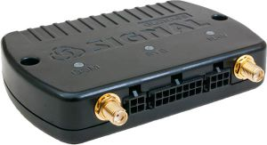

# Navtelekom - SIGNAL S-2551

El SIGNAL S-2551 es un rastreador de vehículos robusto GLONASS/GPS diseñado para proyectos profesionales de telemática y gestión de flotas. Compatible con Plaspy de serie, el S-2551 combina comunicaciones móviles de doble SIM, soporte para los protocolos EGTS y FLEX/FLEX 2.0, y amplias E/S para ofrecer seguimiento en tiempo real confiable, telemetría y diagnósticos avanzados para vehículos y activos móviles.

Diseñado para integradores y operadores de flotas que requieren soporte flexible de sensores y entrega de datos segura, el SIGNAL S-2551 admite antenas GNSS y GSM externas, registro microSD opcional, acceso al configurador USB y una batería Li‑Po interna de respaldo. Sus amplias interfaces \(CAN J1939, RS‑232/485, 1‑Wire\) y funciones de alarma e inmovilizador configurables lo convierten en una opción sólida para implementaciones anti‑robo, telemetría e inteligencia operativa basadas en Plaspy.

## Key Highlights

- Compatible con Plaspy para una integración fluida de seguimiento en tiempo real y telemetría en su plataforma de monitorización.
- Doble SIM, SMS y GPRS con transporte TCP/UDP y soporte para EGTS y FLEX/FLEX 2.0 para una entrega de datos robusta.
- Amplias E/S: RS‑232, RS‑485, CAN J1939, 1‑Wire, 3 entradas analógicas y 3 entradas discretas, 2 entradas de frecuencia y hasta 4 salidas de control configurables.
- Batería de respaldo Li‑Po integrada \(~800–850 mAh\) que proporciona hasta ~6 horas de funcionamiento autónomo y soporte de carga USB.
- Acelerómetro a bordo con detección de choque/impacto, analíticas EcoDriving y registro del perfil de accidentes \(GOST/ASI\).
- Registro de alta capacidad: memoria interna para ~28,000 registros y microSD opcional \(hasta 32 GB\) para archivo local extendido.
- Caja ABS IP54 y rango de alimentación de grado vehicular \(8.5–48 V\) con protección de transitorios de alto voltaje.

## Cómo Funciona con Plaspy

La integración del SIGNAL S-2551 con Plaspy es sencilla: el rastreador transmite la posición GNSS y telemetría detallada a través de redes celulares a los servidores de Plaspy usando los protocolos compatibles. Plaspy ingiere la ubicación, el estado de las E/S y la telemetría de sensores para seguimiento en tiempo real, reproducción histórica y alertas basadas en reglas. El dispositivo puede enviar datos a hasta tres servidores simultáneamente, lo que permite una entrega redundante e integraciones paralelas.

- Actualizaciones de ubicación y telemetría en tiempo real vía GPRS \(TCP/UDP\) y SMS cuando se configure.
- Canales de telemetría que incluyen estados de E/S digitales, lecturas de sensores analógicos y datos del bus del vehículo CAN J1939 para parámetros del motor y diagnósticos.
- Eventos de choque/impacto \(acelerómetro\) se reportan para perfilamiento de accidentes y alertas de emergencia.
- Control de inmovilizador e identificación del conductor mediante llaves 1‑Wire TouchMemory disponibles para flujos de anti‑robo y control de acceso.
- Módulos Bluetooth y de audio opcionales amplían la integración con Plaspy a sensores Bluetooth y funciones de manos libres o escucha cuando estén instalados.

## Resumen técnico

| Conectividad | Doble SIM celular \(SMS, GPRS\), transporte TCP/UDP, soporte CSD |
| --- | --- |
| Protocolos | EGTS, FLEX / FLEX 2.0, soporte de protocolo personalizado; telemetría a hasta tres servidores |
| Bandas | Bandas celulares específicas del modelo \(consulte la documentación del fabricante\) |
| Alimentación & Batería | Alimentación 8.5–48 V con protección contra transitorios de alto voltaje; batería de respaldo Li‑Po integrada ~800–850 mAh \(hasta ~6 horas\); carga USB soportada |
| Interfaces | RS‑232, RS‑485, CAN \(J1939\), 1‑Wire; 3 entradas analógicas; 3 entradas discretas; 2 entradas de frecuencia/pulsos; hasta 4 salidas de control configurables \(conmutación hasta 31 V / 500 mA\) |
| GNSS | Soporte GLONASS / GPS; antena GNSS externa compatible |
| Bluetooth | Módulo Bluetooth opcional disponible para sensores y beacons |
| Registro y Almacenamiento | Memoria interna no volátil ~28,000 registros; soporte microSD hasta 32 GB \(aprox. 2,000,000 registros por GB\) |
| Diagnóstico y Seguridad | Acelerómetro con detección de choque/impacto, analíticas EcoDriving, grabación de perfil de accidente \(GOST/ASI\), cálculo de horas de motor, detección de interferencia GSM, modos de alarma/seguridad configurables |
| Gestión remota | Actualización de firmware y ajustes vía GPRS/CSD; configuración local vía USB con NTC Configurator; el fabricante proporciona firmware y manuales |
| Factor de forma | Caja ABS IP54, 105 × 78 × 20.5 mm, ~0.105 kg |

## Casos de uso

- Gestión de flotas y seguimiento en tiempo real de vehículos: monitorizar rutas, tiempo de inactividad, horas de motor y métricas EcoDriving a través de paneles de Plaspy.
- Antirrobo e inmovilización: identificación del conductor e inmovilizador mediante tarjetas de proximidad, además de modos de alarma configurables ante movimientos no autorizados.
- Telemetría y diagnóstico remoto: recopilar telemetría CAN J1939 y de sensores analógicos para mantenimiento preventivo y monitoreo de combustible cuando se adjunta un sensor de nivel de combustible.
- Detección de accidentes y seguridad: reporte de choques/impactos basado en acelerómetro con registro de perfiles GOST/ASI para apoyar la investigación de incidentes.
- Adjuntos y sensores auxiliares: integre sensores Bluetooth, sondas de temperatura o contactos de puertas/alarma a través de las entradas analógicas/discretas y la interfaz 1‑Wire del dispositivo.

## Por qué elegir este rastreador con Plaspy

El SIGNAL S-2551 combina hardware avanzado de telemática vehicular con un transporte de datos flexible para ofrecer una solución confiable compatible con Plaspy para proyectos exigentes de flota y seguridad. Su amplia gama de E/S, soporte CAN J1939 y opciones de antena externa permiten una integración profunda con el vehículo y una colección de telemetría robusta, mientras que la doble SIM y la entrega de telemetría a múltiples servidores mejoran la disponibilidad y la redundancia de datos. La detección de accidentes integrada, el soporte de inmovilizador y las alarmas configurables añaden capacidades importantes de anti‑robo y seguridad para despliegues empresariales.

Para los equipos de integración, el S-2551 ofrece gestión remota práctica \(actualizaciones GPRS/CSD\) y configuración local vía USB con firmware y documentación proporcionados. El diseño de alimentación robusta \(rango de 8.5–48 V y respaldo Li‑Po\) y la carcasa IP54 lo hacen adecuado para instalaciones en vehículos donde la continuidad y la resiliencia son importantes. Nota: este modelo específico figura como descontinuado en el archivo de productos del fabricante; consulte al fabricante o al distribuidor autorizado para la disponibilidad actual, firmware y compatibilidad documentada con implementaciones de Plaspy.

