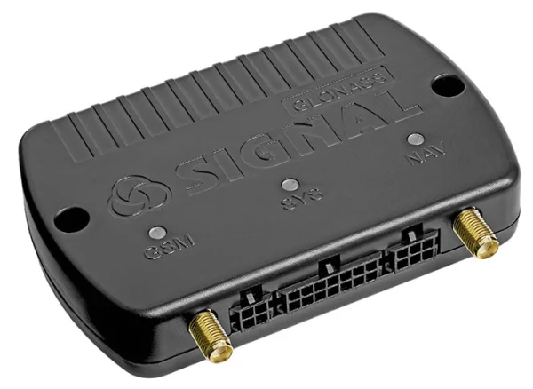

# Navtelekom - SIGNAL S-4651

El SIGNAL S-4651 es un rastreador vehicular profesional LTE 4G diseñado para implementaciones exigentes de gestión de flotas y telemática. Combina conectividad celular de varias generaciones con soporte de SIM doble, conexiones externas para antenas GNSS y GSM, y un amplio conjunto de interfaces vehiculares para ofrecer rastreo en tiempo real fiable, captura de telemetría y registro local seguro para flotas comerciales.

Como dispositivo compatible con Plaspy, el S-4651 es adecuado para organizaciones que requieren captura de datos robusta y visibilidad continua dentro de una consola telemática unificada. Su combinación de interfaces CAN y serie, conectividad Bluetooth, registro en tarjeta SD y batería de respaldo integrada lo convierten en una opción práctica para aportar posición del vehículo, eventos y datos diagnósticos a Plaspy para monitoreo, alertas e informes.

## Puntos clave

- Compatible con Plaspy para integración en tiempo real y gestión de flotas
- Módem celular LTE Cat 1 con fallback a 3G y 2G y dual SIM para conectividad resiliente
- Completo conjunto de entradas y salidas vehiculares que incluye entradas universales, salidas de control, puertos CAN y serie
- Registro local en tarjeta SD y batería de respaldo que preserva datos durante cortes de energía
- Soporte Bluetooth 4.0 para integraciones de corto alcance con sensores y beacons
- Entradas/salidas de audio bidireccional para comunicación con el conductor y flujos de trabajo por voz
- Protección de entradas robusta diseñada para entornos automotrices

## Cómo funciona con Plaspy

Conectar el SIGNAL S-4651 a Plaspy incorpora la posición GNSS y la telemetría a bordo en una única plataforma telemática para monitoreo en vivo, alertas por eventos e informes históricos. El equipo transmite ubicación y datos del vehículo a través de redes celulares, y Plaspy procesa esa información para mostrar mapas, geocercas, alertas e información operativa para los equipos de flota.

- Actualizaciones de ubicación y telemetría en tiempo real para seguimiento continuo de vehículos
- Monitoreo de ignición y estado enviado a Plaspy mediante entradas y datos CAN cuando están disponibles
- Telemetría de combustible y de motor desde el bus CAN que puede visualizarse en Plaspy para análisis de consumo
- Salidas de control e integración CAN que permiten inmovilización remota y flujos de control de flota cuando se configuran en Plaspy
- Sensores Bluetooth y beacons emparejados con el rastreador pueden reenviarse a Plaspy para telemetría de carga o condiciones del conductor
- El registro local en tarjeta SD ofrece captura offline y posterior sincronización con Plaspy para mantener registros históricos continuos

## Casos de uso típicos

- Gestión de flotas medianas y grandes que requieren rastreo en tiempo real e historial de rutas
- Flujos de trabajo anti robo e inmovilización mediante salidas de control remotas y monitoreo de posición
- Supervisión de combustible y diagnóstico recopilando telemetría del bus CAN y reportándola en Plaspy
- Monitoreo de carga y condiciones del habitáculo del conductor mediante sensores Bluetooth y registro local
- Comunicación bidireccional con conductores para despacho, verificaciones de seguridad y coordinación operativa

## Por qué elegir este rastreador con Plaspy

El SIGNAL S-4651 ofrece la conectividad y la profundidad de interfaces que se espera en hardware telemático profesional, lo que lo convierte en una opción sólida para usuarios de Plaspy que necesitan telemetría vehicular detallada y seguimiento resiliente. Su combinación de conectividad celular multigeneracional, diseño de SIM doble, acceso CAN y serie, y almacenamiento local soporta informes avanzados, flujos de trabajo de diagnóstico y continuidad de datos durante cortes temporales.

Para gestores de flota que buscan emparejar hardware capaz con una plataforma de seguimiento integral, el S-4651 proporciona entradas prácticas y funciones de registro para alimentar a Plaspy con datos confiables para mapas, alertas y análisis operativos. Para saber más sobre cómo Plaspy puede trabajar con dispositivos como el SIGNAL S-4651, visite el sitio principal de Plaspy en https://www.plaspy.com. Las especificaciones del producto, la disponibilidad y los datos del fabricante pueden cambiar con el tiempo; por favor verifique la información técnica más reciente en el sitio oficial de Navtelekom en https://www.navtelecom.ru/.
