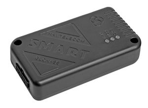

# Navtelekom - SMART S-2423 MID+

El SMART S-2423 MID+ es un rastreador compacto con GPS y GLONASS pensado para la gestión de flotas y el monitoreo vehicular. Compatible con Plaspy desde su instalación, combina un módem GSM 2G con antenas internas GNSS y GSM, además de ofrecer múltiples opciones de entradas y salidas para suministrar localización y telemetría continua a operadores e integradores.

Como dispositivo compatible con Plaspy, el S-2423 MID+ puede reenviar posiciones, lecturas de sensores y métricas de comportamiento del conductor a Plaspy para su monitoreo centralizado, enrutamiento, generación de informes y alertas. Su arquitectura de múltiples interfaces y funciones integradas como Bluetooth, acelerómetro, 1-Wire y soporte RS-485 lo hacen adecuado para quienes buscan visibilidad consolidada y análisis basados en datos dentro de la plataforma Plaspy.

## Aspectos destacados

- Rastreador GPS GLONASS compatible con Plaspy para monitoreo de flotas en tiempo real y recolección de telemetría
- Módem GSM 2G integrado con antenas internas GNSS y GSM para instalaciones vehiculares compactas
- Acelerómetro incorporado para soporte de puntuación de conducción ecológica y telemetría de comportamiento del conductor
- Soporte Bluetooth 4.0 para sensores de corto alcance y balizas locales
- Soporte de entradas y salidas múltiples, incluyendo entradas universales y salidas de control para pulsos de combustible y conmutación remota
- Interfaces 1-Wire y RS-485 para sondas de temperatura y dispositivos de telemetría de terceros
- Batería interna de respaldo y protección contra sobretensiones para mejorar la disponibilidad en entornos eléctricos vehiculares

## Cómo funciona con Plaspy

Cuando se configura para Plaspy, el SMART S-2423 MID+ envía actualizaciones de ubicación y telemetría a la plataforma Plaspy, permitiendo que los administradores de flota vean los activos en tiempo real, generen reportes y configuren alertas. Los integradores suelen aprovisionar y actualizar los dispositivos antes del registro usando las herramientas del fabricante; a partir de ahí Plaspy recoge y normaliza los datos entrantes para su uso operativo.

- Visibilidad en tiempo real de ubicación y movimiento en los paneles y mapas de Plaspy
- Eventos basados en acelerómetro y métricas de conducción ecológica para puntuación y alertas de conductores
- Telemetría de combustible y pulsos mediante entradas universales para informes de kilometraje y consumo
- Acciones de control remoto y alertas anti robo usando salidas de control combinadas con los flujos de trabajo de Plaspy
- Datos de sensores de corto alcance vía Bluetooth y monitoreo de temperatura mediante 1-Wire para el seguimiento de la condición de la carga
- Reenvío de telemetría de terceros desde periféricos RS-485 hacia Plaspy para reportes unificados

## Casos de uso típicos

- Gestión de flotas con seguimiento centralizado, enrutamiento e informes de utilización en Plaspy
- Monitoreo de combustible y registro de kilometraje mediante entradas de pulso e integración de telemetría
- Flujos de trabajo de anti robo y bloqueo remoto combinados con las alertas de Plaspy
- Integración de tacógrafos y telemetría de terceros para cumplimiento y supervisión de horas de conducción
- Monitoreo de carga sensible a la temperatura con sondas 1-Wire y sensores Bluetooth para transporte refrigerado

## Por qué elegir este rastreador con Plaspy

El SMART S-2423 MID+ es una opción práctica para organizaciones que usan Plaspy y necesitan un rastreador compacto con amplio soporte de sensores y periféricos. Su combinación de entradas universales, salidas de control, interfaces RS-485 y 1-Wire, además de Bluetooth de corto alcance y acelerómetro, proporciona la telemetría necesaria para mejorar la visibilidad de la flota, posibilitar análisis de combustible y comportamiento del conductor, y respaldar medidas anti robo.

Para integradores telemáticos y operadores de flota, el S-2423 MID+ funciona bien con Plaspy cuando usted necesita un equipo listo para aprovisionamiento y capaz de alimentar datos diversos del vehículo a una sola plataforma. Para saber más sobre cómo Plaspy puede usar datos de dispositivos como el SMART S-2423 MID+ visite https://www.plaspy.com. Las especificaciones del producto, su disponibilidad y los detalles del fabricante pueden cambiar con el tiempo, por lo que le recomendamos verificar la documentación técnica actual y la información de compatibilidad con el fabricante en https://www.navtelecom.ru/.
