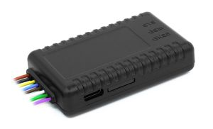

# Navtelekom - START S-2010

El START S-2010 es un rastreador GPS compacto de Navtelekom pensado para monitoreo sencillo de vehículos y activos en instalaciones cableadas. Integra un receptor GLONASS/GPS de alta sensibilidad y una antena GSM en una carcasa reducida, proporcionando reportes de ubicación y telemetría en tiempo real cuando está alimentado de forma permanente. El equipo está optimizado para vehículos ligeros de uso comercial y equipos fijos donde se prioriza un bajo impacto físico y una instalación limpia.

Como dispositivo compatible con Plaspy, el START S-2010 envía su ubicación y telemetría a la plataforma Plaspy para visibilidad de la flota, alertas e informes. Su conjunto de funciones orientado a lo esencial y las capacidades de gestión remota facilitan integrarlo en una flota gestionada con Plaspy, permitiendo a operadores y proveedores centralizar seguimiento, reglas de eventos y reproducción histórica sin complejidad innecesaria.

## Características principales

- Carcasa compacta con antenas GLONASS GPS y GSM integradas para instalaciones ordenadas.
- Compatible con Plaspy para seguimiento en tiempo real, alertas de eventos e informes históricos.
- Módem celular 2G con una nano SIM, además de USB Type-C y Bluetooth 4.0 para configuración y diagnóstico local.
- Suite de E/S práctica que incluye múltiples entradas digitales, una entrada analógica y una salida de control para relé o inmovilizador.
- Diseñado para instalaciones cableadas sin batería interna y con protección de alimentación para soportar el entorno eléctrico del vehículo.
- Gestión remota de dispositivos y capacidad de actualización de firmware vía Navtelecom DRC para simplificar el mantenimiento.

## Cómo funciona con Plaspy

Cuando está conectado, el START S-2010 transmite posiciones y estados de entradas a Plaspy a través de su enlace celular, de modo que los gestores de flota pueden monitorear activos casi en tiempo real. Plaspy recibe los datos del dispositivo para ofrecer mapas, reproducción en la línea de tiempo, alertas e informes rutinarios; el acceso local por USB y Bluetooth acelera la puesta a punto y la resolución de problemas en el vehículo.

- Actualizaciones de ubicación en tiempo real y reproducción histórica en los mapas y líneas de tiempo de Plaspy.
- Alertas basadas en eventos como encendido, apertura de puertas y otras entradas digitales para notificaciones y disparo de reglas.
- Telemetría analógica enviada a Plaspy para paneles e informes de tendencias cuando se conectan sensores externos.
- Control remoto de relé o inmovilizador a través de la salida dedicada para flujos de trabajo de seguridad y operaciones gestionados desde Plaspy.
- Aprovisionamiento centralizado de dispositivos y actualizaciones compatible con flujos de trabajo de configuración local.

## Casos de uso típicos

- Seguimiento de flotas de vehículos ligeros que requieren rastreadores compactos y de bajo perfil.
- Flujos de trabajo de inmovilización y antirobo que combinan entradas del dispositivo y control de relé con alertas de Plaspy.
- Monitoreo de puertas e ignición para seguridad e informes operativos en flotas de servicio.
- Reenvío de telemetría desde sensores externos a los paneles de Plaspy para control de combustible o monitoreo de equipos.
- Instalaciones en activos fijos donde un rastreador alimentado permanentemente ofrece visibilidad continua.

## Por qué elegir este rastreador con Plaspy

El START S-2010 es una opción práctica para organizaciones que buscan un rastreador compacto y compatible con Plaspy, con énfasis en reportes de posición fiables y capacidades de E/S sencillas. Sus antenas integradas y su formato contenido reducen la complejidad de la instalación, mientras que la gestión remota mediante herramientas de Navtelecom disminuye el esfuerzo de mantenimiento en flotas grandes. Para los operadores que priorizan visibilidad confiable en tiempo real y eventos sencillos basados en entradas dentro de Plaspy, el START S-2010 ofrece una alternativa equilibrada.

Para conocer más sobre Plaspy y cómo dispositivos compatibles como el START S-2010 encajan en un flujo de trabajo de gestión de flotas visite https://www.plaspy.com. Las especificaciones del producto, disponibilidad y detalles del fabricante pueden cambiar con el tiempo, por lo que le recomendamos verificar la documentación técnica actual y las variantes regionales en el sitio oficial de Navtelekom https://www.navtelecom.ru/.
