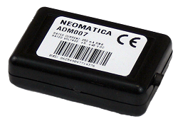

# Neomatica - ADM007

# ADM007 BLE \(Neomatica\) — Rastreador GPS compatible con Plaspy

El ADM007 BLE es un rastreador GPS ultracompacto de Neomatica, diseñado para instalaciones en vehículos y activos donde el espacio o el acceso a cableado es limitado. Como rastreador GPS compatible con Plaspy, el ADM007 BLE aporta seguimiento en tiempo real, telemetría de sensores BLE y posicionamiento GNSS fiable a la plataforma Plaspy, habilitando una gestión de flota discreta, monitorización antirrobo y telemetría de activos distribuida sin la complejidad de rastreadores cableados de mayor tamaño.

El ADM007 BLE combina un receptor GNSS de alta sensibilidad, antenas GSM y GNSS/GLONASS integradas, y soporte para hasta ocho sensores Bluetooth Low Energy en un encapsulado compacto de 45 × 25 × 12 mm. Optimizado para un bajo consumo de datos \(aproximadamente 8–10 MB al mes\) y bajo consumo de energía, este dispositivo certificado CE es ideal para instalaciones encubiertas en vehículos, monitorización ambiental a lo largo de un sitio y soluciones de flotas escalables que requieren sensores Bluetooth para reportar temperatura, humedad, inclinación y presencia de activos.

## Puntos clave

- Rastreador GPS compatible con Plaspy: envía posiciones GNSS y telemetría a Plaspy para paneles, geocercas y alertas.
- Formato ultra compacto \(45 × 25 × 12 mm, 30 g\) para instalaciones discretas en vehículos y activos.
- Soporta hasta 8 sensores Bluetooth simultáneamente \(BLE 4.0\) con un alcance de hasta 100 m para telemetría ambiental y de activos.
- Receptor GNSS/GPS de alta sensibilidad \(‑165 dBm, 132 canales\) para posicionamientos rápidos y fiables en condiciones desafiantes.
- GSM 850/900/1800/1900 con conectividad GPRS Multi-slot Class 12 para transferencias de datos eficientes y bajo consumo de datos mensuales.
- Detección de interferencias integrada para alertar sobre posibles manipulaciones anti-robo o interferencias.
- Amplia memoria de ruta en el dispositivo \(al menos 63,000 entradas\) para carga de rutas históricas y reconstrucción de incidentes.
- Control y configuración flexibles vía Bluetooth, SMS, GPRS y FOTA para gestión remota y actualizaciones de firmware.

## Cómo funciona con Plaspy

El ADM007 BLE se integra con Plaspy enviando posiciones GNSS, estado del dispositivo y telemetría de sensores Bluetooth a través de GPRS o SMS a la plataforma Plaspy. Plaspy procesa esos datos para ofrecer seguimiento en tiempo real, reproducción de rutas históricas, alertas e informes para la gestión de flotas y flujos de trabajo de anti-robo. Los cambios de configuración y las actualizaciones de firmware son compatibles a través de los canales de gestión remota del dispositivo.

- Actualizaciones de ubicación en tiempo real: las posiciones GNSS/GPS \(y GLONASS\) se envían a Plaspy para seguimiento en vivo y geocercas.
- Sensores Bluetooth: telemetría de temperatura, humedad, inclinación, iluminación y etiquetas BLE de hasta 8 periféricos se reportan a Plaspy a través del rastreador.
- Interferencia y estado del dispositivo: la detección de interferencias y alertas de estado del dispositivo pueden activar notificaciones e flujos de trabajo de incidentes en Plaspy.
- Carga de historial de rutas: el almacenamiento en el dispositivo de al menos 63,000 registros permite una reproducción histórica sólida y revisión forense en Plaspy.
- Señales de sensores externos: la única entrada analógica puede usarse para reportar valores de sensores externos \(por ejemplo, señales de sensor de combustible cableado o estado de encendido, según la instalación\) en Plaspy.
- Gestión remota: la configuración vía SMS/GPRS/Bluetooth y el soporte para FOTA simplifican el mantenimiento y mantienen el firmware actualizado.

## Visión general técnica

| Conectividad | GSM/GPRS \(GPRS Multi-slot Class 12\) |
| --- | --- |
| Bandas | GSM 850 / 900 / 1800 / 1900 |
| GNSS | Receptor GPS / GLONASS, 132 canales |
| Sensibilidad GNSS | Sensibilidad del receptor: -165 dBm |
| SIM | 1 nanoSIM |
| Alimentación & Batería | Voltaje de operación: +8.5 … +45 V |
| Capacidad de registro de rutas | Al menos 63,000 entradas |
| Analógico / E/S | 1 entrada analógica |
| Interfaz de sensores | Bluetooth 4.0 \(BLE\), hasta 8 sensores, alcance de hasta 100 m |
| Control y Configuración | Bluetooth, SMS, GPRS; FOTA compatible para actualizaciones de firmware |
| Formato | Carcasa compacta: 45 × 25 × 12 mm; Peso: 30 g |
| Certificaciones | CE certificado para venta en la UE |

## Casos de uso

- Instalaciones encubiertas en vehículos para monitorización anti-robo y seguimiento discreto de flotas donde se requiere baja visibilidad.
- Gestión de flotas con telemetría BLE para mercancía o equipo sensible a la temperatura y paneles centralizados de Plaspy.
- Monitorización distribuida de equipos en el sitio: coloque sensores BLE en activos repartidos por una instalación para capturar temperatura, inclinación y presencia.
- Monitoreo ambiental y de cadena de frío: transmite temperatura y humedad desde periféricos BLE a Plaspy para alertas e informes de cumplimiento.
- Seguimiento de activos para equipos en alquiler o herramientas de alto valor, donde el tamaño compacto y el largo alcance de sensores reducen la complejidad de la instalación.

## Por qué elegir este rastreador con Plaspy

El ADM007 BLE ofrece un equilibrio entre diseño compacto y características de telemetría prácticas que lo convierten en una opción sólida para usuarios de Plaspy que necesitan seguimiento en tiempo real además de la integración de sensores BLE. Su receptor GNSS de alta sensibilidad y la detección de interferencias mejoran la fiabilidad de la posición y la seguridad; la capacidad de manejar hasta ocho sensores BLE amplía el alcance de telemetría de Plaspy para monitoreo ambiental y reporte del estado de activos. El bajo consumo de datos y un almacenamiento robusto de rutas minimizan los costos operativos mientras respaldan la gestión de flotas, los flujos de trabajo anti-robo e insights basados en telemetría. Para flotas y despliegues que requieren instalación discreta o cobertura distribuida de sensores, el ADM007 BLE es un rastreador GPS compatible con Plaspy que facilita la integración y la gestión continua del dispositivo.

### Accesorios y soporte

El ADM007 BLE es compatible con periféricos BLE de Neomatica, incluyendo ADM35 \(temperatura\), ADM35H \(temperatura y humedad\), ADM32 \(inclinación\) y ADM34 \(etiqueta BLE\). Existe una versión con adaptador de encendedor de coche para instalaciones que prefieren una interfaz de alimentación externa. La documentación \(manual de usuario, declaraciones de conformidad\) y el soporte para actualizaciones de firmware son proporcionados por Neomatica a través de sus canales de soporte.

