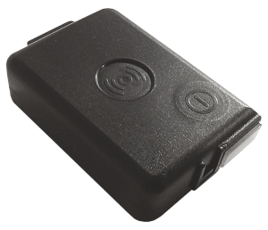

# Neomatica - ADM50

El ADM50 es un rastreador GPS compacto alimentado por batería, diseñado para la supervisión prolongada de personas y activos. Combina posicionamiento GNSS con correcciones asistidas por LBS, una batería Li‑Po de 3350 mAh y varios modos de funcionamiento para equilibrar la precisión de los reportes de ubicación y una larga vida en espera. El equipo incluye funciones de reporte por eventos como un botón de pánico y detección de movimiento, útiles para capturar incidentes y ahorrar batería cuando está inactivo.

Listado como compatible con Plaspy, el ADM50 puede integrarse en la plataforma para mapas en vivo, Alertas y reconstrucción histórica de rutas. Sus intervalos de reporte configurables, informes activados por movimiento e historial de pista local lo hacen práctico en despliegues que requieren visibilidad en tiempo real y monitoreo de larga duración. Tenga en cuenta que el fabricante indica este modelo como retirado o descontinuado, por lo que confirme la disponibilidad actual antes de comprar.

## Características clave

- Rastreador GPS personal compatible con Plaspy, apto para monitoreo prolongado y visibilidad en tiempo real.
- Posicionamiento dual GNSS con asistencia LBS para mejorar la obtención de fijaciones en entornos variados.
- Batería Li‑Po de gran capacidad (3350 mAh) y múltiples modos de operación para ampliar la autonomía en espera y el tiempo entre beacons.
- Botón físico de pánico para notificación inmediata de incidentes y alertas.
- Acelerómetro de tres ejes para detección de movimiento e informes basados en actividad que reducen el consumo energético.
- Capacidad de historial de pista local para almacenar registros de rutas y subirlos después para análisis.
- Factor de forma compacto y liviano para colocación discreta en personas o activos.

## Cómo funciona con Plaspy

Cuando lo utilice con Plaspy, el ADM50 envía telemetría de ubicación y eventos para seguimiento en vivo, alertas e informes históricos. Plaspy aprovecha el comportamiento de reporte configurable y las señales de evento del dispositivo para que usted ajuste con precisión la frecuencia de envío de posiciones y qué incidentes generan notificaciones.

- Actualizaciones de ubicación y telemetría en tiempo real mostradas en los mapas y paneles de Plaspy.
- Posicionamiento asistido por LBS que complementa GNSS para mejorar las fijaciones cuando la recepción de satélites es limitada.
- Notificaciones basadas en movimiento desde el acelerómetro que permiten reportes activados por actividad y reducción de informes durante inactividad.
- Eventos del botón de pánico reenviados a Plaspy para generar alertas inmediatas para operadores o equipos de respuesta.
- Intervalos de reporte y modos de beacon configurables para balancear la granularidad del seguimiento y la duración de la batería.
- Historial de pista local almacenado en el dispositivo que permite recuperar rutas en Plaspy tras periodos de conectividad intermitente.

## Casos de uso típicos

- Seguridad personal y monitoreo de trabajadores solitarios donde son necesarias alertas de pánico y visibilidad de ubicación.
- Protección de activos y monitoreo anti‑robo para equipos portátiles o contenedores.
- Seguimiento de mascotas o animales y eventos deportivos que se benefician de una larga autonomía en modo beacon.
- Vigilancia de activos remotos para elementos estacionales o poco inspeccionados que requieren larga espera.
- Seguimiento básico de flotas o equipos donde son suficientes fijaciones GNSS confiables e informes por movimiento.

## Por qué elegir este rastreador con Plaspy

El ADM50 es una opción práctica para organizaciones que requieren un rastreador compacto y eficiente en consumo compatible con Plaspy. Su enfoque en posicionamiento GNSS, detección de movimiento, reportes configurables y almacenamiento local de pistas lo hace idóneo para escenarios que demandan un equilibrio entre monitoreo en tiempo real y larga autonomía. Estas características permiten a los usuarios de Plaspy adaptar la visibilidad y las alertas a las necesidades operativas sin generar volúmenes de datos innecesarios.

Dado que el ADM50 figura como retirado por el fabricante, su disponibilidad puede ser limitada. Si necesita tipos de telemetría adicionales u opciones de interfaz que este modelo no enfatiza, considere verificar dispositivos alternativos o integraciones externas que se ajusten mejor a esos requisitos. Para más información sobre cómo Plaspy puede usar rastreadores compatibles como el ADM50 visite https://www.plaspy.com. Las especificaciones del producto y su disponibilidad pueden cambiar con el tiempo, por lo que le recomendamos confirmar los detalles actuales en el sitio del fabricante https://neomatica.com/.
