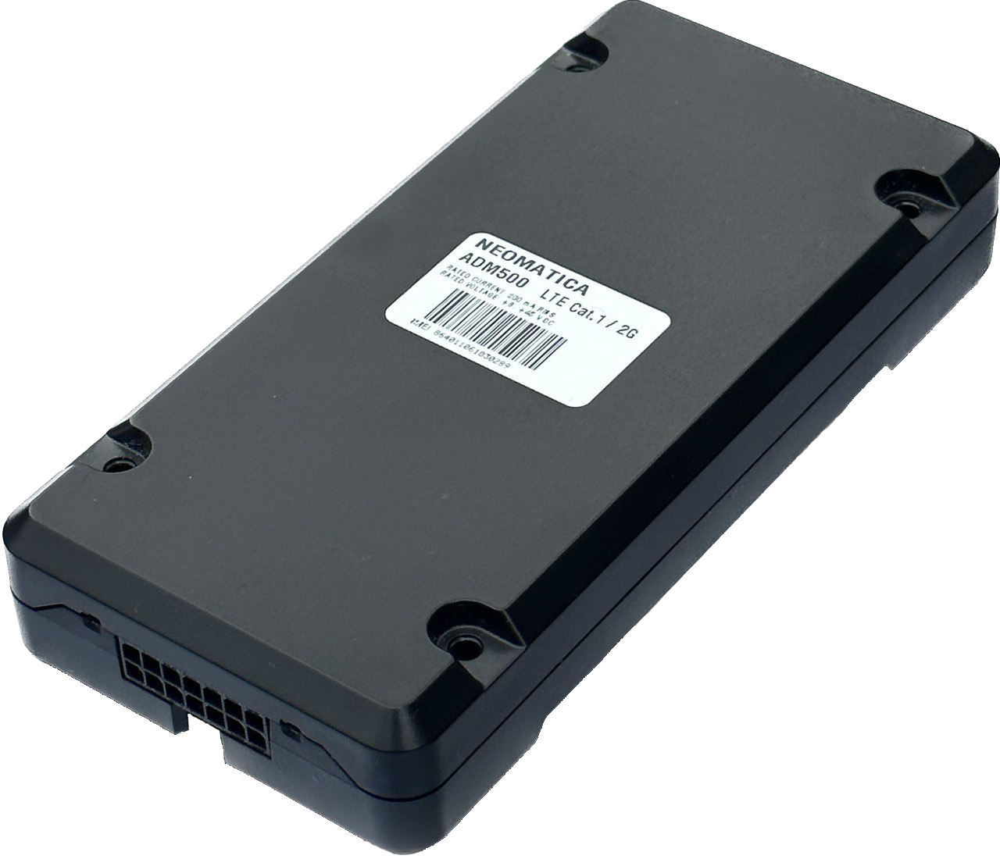

# Neomatica - ADM500

El Neomatica ADM500 es un rastreador GPS de grado profesional diseñado para telemática de vehículos y activos. Integra recepción GNSS multiconstelación (GPS, GLONASS, BDS y Galileo) con conectividad celular para ofrecer ubicación en tiempo real y registro continuo de rutas, ideal para flotas, transporte público, maquinaria agrícola y automóviles particulares. El ADM500 cuenta con doble nanoSIM, batería interna para operación autónoma temporal y amplio soporte de sensores, lo que lo hace apto para un seguimiento persistente incluso cuando se interrumpe la alimentación externa.

Como dispositivo compatible con Plaspy, el ADM500 puede enviar ubicación y telemetría a las plataformas Plaspy para monitoreo en vivo, reportes históricos y alertas operativas. Su ecosistema flexible de sensores y su manejo de eventos encajan bien con los flujos de trabajo de Plaspy que requieren monitoreo de combustible, medición de temperatura, detección de movimiento y señales de control remoto. El diseño del equipo prioriza la continuidad y fiabilidad del flujo de datos, ayudando a Plaspy a mantener un seguimiento preciso y reportes consistentes para flotas y activos distribuidos.

## Características principales

- GNSS multiconstelación para posicionamiento estable y mayor fiabilidad en entornos variados.
- Conectividad celular con soporte para doble nanoSIM que garantiza continuidad de la telemetría y redundancia.
- Batería de respaldo integrada para varias horas de operación autónoma y almacenamiento de rutas en el dispositivo para historiales prolongados.
- Alta compatibilidad con sensores, incluyendo sondas de combustible cableadas e inalámbricas, múltiples sondas de temperatura y periféricos BLE.
- Funciones orientadas a la seguridad como detección de movimiento basada en acelerómetro y alertas por bloqueo de señal para detección de manipulación.
- Múltiples canales I/O para encendido, entradas analógicas y de pulso y salidas colectoras abiertas, facilitando la integración con sistemas vehiculares.

## Cómo funciona con Plaspy

Al conectarse, el ADM500 transmite mensajes estandarizados de ubicación y telemetría que Plaspy ingiere para ofrecer mapas, alertas e informes. Plaspy aprovecha estos flujos de datos para mostrar ubicaciones en vivo, activar notificaciones basadas en eventos y generar informes históricos de viajes y sensores para supervisión operativa.

- Coordenadas GPS en tiempo real y actualizaciones de posición enviadas a Plaspy para seguimiento en vivo y visualización en mapas.
- Telemetría de sensores (sondas de combustible, sensores de temperatura y dispositivos BLE) disponible en los paneles e informes de Plaspy.
- Alertas por eventos como cambios de ignición, detección de movimiento y bloqueo de señal dirigidas a Plaspy para notificaciones inmediatas.
- Datos históricos de rutas y viajes almacenados localmente en el dispositivo y sincronizados con Plaspy para análisis retrospectivos y reportes de cumplimiento.
- Salidas remotas y señales de control expuestas por el equipo que pueden incorporarse a los flujos de trabajo de Plaspy para inmovilización o comandos remotos cuando estén configurados.

## Casos de uso típicos

- Operaciones de flota: seguimiento en vivo de vehículos, historial de rutas e informes de utilización para flotas mixtas.
- Antirrobo y seguridad: detección de movimiento y manipulación integrada en los flujos de monitoreo y alertas.
- Transporte refrigerado: reporte de sensores para carga refrigerada y monitoreo ambiental.
- Gestión de combustible: integración con sensores de combustible cableados o inalámbricos para análisis de consumo y detección de anomalías.
- Monitoreo semipermanente de activos: rastreo con respaldo de batería y sensores externos para equipos estacionarios y remolques.

## Por qué elegir este rastreador con Plaspy

El ADM500 combina hardware telemático práctico con un diseño centrado en sensores que satisface muchos requisitos de gestión de flotas y activos. Su GNSS multiconstelación, conectividad celular redundante y almacenamiento en el dispositivo ayudan a mantener consistencia en los datos de ubicación y eventos, mientras que la amplia compatibilidad I/O y de sensores lo hace flexible para diversas necesidades de telemetría. Para equipos que usan Plaspy, el ADM500 ofrece una fuente de datos potente que puede integrarse en paneles, alertas e informes sin necesidad de personalizaciones extensas.

Si desea explorar cómo el ADM500 puede apoyar su despliegue de Plaspy, conozca más sobre Plaspy en el sitio principal https://www.plaspy.com. Las especificaciones y la disponibilidad pueden cambiar con el tiempo, por lo que le recomendamos verificar los detalles técnicos y la documentación actuales con el fabricante en https://neomatica.com/ antes de tomar decisiones de compra o despliegue.
