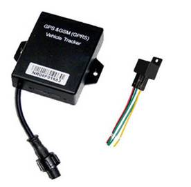

# Noran - NR006

El NR006 Mini GPS Tracker es un dispositivo de localización ultracompacto pensado para motocicletas y vehículos pequeños. Ofrece una instalación discreta y reportes de posición constantes mediante antenas GPS y GSM integradas, con LBS como respaldo en zonas de señal débil. El equipo es ligero, alrededor de 100 g, y está optimizado para entornos donde el tamaño y la ocultación son importantes.

De fábrica, el NR006 es compatible con Plaspy y puede enviar datos de ubicación en tiempo real a una cuenta Plaspy vía SMS o Internet. Su diseño de bajo consumo de datos y los paquetes de posición concisos lo convierten en una opción práctica para usuarios de Plaspy que requieren visibilidad continua sin un alto uso de ancho de banda. Además, soporta flujos de trabajo habituales de flotas y seguridad como historial de rutas, alertas y inmovilización remota cuando se integra con Plaspy.

## Características principales

- Factor de forma ultracompacto, ideal para motocicletas, que permite montaje discreto y disuasión de robos
- Compatibilidad con Plaspy para ubicación en tiempo real, rutas históricas y notificaciones vía SMS o Internet
- Operación de bajo consumo de datos usando paquetes de posición concisos de 34 bytes para reducir el uso de GPRS y los costos operativos
- GPS integrado con LBS como respaldo para mejorar los reportes en entornos urbanos o con señal deficiente
- Alarmas de seguridad y protección como notificaciones de exceso de velocidad y geocercas, además de modo de ahorro de energía
- Capacidad de corte remoto del motor usando el relé suministrado para control del inmovilizador
- Batería de respaldo opcional y memoria flash interna para alertas por corte de alimentación y registro offline

## Cómo funciona con Plaspy

El NR006 envía paquetes de posición compactos y mensajes de evento por SMS o Internet que Plaspy recibe y procesa. Una vez que los datos llegan a Plaspy, quedan disponibles para seguimiento en vivo, reproducción de rutas, notificaciones y generación de reportes, permitiendo supervisión operativa para pequeñas flotas y equipos de seguridad.

- Actualizaciones de ubicación y telemetría en tiempo real entregadas a Plaspy vía Internet o SMS para visibilidad continua
- Posicionamiento GPS con respaldo LBS que ayuda a mantener los reportes de ubicación en zonas con cobertura deficiente
- Notificaciones de alarmas y eventos, como exceso de velocidad y violaciones de geocerca, que aparecen en Plaspy como alertas configurables
- Soporte para inmovilizador remoto: Plaspy puede enviar comandos para accionar el relé suministrado y cortar el vehículo cuando esté configurado
- Registro offline y batería de respaldo opcional permiten retener datos y generar alertas por corte de energía hasta que Plaspy reciba los registros almacenados

## Casos de uso típicos

- Rastreo de flotas de mensajería en motocicleta y vehículos pequeños donde el espacio y el peso son limitados
- Monitorización antirrobo y procesos de recuperación con inmovilización remota y alertas inmediatas a través de Plaspy
- Supervisión del comportamiento del conductor mediante alertas de exceso de velocidad y reproducción de rutas para capacitación y mejora de la seguridad
- Planificación de mantenimiento e informes de utilización donde la telemetría compacta apoya la programación preventiva
- Despliegues de bajo ancho de banda que se benefician del tamaño reducido de los paquetes y la disminución de costos de datos

## Por qué elegir este rastreador con Plaspy

El NR006 es una opción acertada cuando necesita un rastreador compacto y discreto que se integre en una plataforma de gestión de flotas ya establecida. Su pequeño tamaño y reportes de bajo consumo lo hacen ideal para instalaciones en motocicletas y otros lugares de difícil montaje, mientras que el respaldo integrado y el registro offline opcional ayudan a mantener el flujo de datos hacia Plaspy incluso cuando la conectividad es intermitente.

Si sus operaciones requieren hardware discreto, funciones básicas de alarma e inmovilización remota manteniendo bajos los costos de datos, el NR006 junto con Plaspy ofrece una base práctica para seguimiento, alertas e informes históricos. Conozca más sobre Plaspy en https://www.plaspy.com. Las especificaciones del producto, la disponibilidad y los detalles del fabricante pueden cambiar con el tiempo, por lo que le recomendamos verificar la información actual en el sitio del fabricante http://www.norantracker.com/ antes de comprar o desplegar.
