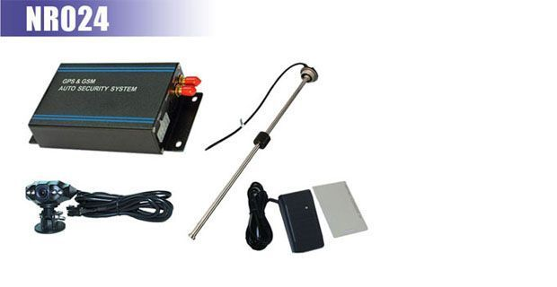

# Noran - NR024

El Noran NR024 es un rastreador GPS vehicular avanzado pensado para uso en flotas. Combina posicionamiento por satélite con comunicación GSM y una cámara digital integrada para ofrecer reportes de ubicación continuos junto con captura de imágenes. El equipo también incorpora funciones como monitoreo de combustible, monitoreo de audio, geocercas, alertas de exceso de velocidad, SOS y control remoto del motor, cubriendo una amplia gama de necesidades de gestión de flotas.

Como dispositivo compatible con Plaspy, el NR024 puede enviar ubicación, estado y contenido multimedia a una plataforma centralizada de seguimiento para supervisión en tiempo real. Su capacidad para subir imágenes y curvas de combustible a un sistema de seguimiento tipo GIS resulta especialmente útil para operadores que requieren contexto adicional además de los datos de posición. Al integrarlo con Plaspy, el NR024 forma parte de una solución más amplia de visibilidad, generación de informes y control operacional.

## Aspectos destacados

- Rastreador GPS orientado a vehículos con cámara digital integrada para captura de fotos y recopilación de evidencia
- Soporta carga de datos inalámbrica para que la ubicación y el estado se reporten a una plataforma remota
- Monitoreo de combustible para ayudar a controlar consumo y costos operativos
- Control remoto del motor para inmovilización o gestión remota cuando las políticas del sistema lo permitan
- Alertas estándar de flota, incluyendo activación de geocercas, advertencias por exceso de velocidad y señalización SOS
- Monitoreo de audio e informes de estado del vehículo para aportar contexto operativo más allá de la ubicación

## Cómo funciona con Plaspy

Al conectarse a Plaspy, el NR024 transmite datos de ubicación y eventos a los paneles e informes de Plaspy para que los responsables de flota monitoreen los vehículos desde una sola interfaz. Plaspy recibe la información del dispositivo y la presenta junto a mapas, alertas y registros históricos.

- Posicionamiento en tiempo real visible en los mapas de Plaspy para monitoreo activo de la flota
- Las fotos subidas aparecen en Plaspy para ayudar a verificar incidentes, entregas o el contexto de una ubicación
- Los datos de monitoreo de combustible se integran en los informes de Plaspy para apoyar análisis de costos y seguimiento de eficiencia
- Alertas del NR024 como violaciones de geocerca, eventos de exceso de velocidad y SOS se enrutan a los flujos de notificación de Plaspy
- Eventos de control de motor y actualizaciones de estado quedan registradas en Plaspy para supervision operativa y respuesta ante incidentes

## Casos de uso típicos

- Gerentes de flota que necesitan combinar ubicación y evidencia fotográfica para revisiones de entregas o incidentes
- Operadores que realizan seguimiento del consumo de combustible entre vehículos para detectar ineficiencias o consumos inesperados
- Organizaciones que requieren cumplimiento de rutas y aplicación de geocercas
- Situaciones en las que el control remoto del motor es útil para responder a robos o prevenir usos no autorizados
- Servicios que requieren monitoreo de audio o estado integrado junto al seguimiento GPS estándar

## Por qué elegir este rastreador con Plaspy

El NR024 es una opción práctica para flotas que desean algo más que reportes de posición simples. Su capacidad de carga de imágenes y el monitoreo de combustible aportan contexto adicional a los eventos del vehículo, y estos tipos de datos se integran bien con las funciones de Plaspy para mapeo, alertas e informes. Usar el NR024 con Plaspy ayuda a transformar las señales crudas del dispositivo en información accionable para despacho, seguridad y equipos operativos.

Dado que las especificaciones y funciones pueden variar según la región y el firmware, el NR024 se presenta aquí en términos generales basados en la información disponible. Si su operación requiere capacidades o integraciones específicas, Plaspy puede ayudar a evaluar si el NR024 satisface esas necesidades y cómo configurarlo dentro de un flujo de trabajo de flota.

Para obtener más información sobre Plaspy y cómo funciona con dispositivos como el Noran NR024 visite https://www.plaspy.com. Las especificaciones del producto, la disponibilidad y los detalles del fabricante pueden cambiar con el tiempo, por lo que le recomendamos verificar la información técnica y la documentación actual con el fabricante en http://www.norantracker.com/ antes de tomar decisiones de compra o implementación.
