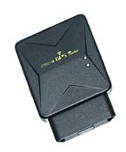

# Noran - NR100

El NR100 es un rastreador OBD II compacto, diseñado para despliegues de flotas y seguridad que requieren ubicación en tiempo real y monitoreo de eventos confiables. Integra posicionamiento dual (GPS y LBS), antenas internas y un receptor GPS SiRF para ofrecer actualizaciones continuas de ubicación, intervalos de reporte configurables y alertas inmediatas por exceso de velocidad, corte de energía y geovallas. El equipo también soporta reportes por SMS e Internet, monitoreo de audio remoto y análisis remoto de fallas para ayudar a mantener la salud del dispositivo y la conciencia situacional.

Como dispositivo compatible con Plaspy, el NR100 puede transmitir sus datos de ubicación y eventos a la plataforma Plaspy para monitoreo y reportes centralizados. Esta compatibilidad hace del NR100 una opción práctica para organizaciones que buscan una solución OBD II lista para usar que se integre con los paneles, alertas y reproducción histórica de Plaspy sin necesidad de personalizaciones complejas.

## Características principales

- Compatible con Plaspy para seguimiento en tiempo real y gestión centralizada de flotas mediante reportes por SMS o Internet
- Posicionamiento dual (GPS + LBS) que mejora la cobertura en zonas urbanas y áreas con señal marginal
- Factor de forma OBD II plug and play para una implementación rápida en vehículos compatibles
- Intervalos de reporte configurables para equilibrar precisión de ubicación y consumo de datos
- Alertas inmediatas por exceso de velocidad, corte de energía y geovallas para facilitar una respuesta rápida ante incidentes
- Monitoreo de audio remoto y análisis de fallas remotos para apoyar la seguridad y el mantenimiento del dispositivo
- Diseño compacto adecuado para flotas comerciales y vehículos de servicio

## Cómo funciona con Plaspy

Al integrarse con Plaspy, el NR100 envía telemetría de ubicación y mensajes de eventos a la plataforma, donde los gestores de flota pueden visualizar rutas, recibir alertas y generar reportes. Plaspy procesa los datos del rastreador para ofrecer supervisión en tiempo real y análisis histórico, habilitando notificaciones automáticas y flujos operativos.

- Actualizaciones de ubicación en tiempo real y visualización de viajes en los mapas de Plaspy para monitoreo en vivo y reproducción
- Enrutamiento de alertas por exceso de velocidad, corte de energía y geovallas para que los equipos puedan reaccionar con rapidez
- Reglas de reporte y notificación configurables en Plaspy para ajustarse a necesidades operativas y presupuestos de datos
- Monitoreo de audio remoto y mensajes sobre el estado del dispositivo disponibles dentro de los flujos de trabajo de Plaspy cuando esté permitido
- Uso de telemetría OBD II para reportes de ignición y datos del vehículo en Plaspy cuando el vehículo lo soporte
- Integración con sensores y accesorios externos a través de Plaspy para ampliar las capacidades de monitoreo

## Casos de uso típicos

- Seguimiento de flotas comerciales para visibilidad de rutas, mejora de ETA y reportes de utilización
- Monitoreo de vehículos de servicio y entrega donde la implementación rápida y la instalación discreta son importantes
- Flujos de trabajo antirobo y respuesta rápida aprovechando alertas por corte de energía, geovallas y exceso de velocidad
- Supervisión del comportamiento del conductor y cumplimiento mediante alertas de eventos y reproducción de viajes
- Operaciones de seguridad que requieren monitoreo de audio remoto y chequeos de salud del dispositivo

## Por qué elegir este rastreador con Plaspy

El NR100 es una opción práctica para organizaciones que buscan un rastreador OBD II compacto y listo para usar que se conecte a una plataforma de gestión de flotas centralizada. Su combinación de posicionamiento dual y alertas de eventos se alinea bien con las características de Plaspy para visibilidad en tiempo real, notificaciones automáticas y reportes históricos. Para flotas que priorizan una instalación rápida y supervisión operativa, emparejar el NR100 con Plaspy reduce el tiempo de puesta en marcha y centraliza la telemetría para una gestión más sencilla.

Si desea evaluar cómo el NR100 puede apoyar sus flujos operativos de flota o seguridad, Plaspy ofrece los paneles y herramientas de alerta para ingerir los datos del dispositivo y convertirlos en información operativa. Para conocer más sobre Plaspy visite https://www.plaspy.com. Las especificaciones y disponibilidad del producto pueden cambiar con el tiempo, por lo que le recomendamos verificar los detalles actuales y la compatibilidad en el sitio del fabricante http://www.norantracker.com/ antes de realizar una adquisición final.
