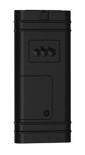

# Oigo Telematics - AR-2CX

El rastreador GPS Oigo Telematics AR-2CX de la serie AR es una solución confiable y eficiente para la gestión de flotas y la recuperación de vehículos robados. Diseñado para instalaciones discretas en vehículos, este rastreador se integra fácilmente en los sistemas de gestión existentes, lo que facilita su implementación y uso.

Una de las características destacadas del AR-2CX es su capacidad para generar una amplia variedad de informes de eventos y alertas. Esto permite a los usuarios monitorear y analizar el rendimiento de su flota, así como recibir notificaciones en tiempo real sobre eventos importantes, como excesos de velocidad, geocercas y paradas no autorizadas.

El AR-2CX es compatible con la tecnología CDMA / 1xRTT, lo que garantiza una conexión estable y confiable en todo momento. Esto es especialmente importante para la recuperación de vehículos robados, ya que permite una localización precisa y rápida en caso de robo.

En resumen, el rastreador GPS Oigo Telematics AR-2CX es una opción ideal para aquellos que buscan una solución de gestión de flotas y recuperación de vehículos robados confiable y fácil de usar. Con su capacidad de integración, informes de eventos y alertas, y tecnología CDMA / 1xRTT, este rastreador ofrece un rendimiento excepcional y una tranquilidad adicional para los propietarios de flotas y vehículos.

### Características destacadas:

- Integración fácil en sistemas de gestión de flotas y recuperación de vehículos robados
- Diseño discreto para instalaciones en vehículos
- Soporte para una amplia variedad de informes de eventos y alertas
- Versión CDMA / 1xRTT para una conexión estable y confiable

