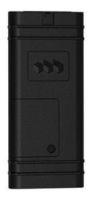

# Oigo Telematics - AR-2GM

El rastreador GPS Oigo Telematics AR-2GM de la serie AR es una solución confiable y eficiente para la gestión de flotas y la recuperación de vehículos robados. Diseñado para instalaciones discretas en vehículos, este rastreador se integra fácilmente en los sistemas de gestión existentes, lo que facilita su implementación y uso.

Una de las características destacadas del AR-2GM es su capacidad para generar una amplia variedad de informes de eventos y alertas. Esto permite a los usuarios monitorear y recibir notificaciones en tiempo real sobre el estado y la ubicación de sus vehículos. Además, este rastreador GPS utiliza tecnología GSM para una conectividad confiable y una cobertura amplia.

En resumen, el rastreador GPS Oigo Telematics AR-2GM es una opción ideal para aquellos que buscan una solución de seguimiento de vehículos confiable y fácil de usar. Con su capacidad de integración, instalación discreta y soporte para informes de eventos y alertas, este rastreador es una herramienta valiosa para la gestión de flotas y la recuperación de vehículos robados.

### Características destacadas:

- Integración fácil en sistemas de gestión de flotas y recuperación de vehículos robados
- Diseño discreto para instalaciones en vehículos
- Soporte para una amplia variedad de informes de eventos y alertas
- Versión GSM para conectividad confiable y cobertura amplia

