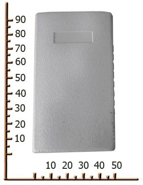

# OKB Tehnoavtomatika - AAP PERSONAL

El sistema de monitoreo AAP PERSONAL de OKB Tehnoavtomatika es un dispositivo de rastreo autónomo pensado para la supervisión de personas y bienes. Funciona con batería interna y cuenta con un receptor GPS de alta sensibilidad que proporciona posicionamiento fiable en objetos remotos o sin una fuente de alimentación fija. El equipo admite transmisión de datos y notificaciones vía GPRS y SMS, y puede reportar su estado a un centro de control, por lo que resulta adecuado para el seguimiento de mercancías, personal y otros activos móviles.

Como dispositivo compatible con Plaspy, el AAP PERSONAL puede enviar datos de ubicación y notificaciones a la plataforma Plaspy para ofrecer una gestión y visibilidad centralizadas. La integración con Plaspy permite ver los dispositivos en un mapa compartido, monitorear sus desplazamientos en el tiempo y recibir alertas e informes que facilitan la supervisión operativa de activos remotos o en tránsito.

## Aspectos clave

- Diseñado para funcionar con batería, ideal para objetos sin alimentación continua
- Receptor GPS de alta sensibilidad que mejora la fiabilidad del posicionamiento
- Varias opciones de notificación, incluyendo mensajes por internet y alertas SMS
- Operación autónoma pensada para monitoreo personal y activos portátiles
- Opciones de software corporativo y servidor para supervisión a nivel de flota
- Solución práctica para transporte cuando la conectividad continua es intermitente

## Cómo funciona con Plaspy

Al integrarse con Plaspy, el AAP PERSONAL envía actualizaciones de ubicación y estado que Plaspy muestra y procesa para monitoreo e informes. Plaspy consolida los mensajes de los dispositivos y los presenta junto con otros datos de la flota para apoyar la toma de decisiones operativas.

- Visibilidad en tiempo real y de ubicaciones recientes en los mapas de Plaspy para los dispositivos rastreados
- Alertas y notificaciones consolidadas que se integran en los flujos de trabajo de Plaspy para una mejor detección de incidentes
- Registros históricos de posiciones y resúmenes de movimiento para respaldar informes y revisiones
- Supervisión a nivel de flota para agrupar y controlar múltiples unidades AAP PERSONAL
- Monitoreo centralizado en Plaspy para combinar reportes del dispositivo con otros datos del sistema

## Casos de uso habituales

- Seguimiento de carga transportada durante envíos temporales o de larga distancia
- Monitoreo de empleados remotos o personal de campo para seguridad y coordinación
- Rastreo temporal de activos cuando no es práctico realizar una instalación permanente
- Monitoreo de vehículos o equipos a pequeña escala utilizando la opción de servidor corporativo
- Situaciones donde los reportes periódicos y notificaciones concisas son suficientes

## Por qué elegir este rastreador con Plaspy

El AAP PERSONAL es una opción práctica para organizaciones que requieren un rastreador autónomo a batería integrado en una plataforma de monitoreo más amplia. Su flexibilidad en notificaciones y la sensibilidad del GPS lo hacen apropiado para el seguimiento de objetos y personas en entornos donde la energía y la conectividad no son constantes. Combinado con Plaspy, el dispositivo aporta datos de ubicación y alertas a una vista central que ayuda a los equipos a mantener la conciencia situacional y a gestionar activos remotos de forma más eficaz.

Si desea explorar cómo las unidades AAP PERSONAL pueden encajar en su sistema de rastreo, conozca más sobre Plaspy en el sitio principal https://www.plaspy.com. Las especificaciones y la disponibilidad del producto pueden cambiar con el tiempo, por lo que le recomendamos verificar los detalles técnicos y la compatibilidad actuales en la web del fabricante http://www.okb-ta.ru/.
