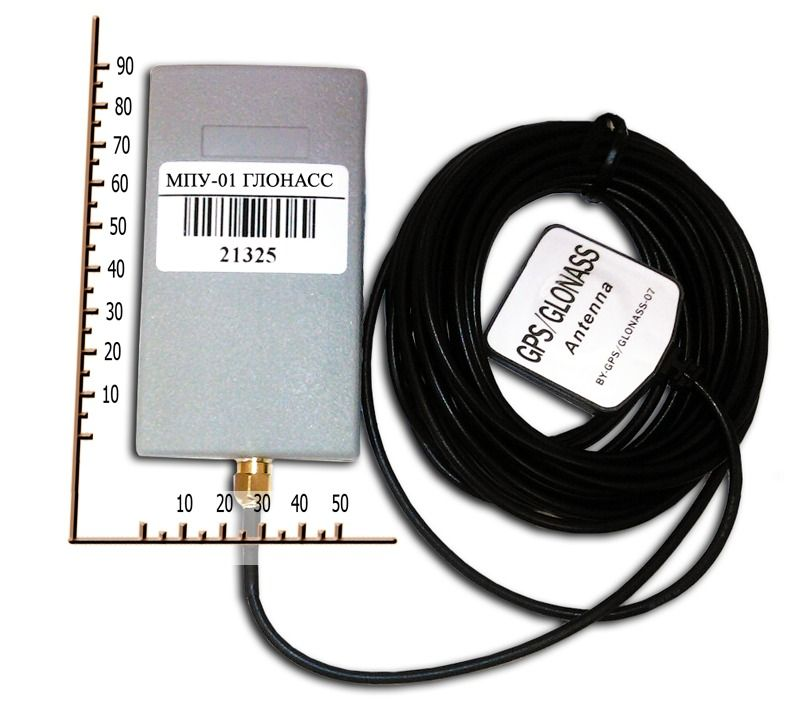

# OKB Tehnoavtomatika - MPU-01GLONASS

El MPU-01 GLONASS Tracking System de OKB Tehnoavtomatika es un equipo de localización compacto y portátil pensado para el monitoreo de vehículos y activos. Cuenta con un receptor GLONASS de 24 canales NV08C-CSM para posicionamiento preciso, dimensiones reducidas de 90 × 50 × 16 mm y un peso inferior a 200 gramos. Opera en las bandas GSM 900 y 1800 y puede recibir y reenviar mensajes SMS, lo que lo hace útil en escenarios donde la comunicación por texto o la mensajería remota básica son necesarias.

Como dispositivo compatible con Plaspy, el MPU-01GLONASS puede integrarse para ofrecer visibilidad de ubicación y control operativo dentro de la plataforma de gestión de flotas Plaspy. Su tamaño compacto y las opciones flexibles de entradas y salidas permiten su instalación en distintos vehículos y activos móviles, y sus funciones de posicionamiento y mensajes lo convierten en una opción práctica para organizaciones que buscan integrar unidades rastreadas en Plaspy para monitoreo, generación de informes y comunicación remota básica.

## Características principales

- Diseño compacto y liviano, adecuado para vehículos y activos portátiles
- Receptor GLONASS de 24 canales NV08C-CSM para datos de posición fiables
- Soporte para bandas GSM 900 y 1800 y capacidad para recibir mensajes SMS
- Función de reenvío SMS para facilitar la comunicación básica entre el rastreador y el usuario
- Opciones de configuración flexibles, incluyendo combinaciones de entradas y salidas digitales y analógicas
- Factor de forma práctico para casos de uso de seguimiento de flotas y activos

## Cómo funciona con Plaspy

Al integrarse con Plaspy, el MPU-01GLONASS suministra información de posición y estado que Plaspy muestra en mapas y en paneles operativos. Plaspy puede consolidar los datos de ubicación y las señales de mensajería del dispositivo en una vista única para su monitoreo y toma de decisiones.

- Mostrar la ubicación y el movimiento en tiempo real en los mapas de Plaspy para visibilidad inmediata
- Almacenar y revisar rutas históricas e historial de posiciones en los informes de Plaspy
- Configurar alertas y notificaciones en Plaspy según cambios de posición o estado de entradas
- Usar las señales de entrada del dispositivo para reflejar estados simples del vehículo o activo en las vistas de Plaspy
- Aprovechar las capacidades de mensajería del dispositivo, cuando estén disponibles, para complementar las notificaciones de Plaspy

## Casos de uso típicos

- Seguimiento de la ubicación de flotas de vehículos en operaciones diarias
- Monitoreo de equipos portátiles y activos móviles
- Supervisión de flotas de alquiler y monitoreo básico de uso
- Rastreos de carga y remolques donde se requieren equipos compactos
- Seguimiento de vehículos de servicio de campo para verificar rutas y horarios

## Por qué elegir este rastreador con Plaspy

El MPU-01GLONASS combina un diseño mecánico compacto con un receptor GLONASS multicanal y soporte para las bandas GSM más comunes, lo que lo convierte en una opción versátil para organizaciones que necesitan seguimiento de ubicación sencillo e integración con Plaspy. Sus configuraciones flexibles de entradas y salidas ofrecen posibilidades para monitorizar estados básicos, ayudando a ampliar la visibilidad en Plaspy más allá de la ubicación y hacia la condición o eventos del activo.

Si usted busca un rastreador pequeño y confiable para vehículos o activos portátiles, el MPU-01GLONASS puede resultar una solución práctica para muchos despliegues. Como en cualquier selección de equipo, confirme la configuración y capacidades específicas que necesita para asegurarse de que encajen con su instalación y requisitos operativos en Plaspy.

Para saber más sobre cómo Plaspy puede trabajar con rastreadores compatibles como el MPU-01GLONASS visite https://www.plaspy.com. Las especificaciones y la disponibilidad de producto pueden cambiar con el tiempo, por lo que le recomendamos verificar los detalles técnicos actuales y las opciones con el fabricante en http://www.okb-ta.ru/ antes de finalizar la compra.
