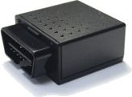

# Orion - BD-3112

El rastreador GPS Orion BD-3112 es una solución versátil y confiable para todas tus necesidades de seguimiento. Ya sea que necesites vigilar tus pertenencias personales, administrar una flota de vehículos o garantizar la seguridad de tus seres queridos, este dispositivo de última generación tiene todo lo que necesitas. Con su diseño ligero y compacto, ofrece el equilibrio perfecto entre discreción y eficiencia.

Una de las características destacadas del Orion BD-3112 es su capacidad de seguimiento en tiempo real. Puedes recibir actualizaciones de ubicación en vivo, lo que te permite monitorear tus activos en todo momento. Además, el dispositivo ofrece funcionalidad de geovallado, lo que te permite configurar límites personalizados y recibir notificaciones instantáneas cuando tus activos ingresen o salgan de estas zonas designadas.

Diseñado para uso multipropósito, el Orion BD-3112 se puede utilizar para rastrear vehículos, pertenencias personales o incluso para vigilar de cerca a tus seres queridos. También cuenta con un botón de emergencia SOS, que brinda tranquilidad adicional al permitirte enviar alertas inmediatas en situaciones urgentes.

En cuanto a las especificaciones técnicas, el Orion BD-3112 está diseñado para funcionar en diversas condiciones ambientales. Está diseñado para ser portátil y sigiloso, con una construcción liviana que minimiza el impacto en la movilidad de tu activo. El dispositivo también es compatible con una amplia gama de entradas de energía, lo que lo hace adecuado para su uso en cualquier parte del mundo.

En términos de conectividad, el Orion BD-3112 admite múltiples bandas de frecuencia, lo que garantiza una cobertura constante de la red GSM a nivel mundial. También cuenta con una sensibilidad GPS mejorada, lo que permite un seguimiento preciso de la ubicación incluso en áreas con estructuras urbanas densas. Con su sólida calidad de construcción y cumplimiento de estándares internacionales de seguridad y operación, este rastreador está diseñado para durar.

En conclusión, el rastreador GPS Orion BD-3112 es una solución confiable y eficiente para la gestión y seguridad de activos. Ya sea que estés rastreando artículos personales, administrando una flota o garantizando la seguridad de tus seres queridos, este dispositivo ofrece las características y el rendimiento que necesitas. Confía en el Orion BD-3112 para mantener lo que más te importa a la vista, sin importar dónde te encuentres en el mundo.

