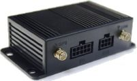

# Orion - ET-100

El Orion ET-100 es un rastreador GPS compacto pensado para la gestión y seguridad de activos. Es adecuado para una amplia variedad de situaciones, desde el seguimiento de objetos personales hasta la administración de flotas vehiculares y la supervisión de la seguridad de familiares. El ET-100 permite una colocación discreta gracias a su diseño ligero y ofrece visibilidad continua de la ubicación para que usted siempre sepa dónde se encuentran sus activos.

Como dispositivo compatible con Plaspy, el ET-100 integra sus funciones básicas de rastreo en una plataforma centralizada de gestión de flotas y activos. Las actualizaciones de ubicación en tiempo real, los eventos de geocercas y las alertas SOS generadas por el ET-100 pueden mostrarse dentro de Plaspy para facilitar la monitorización, las alertas y los informes. Esa compatibilidad hace del ET-100 una opción práctica cuando desea combinar hardware de rastreo con Plaspy para supervisión operativa.

## Aspectos destacados

- Diseño compacto y liviano para una colocación discreta en los activos
- Actualizaciones de ubicación en tiempo real para mantener visibilidad constante
- Función de geocercas para disparar alertas al cruzar límites definidos
- Botón SOS para alertas de emergencia inmediatas
- Alta sensibilidad GPS para posicionamiento preciso en entornos difíciles
- Construcción robusta y cumplimiento de normas internacionales de seguridad y eficiencia

## Cómo funciona con Plaspy

Al usarlo con Plaspy, los datos del ET-100 se integran en una única interfaz de supervisión para que los equipos puedan ver ubicaciones y responder a eventos rápidamente. Plaspy convierte las señales del rastreador en información útil para operaciones, seguridad e informes.

- Visualización de ubicación en vivo en los mapas de Plaspy para monitorización continua
- Creación de geocercas y alertas automatizadas cuando los activos entran o salen de áreas definidas
- Gestión de eventos SOS con notificaciones enviadas a través de Plaspy para respuestas rápidas
- Registros históricos de movimientos y rutas para revisión y análisis de incidentes
- Agrupación de activos y vistas de estado para administrar flotas o carteras de elementos rastreados
- Alertas y reportes personalizables para adaptarse a las necesidades operativas

## Casos de uso habituales

- Supervisión de vehículos de flota para control de rutas y operación
- Gestión de activos de alto valor y seguimiento de equipos
- Rastreo de objetos personales como objetos de valor y equipaje
- Monitoreo de la seguridad y ubicación de familiares o cuidadores
- Prevención de pérdidas y seguridad en operaciones comerciales

## Por qué elegir este rastreador con Plaspy

El Orion ET-100 combina funciones prácticas de rastreo con un factor de forma pensado para colocación flexible, lo que lo convierte en una buena opción para organizaciones que necesitan visibilidad de ubicación confiable sin hardware voluminoso. Sus actualizaciones en tiempo real, geocercas y capacidad SOS se alinean con flujos de trabajo comunes de monitoreo y seguridad que Plaspy soporta, ayudando a centralizar alertas y gestionar respuestas.

Plaspy aporta valor al transformar los datos de ubicación y eventos del ET-100 en conocimientos operativos, paneles consolidados e informes configurables. Para organizaciones que requieren supervisión sencilla de activos y alertas oportunas, el ET-100 junto con Plaspy ofrece una solución equilibrada que cubre necesidades de rastreo tanto personales como comerciales.

Para saber más sobre Plaspy y cómo rastreadores compatibles como el Orion ET-100 pueden utilizarse dentro de la plataforma, visite https://www.plaspy.com. Product specifications, availability, and manufacturer details can change over time, so verify the latest information on the official Orion site http://www.oriontech.com.tw/.
