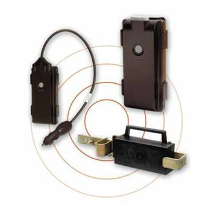

# Pointer - Cello Track 8M

El CELLOTRACK IP67 de Pointer es un dispositivo de seguimiento innovador y adaptable, diseñado para rastrear activos móviles y fijos. Este pequeño dispositivo permite un seguimiento continuo y una vigilancia precisa de la ubicación de activos valiosos, lo que aumenta la productividad operativa de una empresa.

Una de las características destacadas del CELLOTRACK IP67 es su batería de larga duración, que puede durar aproximadamente 3 años. Esto garantiza un seguimiento constante sin la necesidad de reemplazar la batería con frecuencia. Además, cuenta con una carcasa resistente a la intemperie de gran durabilidad con clasificación IP67, lo que significa que es resistente al polvo y al agua, lo que lo hace adecuado para su uso en entornos exigentes.

El CELLOTRACK IP67 también cuenta con un cargador interno, lo que le permite ser utilizado en situaciones en las que el suministro de energía es intermitente. Esto asegura que el dispositivo siga funcionando incluso en condiciones de energía limitada.

En resumen, el CELLOTRACK IP67 de Pointer es un rastreador GPS versátil y confiable que ofrece un seguimiento preciso y continuo de activos valiosos. Con su batería de larga duración y su resistente carcasa, es una opción ideal para empresas que buscan aumentar su eficiencia operativa y proteger sus activos.

### Características destacadas:

- Batería de larga duración \(aproximadamente 3 años\)
- Carcasa resistente a la intemperie con clasificación IP67
- Cargador interno para uso en situaciones con suministro de energía intermitente

